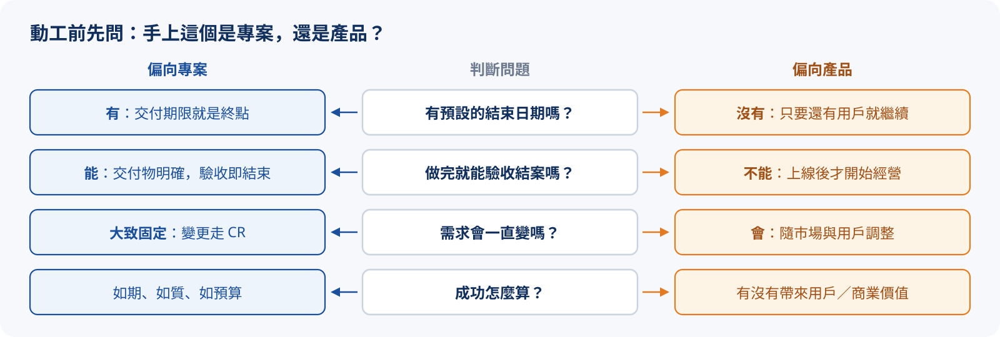
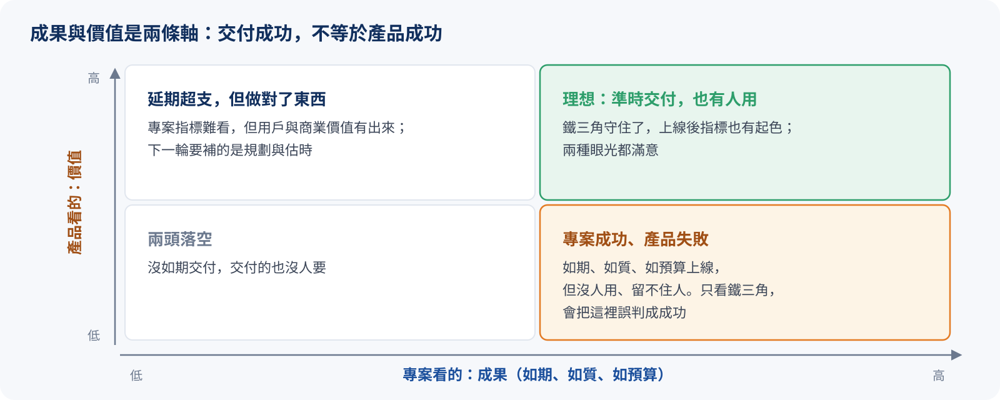
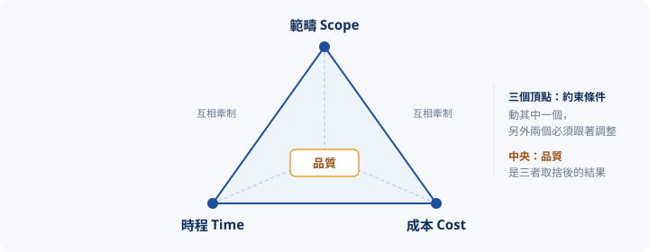
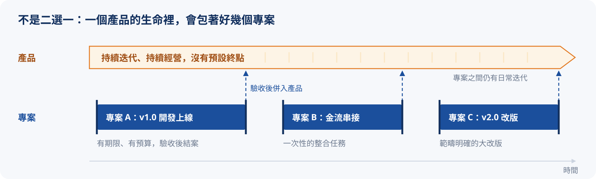

# 專案 V.S 產品

在規劃一件事情的執行方式之前，要先想清楚：手上這個項目，到底是**專案**還是**產品**？
這個判斷會一路影響後續的資源調度與管理模式。兩者的思考重點很不一樣，下面各自展開。

## 專案（Project）

專案是「為了交付特定成果而存在」的一次性任務，有明確的起點與終點：

- **需求**：相對明確、可被界定
- **時間**：有限，有交付期限
- **資源**：有限，人力與預算固定
- **交付物**：明確，做完即驗收
- **生命週期**：有限，專案結束，任務就結束

:::tip
PM 在專案中關注的是：**如期、如質、如預算**地把東西交出去。
:::

## 產品（Product）

產品是「持續為用戶與商業創造價值」的長期經營，沒有預設的終點：

- **需求**：變化頻繁，會隨市場與用戶調整
- **節奏**：持續迭代、持續交付
- **方向**：不斷優化與改進
- **生命週期**：沒有明確結束時間

:::tip
PM（或 :tip[PO]{content="Product Owner，產品負責人：在敏捷團隊中負責定義產品方向、排定 Backlog 優先順序的人。"}）在產品中關注的是：**這次迭代有沒有為用戶／商業帶來價值**。
:::

:::note
一句話總結：**專案看重成果，產品看重價值。**
:::

成果與價值是兩條獨立的軸，交付成功不等於產品成功。最危險的是右下角：鐵三角全部守住，上線後卻沒人用。

按下「開始模擬」，看同一個時鐘下，專案與產品如何走向完全不同的終局：

{/* @ai-visualize
id: pm-lifecycle
type: motion
prompt: |
  核心洞察：專案是單一路徑、有終點；產品是循環迭代、無終點。同一個時鐘下，一個會停下來，一個持續釋出價值。
  互動：「開始模擬 / 暫停 / 重置」按鈕驅動共用時鐘；左欄專案進度條走到 100% 即停止，
        右欄產品顯示目前第幾輪與累積價值。
  圖形：左欄是專案甘特圖（啟動 / 規劃 / 執行 / 結案，以月為軸），時間游標推進、階段條依序填滿，
        第 8 個月的結案里程碑之後以灰底標示「已結案」；右欄是產品迭代循環（規劃 → 開發 → 發佈 → 量測），
        進度弧沿圓環前進、目前階段高亮，旁邊的累積價值階梯折線每完成一輪就上升一階。
caption: 按下「開始模擬」，看同一個時鐘下，專案與產品如何走向完全不同的終局。
status: generated
*/}
import GeneratedFrame from '@/components/GeneratedFrame.astro'
import PmLifecycle from '@notes/components/pm-lifecycle'

<GeneratedFrame id="pm-lifecycle" type="motion" prompt={"核心洞察：專案是單一路徑、有終點；產品是循環迭代、無終點。同一個時鐘下，一個會停下來，一個持續釋出價值。\n互動：「開始模擬 / 暫停 / 重置」按鈕驅動共用時鐘；左欄專案進度條走到 100% 即停止，\n      右欄產品顯示目前第幾輪與累積價值。\n圖形：左欄是專案甘特圖（啟動 / 規劃 / 執行 / 結案，以月為軸），時間游標推進、階段條依序填滿，\n      第 8 個月的結案里程碑之後以灰底標示「已結案」；右欄是產品迭代循環（規劃 → 開發 → 發佈 → 量測），\n      進度弧沿圓環前進、目前階段高亮，旁邊的累積價值階梯折線每完成一輪就上升一階。\n"} caption="按下「開始模擬」，看同一個時鐘下，專案與產品如何走向完全不同的終局。">
  <PmLifecycle client:visible />
</GeneratedFrame>

## 需求變動

同樣是「需求變了」，在兩種情境下的意義完全相反：

- **專案**：需求變動被視為**風險**，原則上要凍結需求。任何變更都得走變更管理流程（:tip[Change Request，簡稱 CR]{content="變更請求：正式提出需求變更的文件與流程，通常包含影響評估、成本估算與相關方簽核。"}），評估對範疇、時間、成本的影響，並取得相關方批准。
- **產品**：需求變動是**常態**，本來就預期會變。PM 要擁抱變化，快速回應市場與用戶反饋，持續優化產品。

{/* @ai-visualize
id: pm-change-request
type: motion
prompt: |
  核心洞察：同一份需求變更，在專案要走正式 CR 流程層層簽核，在產品只是加進 Backlog 排優先順序，
            兩邊的時間尺度差一個量級。
  互動：「模擬需求變更」按鈕啟動共用的天數計時，可重置；下方兩張摘要卡隨進度更新。
  圖形：共用天數軸（0–35 天）的甘特圖，上方泳道是專案四步（評估影響、CR 文件、多層簽核、執行變更，約 35 天），
        下方泳道是產品三步（加入 Backlog、排序、下個 Sprint，約 13 天）；每列標出負責角色，
        「今日」游標掃過時各步驟條依序填滿，產品上線後以虛線標出「產品已上線 n 天」的差距。
caption: 同一份需求，專案走簽核、產品走 Backlog，看看兩邊各要多少天。
status: generated
*/}
import PmChangeRequest from '@notes/components/pm-change-request'

<GeneratedFrame id="pm-change-request" type="motion" prompt={"核心洞察：同一份需求變更，在專案要走正式 CR 流程層層簽核，在產品只是加進 Backlog 排優先順序，\n          兩邊的時間尺度差一個量級。\n互動：「模擬需求變更」按鈕啟動共用的天數計時，可重置；下方兩張摘要卡隨進度更新。\n圖形：共用天數軸（0–35 天）的甘特圖，上方泳道是專案四步（評估影響、CR 文件、多層簽核、執行變更，約 35 天），\n      下方泳道是產品三步（加入 Backlog、排序、下個 Sprint，約 13 天）；每列標出負責角色，\n      「今日」游標掃過時各步驟條依序填滿，產品上線後以虛線標出「產品已上線 n 天」的差距。\n"} caption="同一份需求，專案走簽核、產品走 Backlog，看看兩邊各要多少天。">
  <PmChangeRequest client:visible />
</GeneratedFrame>

## 衡量指標

兩者對「成功長什麼樣子」的衡量標準也不同：

- **專案**：管理鐵三角，也就是**範疇、時程、成本（預算）**
- **產品**：價值導向指標，例如**用戶價值、商業價值、留存率與黏著度**

### 專案：管理鐵三角的取捨

三個要素互相牽動、彼此制約，核心邏輯是：**動一個，就會影響另外兩個**。

例如客戶臨時要加功能（範疇上升），接下來只能在以下選項中取捨：

- 延後交期（時間上升）
- 加人加錢（成本上升）
- 犧牲其他功能或品質

三者不可能同時最佳化，PM 的工作就是在這三者之間做取捨。

### 產品：四要素的取捨

衡量四要素（用戶價值、商業價值、留存率、黏著度）同樣互相牽動：動一個，就會影響其他三個。

例如為了衝短期營收強推付費牆或廣告（商業價值上升），往往要付出代價：

- 使用者體驗下降（用戶價值下降）
- 使用者不再回訪（留存率下降）
- 回訪頻率降低（黏著度下降）

四者不一定能同時最佳化，PM 的工作同樣是在這之間做取捨。

:::warning{title="先講在前面：四要素是我自己湊的"}
專案的管理鐵三角是業界公認、有明確約束的模型；但「產品四要素」不是正式框架，只是我從一堆產品指標裡挑幾個比較有感的（用戶價值、商業價值、留存率、黏著度）來和鐵三角對照。

老實說，這四個也不是真的此消彼長：產品做得好的時候，用戶價值、留存、黏著常常一起往上。寫「動一個影響其他三個」是想借鐵三角的形狀，提醒自己「資源有限、別想全都要」，不是什麼嚴謹定律。真的要衡量產品，還是研究一些成熟框架比較準，見下方延伸閱讀。
:::

:::info{title="延伸閱讀：其他產品衡量框架" collapsible}
產品品質的衡量方式很多，常見的有 Google 的 :tip[HEART 框架]{content="Happiness、Engagement、Adoption、Retention、Task success 五個面向，用來衡量使用者體驗。"}、:tip[AARRR 模型]{content="Acquisition、Activation、Retention、Revenue、Referral，俗稱海盜指標，描述使用者從獲取到推薦的漏斗。"}、:tip[北極星指標]{content="North Star Metric：一個最能代表產品為用戶創造核心價值的單一指標，全公司對齊它。"} 等。不同公司、不同產品會有不同的衡量指標，依情境挑選即可。
:::

拖動任一指標，看資源有限下其他指標如何被牽動：

{/* @ai-visualize
id: pm-metrics
type: motion
prompt: |
  核心洞察：資源有限，指標之間是取捨關係，不可能同時都最佳化；左邊鐵三角是公認模型，右邊四要素只是示意。
  互動：左欄三個 slider（範疇 / 時程 / 成本）、右欄四個 slider（用戶價值 / 商業價值 / 留存率 / 黏著度），
        總量守恆：拉高一項，其他項依比例被扣掉；下方即時說明誰被犧牲最多，可各自重置。
  圖形：每欄一張雷達圖（三軸／四軸），含 25 / 50 / 75 / 100 格線；虛線是均衡基準（各 50），
        實線多邊形是目前配置，隨 slider 變形；最高與最低的軸以標記與顏色強調。
caption: 拖動任一指標，看資源有限下其他指標如何被牽動。這是「取捨示意」，凸顯不可能同時都最佳化。
status: generated
*/}
import PmMetrics from '@notes/components/pm-metrics'

<GeneratedFrame id="pm-metrics" type="motion" prompt={"核心洞察：資源有限，指標之間是取捨關係，不可能同時都最佳化；左邊鐵三角是公認模型，右邊四要素只是示意。\n互動：左欄三個 slider（範疇 / 時程 / 成本）、右欄四個 slider（用戶價值 / 商業價值 / 留存率 / 黏著度），\n      總量守恆：拉高一項，其他項依比例被扣掉；下方即時說明誰被犧牲最多，可各自重置。\n圖形：每欄一張雷達圖（三軸／四軸），含 25 / 50 / 75 / 100 格線；虛線是均衡基準（各 50），\n      實線多邊形是目前配置，隨 slider 變形；最高與最低的軸以標記與顏色強調。\n"} caption="拖動任一指標，看資源有限下其他指標如何被牽動。這是「取捨示意」，凸顯不可能同時都最佳化。">
  <PmMetrics client:visible />
</GeneratedFrame>

## 小結

同樣是 PM 的角色，在「專案」與「產品」的情境下，思考重點截然不同，整理成一張對照表：

| 比較項目 | 專案 | 產品 |
| :------- | :--- | :--- |
| 生命週期 | 有明確結束 | 持續迭代，沒有結束 |
| 衡量標準 | 範疇、時程、成本（鐵三角，品質為其結果） | 用戶價值、商業價值、留存 |
| 需求變動 | 盡量凍結，變更需走 CR | 預期會變，擁抱變化 |
| 思考方式 | 以終為始，規劃導向 | 假設驗證，持續學習 |

不過兩者不是二選一。一個產品的生命裡，常常會包著好幾個專案：v1.0 開發上線、一次金流串接、一次大改版，各自有起點、終點與驗收；結案之後，成果併回產品繼續經營。所以同一個 PM 可能這個月用專案的眼光管交付，下個月用產品的眼光看價值。

:::tip{title="下一章"}
分清專案與產品之後，下一步是依「在管什麼」挑選方法論：Waterfall 還是 Agile。前往 [第二章：專案管理方法與精神](./pm-02-waterfall-vs-agile.mdx)，或回到 [學習地圖](./pm-00-learning-map.mdx) 看整體路徑。
:::
