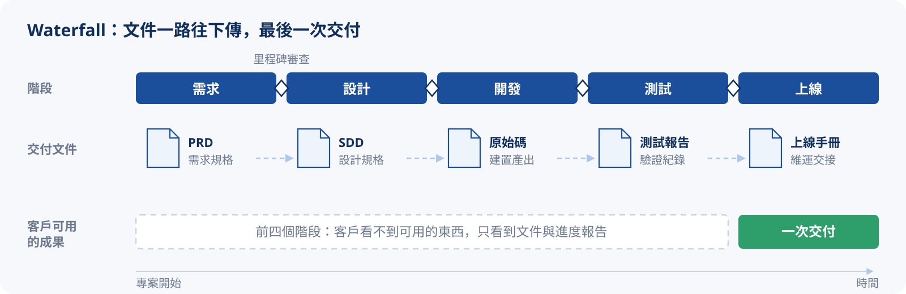
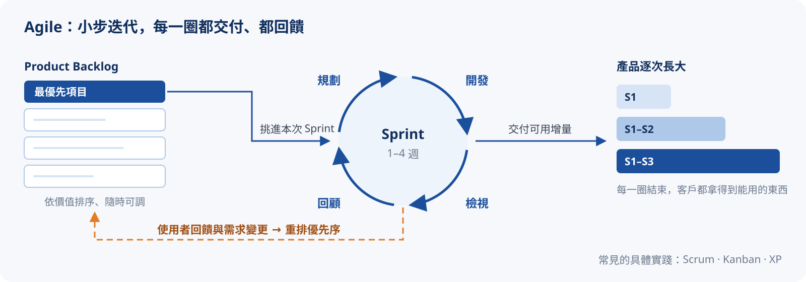
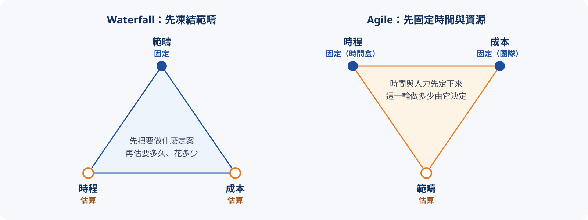

# 專案管理方法與精神

上一章分清了專案與產品的差異，這一章來看專案管理中兩種常見的模式：**Waterfall**（瀑布式）與 **Agile**（敏捷式）。

:::info
目前先針對常見的 Waterfall 與 Agile 做比較，其他模式我沒有實際接觸過，暫時不展開。
:::

## Waterfall（瀑布式）

階段清楚、文件齊全、前期規劃重、變更成本高。適合需求穩定、合規要求高，或對交付物有明確規範的專案，例如政府標案、ERP 導入、金融系統。所以大部分的「專案」會採用瀑布式方法。

Waterfall 這類的執行方法屬於一種 :tip[SDLC]{content="Software Development Life Cycle，軟體開發生命週期：把專案從構思到退役拆解成數個明確階段。"} 模型。雖然名字裡有「軟體開發」，但不只軟體專案，其他類型的專案也常借用這套思路來規劃執行。

:::tip
SDLC 簡單來說，就是一件工作從構思到退役所經歷的完整流程：把執行工作拆成數個明確的階段，協助團隊有系統地規劃、執行與管控專案。
:::

## Agile（敏捷式）

迭代交付、擁抱變化、強調溝通與回饋。適合需求不明確、需要快速試錯、市場變化快的產品，例如消費型 App、SaaS 產品。「產品」因為需要快速回應市場與用戶回饋，通常會採用敏捷式方法。

:::warning
Agile 比較像是一種精神或文化，背後有很多具體的實踐方法，例如 :tip[Scrum]{content="最常見的敏捷框架：以固定長度的 Sprint 迭代，定義 PO、SM、開發團隊三種角色與一組固定會議。"}、:tip[Kanban]{content="看板方法：把工作視覺化在看板上，限制進行中的工作數量（WIP），讓工作持續流動。"}、:tip[極限編程]{content="Extreme Programming（XP）：強調結對程式設計、測試驅動開發、持續整併等工程實踐的敏捷方法。"}。這部分內容較多，之後再獨立整理。
:::

:::note
兩種方法論在後面的章節還會再深入，現階段先有概念即可。
:::

## 核心差異對照

一句話：**瀑布把變更視為威脅而力求凍結，敏捷把變更視為原料而擁抱流動**。

用上一章的鐵三角來看，兩者固定的東西剛好相反：瀑布先把範疇定死，時程與成本跟著估；敏捷先把時間盒與團隊定死，這一輪能做多少範疇跟著調。

逐項比較如下：

| 面向 | Waterfall 瀑布 | Agile 敏捷 |
| :--- | :------------- | :--------- |
| 交付方式 | 走完所有階段後一次性交付 | 每個 Sprint 交付可用的增量 |
| 需求變更 | 成本高、抗拒變更 | 成本低、擁抱變化 |
| 文件 | 前期齊全、文件驅動 | 精簡夠用即可 |
| 規劃時機 | 前期規劃重、一次定案 | 持續滾動、隨迭代調整 |
| 溝通回饋 | 里程碑階段審查 | 高頻、持續回饋 |
| 適用情境 | 需求穩定、合規要求高（政府標案、ERP 導入、金融系統） | 需求不明、需要快速試錯（消費型 App、SaaS 產品） |

表格裡最關鍵的一列是「需求變更」。同一個變更，發生在專案的不同時間點，兩種模式要付出的代價差距會越拉越大：

{/* @ai-visualize
id: pm-change-cost
type: motion
prompt: |
  核心洞察：瀑布的變更成本隨進度指數上升，因為前面凍結的階段都要回頭重走；敏捷的變更成本幾乎持平，
            因為變更只影響還沒開始的 Sprint。
  互動：slider 調整專案進度（0–100%），按鈕「觸發需求變更」切換是否顯示變更影響，可重置；
        下方兩張摘要卡隨進度說明目前階段與代價。
  圖形：上半部是共用進度軸的兩條泳道，瀑布為五個階段條（需求 / 設計 / 開發 / 測試 / 上線），
        敏捷為 8 個 Sprint 方塊；進度游標推進時已完成部分填滿藍色。觸發變更後，瀑布已觸及的階段
        以橘色斜線標示「重做」，敏捷只有下一個 Sprint 標示「排入」。
        下半部是變更成本曲線（對數刻度，1x–100x），瀑布曲線陡升、敏捷近乎持平，游標處標出兩邊的倍數。
  資料/數值：瀑布倍數在階段邊界取 1 / 5 / 10 / 20 / 50 / 100（示意），敏捷約 1x–2x。
caption: 拖動進度，再按「觸發需求變更」，看同一個變更在兩種模式下要拆掉多少東西。
status: generated
*/}
import GeneratedFrame from '@/components/GeneratedFrame.astro'
import PmChangeCost from '@notes/components/pm-change-cost'

<GeneratedFrame id="pm-change-cost" type="motion" prompt={"核心洞察：瀑布的變更成本隨進度指數上升，因為前面凍結的階段都要回頭重走；敏捷的變更成本幾乎持平，\n          因為變更只影響還沒開始的 Sprint。\n互動：slider 調整專案進度（0–100%），按鈕「觸發需求變更」切換是否顯示變更影響，可重置；\n      下方兩張摘要卡隨進度說明目前階段與代價。\n圖形：上半部是共用進度軸的兩條泳道，瀑布為五個階段條（需求 / 設計 / 開發 / 測試 / 上線），\n      敏捷為 8 個 Sprint 方塊；進度游標推進時已完成部分填滿藍色。觸發變更後，瀑布已觸及的階段\n      以橘色斜線標示「重做」，敏捷只有下一個 Sprint 標示「排入」。\n      下半部是變更成本曲線（對數刻度，1x–100x），瀑布曲線陡升、敏捷近乎持平，游標處標出兩邊的倍數。\n資料/數值：瀑布倍數在階段邊界取 1 / 5 / 10 / 20 / 50 / 100（示意），敏捷約 1x–2x。\n"} caption="拖動進度，再按「觸發需求變更」，看同一個變更在兩種模式下要拆掉多少東西。">
  <PmChangeCost client:visible />
</GeneratedFrame>

:::info{title="倍數只是示意" collapsible}
瀑布那條曲線參考的是 :tip[Barry Boehm]{content="軟體工程學者，1981 年在《Software Engineering Economics》中提出缺陷越晚發現、修正成本越高的觀察。"} 常被引用的「越晚修正越貴」觀察，實際倍數依專案差異很大，近年也有研究質疑它被過度簡化。敏捷那條「近乎持平」的曲線，則是 Kent Beck 在極限編程中主張的理想狀態，前提是有自動化測試、持續整合等工程實踐撐著。重點是形狀，不是數字。
:::

## 實務上：很少有純瀑布或純敏捷

實務上很少有純瀑布或純敏捷，尤其是敏捷。如果有人說他們完全遵循敏捷精神，大概就跟說自己完全懂量子力學差不多。再加上現在 AI Coding 的風氣：這些方法論原本都是讓「人」照特定模式執行，AI 介入之後改變了專案執行的節奏和方式，更不可能完全照著某一套走。

但這兩種方法論的核心精神和原則還是很有參考價值。理解它們的差異和適用情境，才能在實務中靈活運用、甚至混搭。另外，當決策者不理解變更的代價時，這些框架也可以當成溝通與說服的工具：說清楚「這樣做的風險和代價」，替團隊爭取更多的彈性與資源。

最常見的混搭是：**對外**用瀑布式的里程碑和階段，定義專案的範疇和交付節點；**對內**用敏捷式的 Sprint 迴圈推進團隊的工作。這樣就能兼顧外部的管理需求與內部的執行效率。

{/* @ai-visualize
id: pm-hybrid-model
type: motion
prompt: |
  核心洞察：外層剛性框架確保對外承諾可預期，內層敏捷迴圈讓執行保持彈性；兩者並存，而非二選一。
            中途的需求變更在內層被 Sprint 消化，外層里程碑日期不動。
  互動：「上一個 / 完成本 Sprint」逐步推進，「插入需求變更」把一項變更排進下一個 Sprint，可重置；
        下方兩張卡並排說明「對外（客戶、管理層）看到的」與「對內（團隊）在跑的」。
  圖形：上層是對外契約層，四段里程碑條（M1 範疇定義 / M2 設計凍結 / M3 開發完成 / M4 交付上線），
        每段結尾有菱形閘門，達成時轉為完成色；下層是對內團隊層，七個 Sprint 迴圈（S1–S7，帶箭頭的圓弧），
        完成的填滿藍色、進行中的以橘色旋轉強調；閘門以虛線連到它所涵蓋的最後一個 Sprint，
        插入的變更以橘色小標籤掛在對應 Sprint 下方。
caption: 推進 Sprint、插入需求變更，看變更在內層被消化，外層里程碑照常達成。
status: generated
*/}
import PmHybridModel from '@notes/components/pm-hybrid-model'

<GeneratedFrame id="pm-hybrid-model" type="motion" prompt={"核心洞察：外層剛性框架確保對外承諾可預期，內層敏捷迴圈讓執行保持彈性；兩者並存，而非二選一。\n          中途的需求變更在內層被 Sprint 消化，外層里程碑日期不動。\n互動：「上一個 / 完成本 Sprint」逐步推進，「插入需求變更」把一項變更排進下一個 Sprint，可重置；\n      下方兩張卡並排說明「對外（客戶、管理層）看到的」與「對內（團隊）在跑的」。\n圖形：上層是對外契約層，四段里程碑條（M1 範疇定義 / M2 設計凍結 / M3 開發完成 / M4 交付上線），\n      每段結尾有菱形閘門，達成時轉為完成色；下層是對內團隊層，七個 Sprint 迴圈（S1–S7，帶箭頭的圓弧），\n      完成的填滿藍色、進行中的以橘色旋轉強調；閘門以虛線連到它所涵蓋的最後一個 Sprint，\n      插入的變更以橘色小標籤掛在對應 Sprint 下方。\n"} caption="推進 Sprint、插入需求變更，看變更在內層被消化，外層里程碑照常達成。">
  <PmHybridModel client:visible />
</GeneratedFrame>

:::warning{title="混搭不是萬靈丹"}
內層能消化的變更，前提是它還在里程碑的範疇之內。如果變更大到動搖範疇（例如整個模組砍掉重練），還是得回到外層走正式的變更流程（上一章提到的 CR）。
:::

## 小結

- **Waterfall** 追求可預測：前期把事情想清楚、凍結下來，換取交付的確定性
- **Agile** 追求可適應：小步快跑、持續回饋，換取回應變化的速度
- 方法論不是信仰，是依「在管什麼」挑出來的工具箱；實務上多半是混搭

:::tip{title="下一章"}
選好方法論之後，接著要問「誰來做」：同一群人換到 Waterfall 與 Scrum 底下，權責流向完全不同。前往 [第三章：Role & Responsibility](./pm-03-role-responsibility.mdx)，或回到 [學習地圖](./pm-00-learning-map.mdx)。
:::
