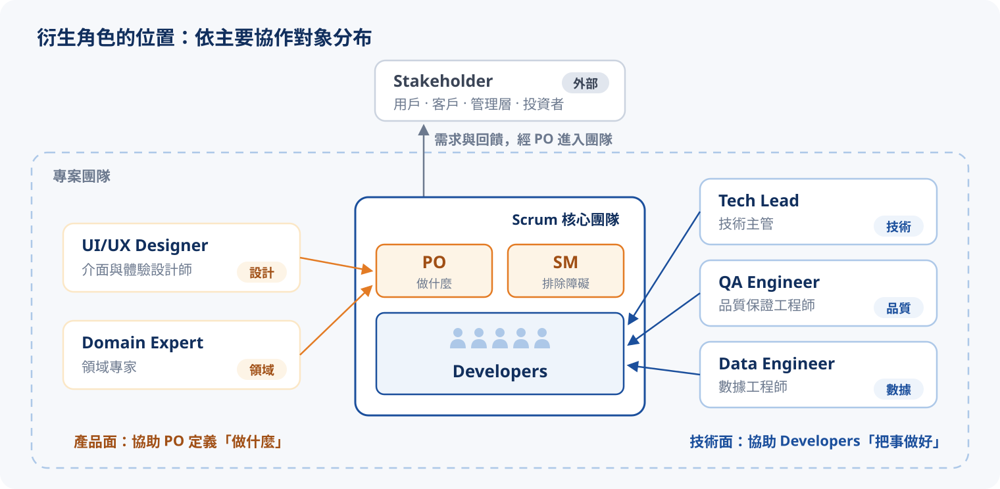
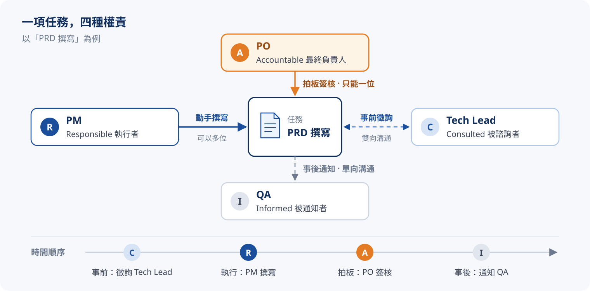

# Role & Responsibility（R&R）

上一章比較了 Waterfall 與 Agile 兩種模式，這一章接著看：同一群人換到不同模式底下，**角色與職責**（R&R）會如何隨之改變。

同一群人，在不同的開發模式底下，權力與責任的流向其實天差地遠。R&R 要釐清的，正是「決策」與「執行」如何在團隊裡分配。

Agile 這一側會用 **Scrum** 來說明：它是目前最常見的敏捷框架，而且有明確的角色與職責定義。

:::tip
R&R 要回答的不是「團隊有哪些頭銜」，而是「**每件事誰拍板、誰動手、誰該被問、誰只是被通知**」。
:::

## Waterfall vs Scrum：兩種權責結構

同樣是「帶團隊的人」，兩邊站的位置完全不同：

- **Waterfall**：PM 站在指揮鏈頂端，指令經過架構師，逐層往下指派給開發團隊與測試團隊
- **Scrum**：開發團隊在中央自組織；PO 從外圍決定方向（餵養 Backlog），SM 從外圍排除障礙，兩者都是「服務」團隊，而不是指揮團隊

把兩種結構並排，比讀清單更有感。選一個問題，看兩邊由誰回答；點任一角色可以查看完整職責：

{/* @ai-visualize
id: pm-rr-structure
type: motion
prompt: |
  核心洞察：Waterfall 的權責由上而下指派，Scrum 的權責由外圍服務一個自組織的中央團隊；
            同一個問題（誰決定做什麼、誰分派工作），兩邊的答案落在完全不同的位置。
  互動：一排問題按鈕（誰決定做什麼 / 誰決定怎麼做 / 誰分派工作 / 誰排除障礙 / 誰把關品質），
        選取後兩張圖中負責回答的角色以橘色強調、其他角色淡出，圖下各有一行答案；
        點任一角色節點，底部面板顯示該角色完整職責；可暫停權責流向動畫。
  圖形：左圖是 Waterfall 指揮鏈（PM → 架構師 → 開發團隊 / 測試團隊的樹狀方塊），箭頭一路向下並有流動虛線；
        右圖是 Scrum 自組織圈，中央大圓是開發團隊（內有數個成員小點），PO 與 SM 在外圍，
        箭頭向內並標示「餵養 Backlog」「排除障礙」。
        示意物件參與互動：Waterfall 方塊內有線稿圖示（甘特、藍圖、程式碼、檢核表），PM 兩側為「需求規格」「風險清單」文件，
        工作卡沿指揮鏈往下傳；Scrum 側 PO 旁有 Backlog 卡片堆並沿箭頭餵進團隊，團隊圓內有中性人形剪影、
        Sprint Backlog 小卡與 DoD 標籤，障礙方塊在團隊邊界被推出去；選取問題時相關物件轉橘、其餘淡出。
caption: 選一個問題，看 Waterfall 與 Scrum 各由誰回答；點任一角色查看完整職責。
status: generated
*/}
import GeneratedFrame from '@/components/GeneratedFrame.astro'
import PmRrStructure from '@notes/components/pm-rr-structure'

<GeneratedFrame id="pm-rr-structure" type="motion" prompt={"核心洞察：Waterfall 的權責由上而下指派，Scrum 的權責由外圍服務一個自組織的中央團隊；\n          同一個問題（誰決定做什麼、誰分派工作），兩邊的答案落在完全不同的位置。\n互動：一排問題按鈕（誰決定做什麼 / 誰決定怎麼做 / 誰分派工作 / 誰排除障礙 / 誰把關品質），\n      選取後兩張圖中負責回答的角色以橘色強調、其他角色淡出，圖下各有一行答案；\n      點任一角色節點，底部面板顯示該角色完整職責；可暫停權責流向動畫。\n圖形：左圖是 Waterfall 指揮鏈（PM → 架構師 → 開發團隊 / 測試團隊的樹狀方塊），箭頭一路向下並有流動虛線；\n      右圖是 Scrum 自組織圈，中央大圓是開發團隊（內有數個成員小點），PO 與 SM 在外圍，\n      箭頭向內並標示「餵養 Backlog」「排除障礙」。\n      示意物件參與互動：Waterfall 方塊內有線稿圖示（甘特、藍圖、程式碼、檢核表），PM 兩側為「需求規格」「風險清單」文件，\n      工作卡沿指揮鏈往下傳；Scrum 側 PO 旁有 Backlog 卡片堆並沿箭頭餵進團隊，團隊圓內有中性人形剪影、\n      Sprint Backlog 小卡與 DoD 標籤，障礙方塊在團隊邊界被推出去；選取問題時相關物件轉橘、其餘淡出。\n"} caption="選一個問題，看 Waterfall 與 Scrum 各由誰回答；點任一角色查看完整職責。">
  <PmRrStructure client:visible />
</GeneratedFrame>

:::note
這是兩種方法論最深的權責分野：Waterfall 的 PM 由上而下**指派**，Scrum 的 PO / SM 由外圍**服務**。
:::

## 常見的衍生角色

不一定每個團隊都有，但中大型專案常會看到這些角色，各自補上團隊裡的一塊專業。先看它們站在哪裡：產品面的角色協助 PO 定義「做什麼」，技術面的角色協助開發團隊「把事做好」，Stakeholder 則在團隊之外：

各角色的職責：

| 角色 | 領域 | 在團隊裡負責什麼 |
| :--- | :--- | :--------------- |
| Stakeholder（利益相關者） | 外部 | 對產品或專案有直接或間接利益的人，包含用戶、客戶、管理層、投資者等 |
| Tech Lead（技術主管） | 技術 | 負責技術決策與指導，協助團隊解決技術問題，並與 PO、SM 協作，確保技術方向與產品需求一致 |
| UI/UX Designer（介面與體驗設計師） | 設計 | 設計產品的介面與使用者體驗，確保產品在易用性與美觀上符合用戶需求 |
| Domain Expert（領域專家） | 領域 | 在特定領域具備專業知識，協助團隊理解用戶需求與市場脈絡 |
| QA Engineer（品質保證工程師） | 品質 | 負責測試規劃與執行，協助團隊識別與解決品質問題 |
| Data Engineer（數據工程師） | 數據 | 負責資料基礎設施的設計、建置與維護，協助團隊以數據驅動決策 |

## RACI Matrix

角色一多，最常出問題的就是「這件事到底誰負責」。中大型專案常用 :tip[RACI Matrix]{content="責任分配矩陣：列出任務與角色，在每一格標註 R / A / C / I，讓每項任務的權責一目了然。"} 把每項任務的權責寫清楚：

- **R（Responsible）執行者**：實際動手做的人，可以有多位
- **A（Accountable）最終負責人**：拍板、出事扛責的人，**每項任務只能有一位**
- **C（Consulted）被諮詢者**：事前要徵詢意見，雙向溝通
- **I（Informed）被通知者**：事後告知結果，單向溝通

同一個人可以同時是 R 和 A（例如 Tech Lead 自己設計、自己拍板架構）。下面這張表可以直接編輯：點格子切換字母，按「常見錯誤」看看權責不清的表長什麼樣子：

{/* @ai-visualize
id: pm-raci
type: table
prompt: |
  核心洞察：RACI 最重要的鐵律是每項任務「恰好一位 A」；A 有兩位責任就被稀釋，沒有 A 就沒人拍板。
  互動：矩陣每一格可點擊，依序切換 空白 → R → A → A/R → C → I；每列即時檢查並標示
        「恰好 1 位 A」或錯誤原因（A 有多位 / 沒有 A / 沒有 R）；R / A / C / I 按鈕聚焦同類字母；
        點任務名稱拆解該列的權責分工；「常見錯誤」載入有問題的範例、「還原範例」回到正確範例。
  圖形：4 個任務（PRD 撰寫 / 架構設計 / UAT 驗收 / 上線核准）x 4 個角色（PM / PO / Tech Lead / QA）的表格，
        字母以色塊呈現（A 橘、R 藍、C 淺藍、I 灰）；表格底部每個角色一組雙細長條，
        顯示他扛了幾個 R、幾個 A，看出負荷是否集中在某個人身上。
caption: 點格子切換 R / A / C / I，每一列都要恰好 1 位 A；試試「常見錯誤」。
status: generated
*/}
import PmRaci from '@notes/components/pm-raci'

<GeneratedFrame id="pm-raci" type="table" prompt={"核心洞察：RACI 最重要的鐵律是每項任務「恰好一位 A」；A 有兩位責任就被稀釋，沒有 A 就沒人拍板。\n互動：矩陣每一格可點擊，依序切換 空白 → R → A → A/R → C → I；每列即時檢查並標示\n      「恰好 1 位 A」或錯誤原因（A 有多位 / 沒有 A / 沒有 R）；R / A / C / I 按鈕聚焦同類字母；\n      點任務名稱拆解該列的權責分工；「常見錯誤」載入有問題的範例、「還原範例」回到正確範例。\n圖形：4 個任務（PRD 撰寫 / 架構設計 / UAT 驗收 / 上線核准）x 4 個角色（PM / PO / Tech Lead / QA）的表格，\n      字母以色塊呈現（A 橘、R 藍、C 淺藍、I 灰）；表格底部每個角色一組雙細長條，\n      顯示他扛了幾個 R、幾個 A，看出負荷是否集中在某個人身上。\n"} caption="點格子切換 R / A / C / I，每一列都要恰好 1 位 A；試試「常見錯誤」。">
  <PmRaci client:visible />
</GeneratedFrame>

:::warning
實務上要特別注意：**A（最終負責人）只能有一個**，否則責任會被稀釋，出事時容易互踢皮球。
:::

## 小結

- R&R 釐清的是「決策」與「執行」如何在團隊裡分配，不是列頭銜
- Waterfall 權責由上而下指派；Scrum 權責由外圍服務自組織團隊
- 用 RACI Matrix 把每項任務的權責寫清楚，鐵律是「每項任務恰好一位 A」

:::tip{title="下一章"}
權責分清楚之後，下一章回到最經典的 Waterfall SDLC，看階段、會議、交付物如何環環相扣。前往 [第四章：Waterfall SDLC](./pm-04-waterfall-sdlc.mdx)，或回到 [學習地圖](./pm-00-learning-map.mdx)。
:::
