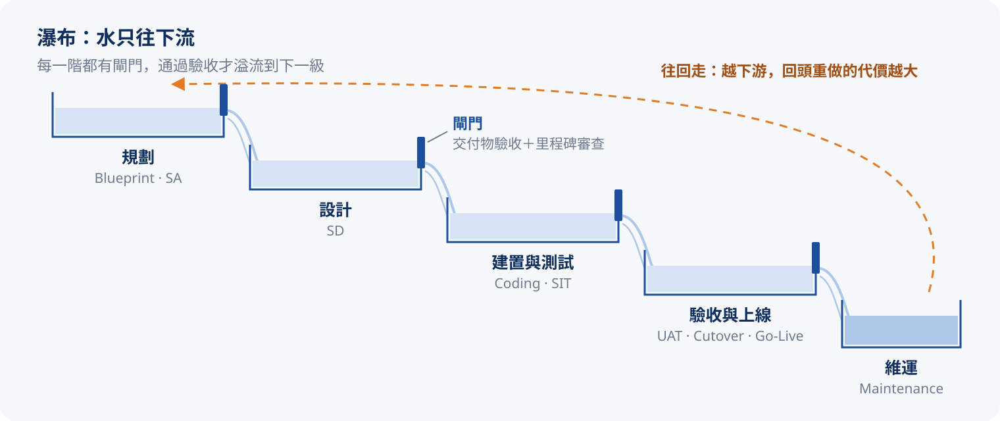
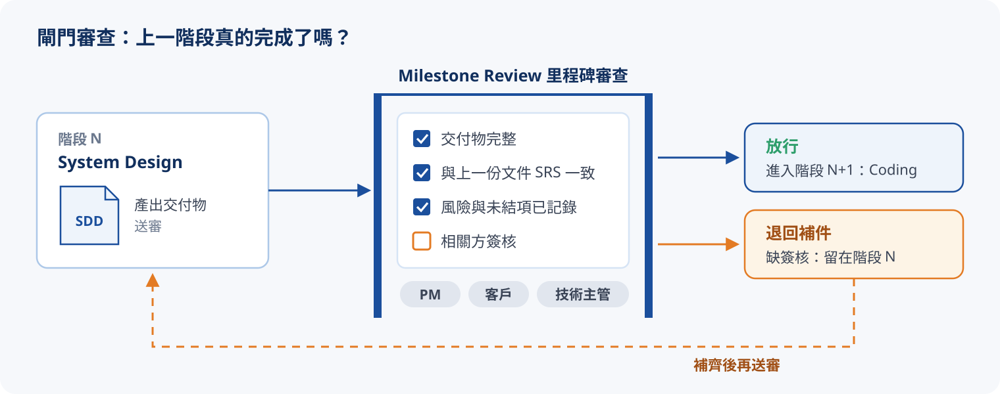
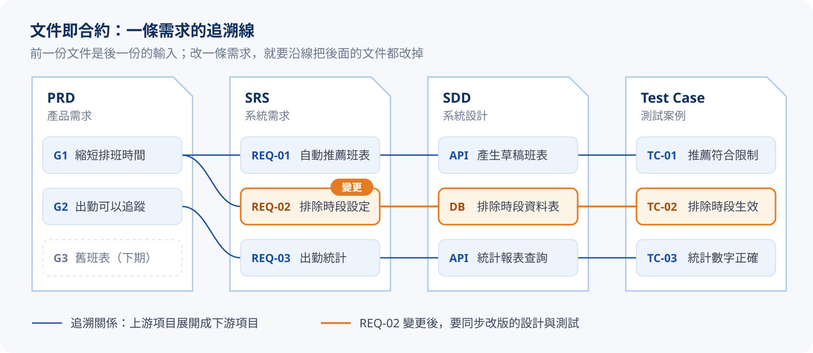

# Waterfall SDLC

前面幾章分清了專案與產品、比較了方法論，也釐清了團隊的角色與職責。這一章再往下鑽，深入最經典的 Waterfall :tip[SDLC]{content="Software Development Life Cycle，軟體開發生命週期：把專案從構思到退役拆解成數個明確階段。"}，看它的**階段、會議與交付物**如何環環相扣。

之所以叫「瀑布」，是因為流程像水一樣單向往下流：每個階段都有一道閘門（交付物驗收、里程碑審查），通過了，水才往下一級流；要往回走，代價很高。

## 九個階段

1. **Blueprint｜藍圖**：確認專案目標、範疇與預期成果，把模糊的想法收斂成可被估算的輪廓。這是整段瀑布最便宜的修改點，凍結後再動，成本就會逐級放大。
2. **System Analysis｜系統分析（SA）**：把藍圖翻譯成「系統做什麼」：訪談需求、釐清業務流程、定義使用者情境，產出需求規格（SRS）與業務流程圖。
3. **System Design｜系統設計（SD）**：把「做什麼」轉成「怎麼做」：系統架構、資料模型、介面、API 規格、權限與整合點都在這裡決定。
4. **Coding｜開發**：依設計文件實作系統。理論上開發者不必再重新「想」需求，只需要把 SDD 變成程式。
5. **System Integration Testing｜系統整合測試（SIT）**：由 QA 進行模組與系統間的整合測試，重點在「整體會不會壞」，而不是「功能對不對」。
6. **User Acceptance Testing｜使用者驗收測試（UAT）**：由用戶端依驗收標準實際操作，確認系統符合業務需求；UAT 通過，代表業務方認可系統可以上線。
7. **Cutover｜切換（視情況）**：正式上線前的切換作業，包含資料移轉、停機計畫、舊系統下線、進退版機制等。全新系統或沒有歷史資料的情境可以略過。
8. **Go-Live｜上線**：系統正式對外運作。從這一刻起，任何修改都是 Production 修改，成本最高。
9. **Maintenance｜維運**：上線後的維護、修補與優化；也是知識回流到下一個專案藍圖的階段。

## 五場管控會議

會議在 Waterfall 中扮演**守門人**的角色：確認「上一階段是否真的完成」。

以 System Design 的里程碑審查為例，一道閘門通常長這樣：

不同位置的閘門由不同的會議把關，五場會議整理如下：

| # | 會議 | 位置 | 用途 |
| :-: | :--- | :--- | :--- |
| 1 | Kickoff Meeting｜啟動會議 | Blueprint | 對齊目標、範疇、角色責任與初步計畫；唯一不審查交付物、而是建立共識的會議 |
| 2 | Milestone Review｜里程碑審查會議 | SA 到 SIT 的各個閘門 | 評估進度與成果、決定是否放行下一階段，是 Waterfall 的節拍器 |
| 3 | UAT Meeting｜使用者驗收會議 | UAT | 讓用戶與利益相關者實際參與驗收、簽署驗收文件，是業務側對系統的正式背書 |
| 4 | Go-Live Meeting｜上線會議 | Cutover 到 Go-Live 之間 | 確認部署計畫、步驟、分工、回退機制與支援資源，讓上線當天沒有意外 |
| 5 | Handover Meeting｜交接會議 | Maintenance | 把成果與文件交接給維運團隊，含專案總結、知識轉移、未結項目與已知風險 |

## 七份交付物

Waterfall 的另一個特徵是**文件即合約**：前一份文件是後一份的輸入，文件鏈跑通了，專案才算真的跑完。

以 DutyMate 為例，每一份文件裡的項目都能往上追到來源、往下追到驗證方式：

這條追溯線，也是後面「變更成本」的根源。七份交付物整理如下：

| # | 交付物 | 產出階段 | 用途 |
| :-: | :--- | :--- | :--- |
| 1 | PRD（Product Requirement Document） | Blueprint | 定義「為什麼要做」與「成功長什麼樣」 |
| 2 | SRS（System Requirement Spec） | System Analysis | 把 PRD 轉成可驗證的系統需求 |
| 3 | SDD（System Design Document） | System Design | 承接 SRS，給出架構與細部設計 |
| 4 | Test Plan / Test Case | SIT | 測試計畫與案例，對應 SRS 與 SDD 中的可驗證項 |
| 5 | UAT Checklist | UAT | 驗收清單，是業務方簽收的依據 |
| 6 | Cutover Plan | Cutover | 切換計畫，含資料移轉、停機計畫、進退版策略 |
| 7 | Maintenance Manual | Go-Live / Handover | 維運手冊，是交接會議的核心交付，封裝專案知識 |

Coding 與 Go-Live 沒有獨立文件：它們的產出分別是程式碼本身與上線本身。

## 階段、會議、交付物一起看

把三張表疊在同一條瀑布上，就能看出它們如何接力。一格一格「通過閘門」，或直接點任一階段：

{/* @ai-visualize
id: pm-sdlc-pipeline
type: motion
prompt: |
  核心洞察：Waterfall 是閘門式的單向流程，階段、會議、交付物三條線對齊在同一條骨幹上；
            每過一道閘門，就多一份文件交棒給下一階段。
  互動：「上一階段 / 通過閘門」逐步推進，「自動播放」依序走完九階段，可重置；點任一階段直接跳轉；
        下方面板顯示目前階段的說明、對應會議與交付物。
  圖形：上方是九個階段方塊排成往右下降的階梯（像水往下流），方塊間有水流線與閘門標記，
        通過的階段填滿藍色、目前階段橘色外框，Cutover 以虛線標示「視情況」；
        中間一列是五場會議的膠囊條，橫跨它負責的階段範圍；
        下方是交付物接力鏈（PRD → SRS → SDD → Test Plan → UAT List → Cutover → Manual），
        已產出的實線、未產出的虛線，本階段剛產出的以橘色強調。
  場景插圖：下方面板左側是目前階段的場景示意，切換階段時重播動畫（藍圖紙上的範疇邊界、業務流程與 SRS、分層架構、逐行長出的程式碼、模組整合連線、驗收清單與簽核、資料移轉與回退、請求流入正式環境、監控異常與知識回流到下個藍圖）。
caption: 一格一格通過閘門，看會議與交付物如何跟著階段接力。
status: generated
*/}
import GeneratedFrame from '@/components/GeneratedFrame.astro'
import PmSdlcPipeline from '@notes/components/pm-sdlc-pipeline'

<GeneratedFrame id="pm-sdlc-pipeline" type="motion" prompt={"核心洞察：Waterfall 是閘門式的單向流程，階段、會議、交付物三條線對齊在同一條骨幹上；\n          每過一道閘門，就多一份文件交棒給下一階段。\n互動：「上一階段 / 通過閘門」逐步推進，「自動播放」依序走完九階段，可重置；點任一階段直接跳轉；\n      下方面板顯示目前階段的說明、對應會議與交付物。\n圖形：上方是九個階段方塊排成往右下降的階梯（像水往下流），方塊間有水流線與閘門標記，\n      通過的階段填滿藍色、目前階段橘色外框，Cutover 以虛線標示「視情況」；\n      中間一列是五場會議的膠囊條，橫跨它負責的階段範圍；\n      下方是交付物接力鏈（PRD → SRS → SDD → Test Plan → UAT List → Cutover → Manual），\n      已產出的實線、未產出的虛線，本階段剛產出的以橘色強調。\n場景插圖：下方面板左側是目前階段的場景示意，切換階段時重播動畫（藍圖紙上的範疇邊界、業務流程與 SRS、分層架構、逐行長出的程式碼、模組整合連線、驗收清單與簽核、資料移轉與回退、請求流入正式環境、監控異常與知識回流到下個藍圖）。\n"} caption="一格一格通過閘門，看會議與交付物如何跟著階段接力。">
  <PmSdlcPipeline client:visible />
</GeneratedFrame>

## Waterfall 的風險：需求變更的成本

單向流程帶來一個結構性風險：需求如果到後期才改，變更必須沿著「設計、開發、測試、文件」一路回頭重做，而且每往後一個階段，要拆掉的東西就越多。[第二章](./pm-02-waterfall-vs-agile.mdx) 看過成本曲線的形狀，這裡換個角度，看**哪些交付物要跟著改版**：

{/* @ai-visualize
id: pm-sdlc-change-ripple
type: motion
prompt: |
  核心洞察：變更越晚發生，要回頭改版的交付物越多，成本越呈指數放大；
            這正是閘門、需求凍結與里程碑審查存在的理由：把問題擋在便宜的前期。
  互動：一排階段按鈕（BP / SA / SD / DEV / SIT / UAT / CUT / GO / MNT）選擇變更發生的時點，
        也可以直接點長條圖；下方說明卡顯示倍數、受影響的產出數量與原因。
  圖形：上方是九個階段的變更成本長條圖（1x 到 80x，示意），選取的階段以橘色強調、之前的階段淡藍；
        下方是產出鏈（PRD、SRS、SDD、程式碼、Test Plan、UAT List、Cutover、Manual）對齊各自的產出階段，
        受影響的產出以橘色實線標示「需改版」，並有一條從變更點回流到 PRD 的虛線箭頭，標示「回頭重做 n 份產出」。
  資料/數值：倍數 1 / 1.5 / 2.5 / 5 / 10 / 20 / 35 / 60 / 80（示意）。
  插圖：產出鏈的每一份產出畫成可辨識的縮圖（PRD 目標、SRS 編號清單、SDD 架構方塊、程式碼編輯器、測試表格、驗收清單與簽名、新舊系統切換、維運手冊），受影響的縮圖加上修訂斜線與「改版」角標；說明卡左側是「改版文件堆」，受影響的產出一張張疊上來，上線之後再加上「線上系統」。
caption: 選一個變更發生的時點，看成本與需要改版的產出如何一起放大。
status: generated
*/}
import PmSdlcChangeRipple from '@notes/components/pm-sdlc-change-ripple'

<GeneratedFrame id="pm-sdlc-change-ripple" type="motion" prompt={"核心洞察：變更越晚發生，要回頭改版的交付物越多，成本越呈指數放大；\n          這正是閘門、需求凍結與里程碑審查存在的理由：把問題擋在便宜的前期。\n互動：一排階段按鈕（BP / SA / SD / DEV / SIT / UAT / CUT / GO / MNT）選擇變更發生的時點，\n      也可以直接點長條圖；下方說明卡顯示倍數、受影響的產出數量與原因。\n圖形：上方是九個階段的變更成本長條圖（1x 到 80x，示意），選取的階段以橘色強調、之前的階段淡藍；\n      下方是產出鏈（PRD、SRS、SDD、程式碼、Test Plan、UAT List、Cutover、Manual）對齊各自的產出階段，\n      受影響的產出以橘色實線標示「需改版」，並有一條從變更點回流到 PRD 的虛線箭頭，標示「回頭重做 n 份產出」。\n資料/數值：倍數 1 / 1.5 / 2.5 / 5 / 10 / 20 / 35 / 60 / 80（示意）。\n插圖：產出鏈的每一份產出畫成可辨識的縮圖（PRD 目標、SRS 編號清單、SDD 架構方塊、程式碼編輯器、測試表格、驗收清單與簽名、新舊系統切換、維運手冊），受影響的縮圖加上修訂斜線與「改版」角標；說明卡左側是「改版文件堆」，受影響的產出一張張疊上來，上線之後再加上「線上系統」。\n"} caption="選一個變更發生的時點，看成本與需要改版的產出如何一起放大。">
  <PmSdlcChangeRipple client:visible />
</GeneratedFrame>

:::warning{title="所以才要閘門"}
各階段的閘門、需求凍結與里程碑審查，目的都一樣：**盡早凍結、盡早驗收**，把問題擋在便宜的前期。真的非改不可，就走 [第一章](./pm-01-project-vs-product.mdx) 提到的變更管理流程（CR），把影響評估清楚再動手。
:::

## 小結

| # | 階段 | 對應會議 | 該階段交付物 |
| :-: | :--- | :--- | :--- |
| 1 | Blueprint | Kickoff Meeting | PRD |
| 2 | System Analysis（SA） | Milestone Review | SRS |
| 3 | System Design（SD） | Milestone Review | SDD |
| 4 | Coding | Milestone Review | 程式碼本身 |
| 5 | SIT | Milestone Review | Test Plan / Case |
| 6 | UAT | UAT Meeting | UAT Checklist |
| 7 | Cutover（視情況） | Go-Live Meeting | Cutover Plan |
| 8 | Go-Live | Go-Live Meeting | 上線本身 |
| 9 | Maintenance | Handover Meeting | Maintenance Manual |

:::tip{title="下一章"}
觀念與流程都有了，最後一章看怎麼把它們落地：WBS、Gantt、Kanban、Task 這幾種工具如何分工與串接。前往 [第五章：專案管理工具](./pm-05-pm-tools.mdx)，或回到 [學習地圖](./pm-00-learning-map.mdx)。
:::
