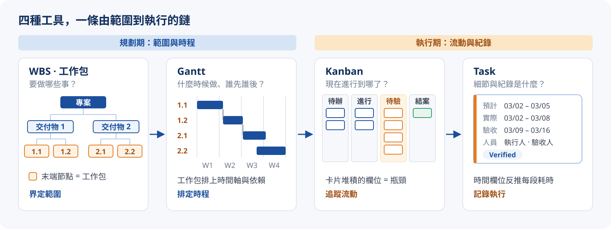
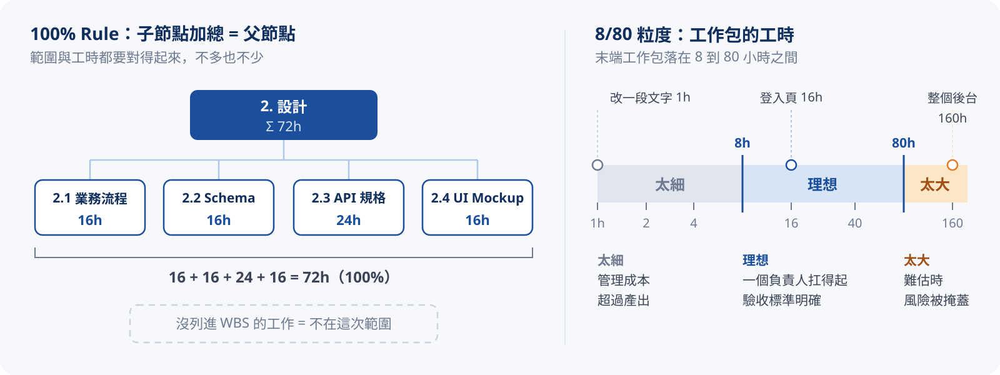
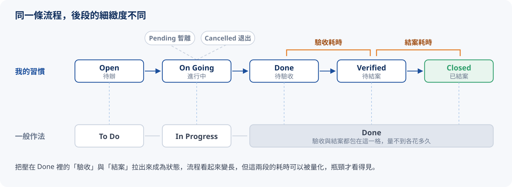
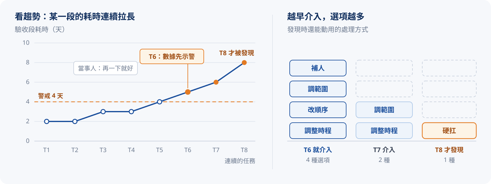

# Mgmt. Tool（管理工具）

前面幾章談的大多是觀念：專案與產品的差異、方法論的選擇、角色職責的分工，以及 Waterfall 的流程。這一章把觀念轉成可以落地的具體作法，也就是**專案管理工具**。

實際上的工具當然不只這些。下面幾項是依過去經驗整理出來、可以按層級區分使用情境的：

| 工具 | 回答的問題 | 層級 |
| :--- | :--------- | :--- |
| WBS | 要做哪些事？（範圍） | 規劃 |
| 工作包 | 範圍拆到最小是哪一塊？（最小交付單位） | 拆解 |
| Gantt | 什麼時候做、誰先誰後？（時程與依賴） | 排程 |
| Kanban | 現在進行到哪了？（流動狀態） | 追蹤 |
| Task | 這件事的細節與紀錄是什麼？（執行） | 執行 |



## WBS（Work Breakdown Structure）

:::tip
**工作分解結構**：把專案的最終交付物，由上而下層層拆解成可以被管理、估時、指派的工作單元；最末端的單元嚴格來說稱為 **Work Package（工作包）**。
:::

### 結構特性

- **樹狀結構**：專案總目標 → 主要交付物 → 子交付物 → 工作包
- **100% Rule**：子節點的總和必須等於父節點的全部範圍，總工時也一樣
- 以「**交付物、成果**」為導向，而不是以「動作」為導向（避免拆成一堆動詞清單）

### 拆解的粒度

一個末端工作包的工時，建議落在 **8 到 80 小時**之間：

- **太大**：難以估時與追蹤，風險被掩蓋
- **太細**：管理成本超過實際產出的價值
- **理想**：能被一個負責人扛起，而且驗收標準明確



### 為什麼 PM 需要 WBS

- **確認範圍**：沒列進 WBS 的東西，預設就不在這次專案內
- **估算的基礎**：沒有拆解，就沒有工時與成本估算
- **風險識別**：拆解過程會浮現原本沒想到的依賴與盲點
- **指派責任**：每個工作包都要有明確的負責人（呼應 [第三章](./pm-03-role-responsibility.mdx) RACI 裡的 R）
- **承接後續工具**：Gantt、Kanban、Task 都是以末端工作包為基礎再展開

### 範例：DutyMate 值日生排班系統

以我正在跑的 Side Project「DutyMate」（值日生排班 App）為例，把 PRD 的範圍拆成 WBS：

```text title="DutyMate WBS"
DutyMate 值日生排班系統
├── 1. 需求與規劃
│   ├── 1.1 痛點訪談與需求確認
│   ├── 1.2 PRD 定稿與待釐清項確認
│   └── 1.3 範圍與里程碑確認
├── 2. 設計
│   ├── 2.1 業務流程與 Use Case
│   ├── 2.2 資料庫 Schema 設計
│   ├── 2.3 API 規格設計
│   └── 2.4 UI Mockup
├── 3. 開發
│   ├── 3.1 基礎建設與權限（專案骨架、登入、用戶管理、角色權限）
│   ├── 3.2 活動設定與排除時段（活動設定、排除時段、排班限制表）
│   ├── 3.3 草稿班表與推薦演算法（推薦演算法、排班統計、班表發布）
│   ├── 3.4 正式班表與檢視（篩選值日生、工作任務備註、無法出勤標記）
│   └── 3.5 出勤統計與過往班表匯入
├── 4. 測試
│   ├── 4.1 單元測試（Jest）
│   ├── 4.2 系統整合測試（SIT）
│   └── 4.3 使用者驗收測試（UAT）
└── 5. 上線
    ├── 5.1 Docker 部署設定
    ├── 5.2 Cutover 與 Go-Live
    └── 5.3 上線後監控與保固
```

### WBS 加上時間欄位，就是 Gantt

使用 WBS 時，通常會搭配 Gantt 排程：直接在 WBS 上加時間欄位（開始日、工時）來反推時程，再搭配 Task 記錄每個任務的細節與討論。

我習慣在 WBS 上直接加負責人（PIC）與進度欄位，這樣排程與指派可以一次完成。下面把上面的 WBS 加上 PIC 與工時，右側時程依「同一個人不能同時做兩件事、前一個階段結束後下一階段才開始」自動排出來：

{/* @ai-visualize
id: pm-wbs-gantt
type: free
prompt: |
  核心洞察：WBS 的 100% Rule 讓每個彙總節點都等於子工作包加總；8/80 粒度規則讓工作包可估、可追蹤；
            在 WBS 上加工時與 PIC 欄位，時程就能自動推出來，這就是 Gantt。
  互動：每個工作包的工時可以直接編輯、可以刪除（刪除即移出範圍），彙總節點即時重算；
        名稱前的狀態圖示依 8/80 規則標示過短 / 合理 / 過長，點擊看建議；可重置。
  圖形：左側是凍結欄的 WBS 表（工作項目 / PIC / 工時，根節點與階段節點顯示 Σ 加總），
        右側是對齊每一列的甘特時間軸（以週為刻度），工作包依 PIC 與階段依賴自動排程，
        長條顏色對應粒度狀態，階段列顯示整段跨度。
  資料/數值：DutyMate 的 18 個工作包，預設總工時 452 小時、每天 8 小時。
caption: 改工時或刪工作包，看 100% Rule 加總與右側時程如何一起變動；狀態圖示依 8/80 規則標示粒度。
status: generated
*/}
import GeneratedFrame from '@/components/GeneratedFrame.astro'
import PmWbsGantt from '@notes/components/pm-wbs-gantt'

<GeneratedFrame id="pm-wbs-gantt" type="free" prompt={"核心洞察：WBS 的 100% Rule 讓每個彙總節點都等於子工作包加總；8/80 粒度規則讓工作包可估、可追蹤；\n          在 WBS 上加工時與 PIC 欄位，時程就能自動推出來，這就是 Gantt。\n互動：每個工作包的工時可以直接編輯、可以刪除（刪除即移出範圍），彙總節點即時重算；\n      名稱前的狀態圖示依 8/80 規則標示過短 / 合理 / 過長，點擊看建議；可重置。\n圖形：左側是凍結欄的 WBS 表（工作項目 / PIC / 工時，根節點與階段節點顯示 Σ 加總），\n      右側是對齊每一列的甘特時間軸（以週為刻度），工作包依 PIC 與階段依賴自動排程，\n      長條顏色對應粒度狀態，階段列顯示整段跨度。\n資料/數值：DutyMate 的 18 個工作包，預設總工時 452 小時、每天 8 小時。\n"} caption="改工時或刪工作包，看 100% Rule 加總與右側時程如何一起變動；狀態圖示依 8/80 規則標示粒度。">
  <PmWbsGantt client:visible />
</GeneratedFrame>

:::info{title="範本"}
我用 Excel 做了一份已套好基礎欄位的 [WBS 範本](https://stevelin-notecraft.netlify.app/downloads/20260616%20WBS-template.xlsx)，有需要可以下載。Excel 官網也有其他 [Gantt 範本](https://excel.cloud.microsoft/create/en/gantt-charts/) 可以參考。
:::

## Kanban（看板）

:::tip
源自豐田生產系統，核心是**把工作流視覺化**，並**限制在製品數量**（:tip[WIP]{content="Work In Progress，在製品：同一時間正在進行、尚未完成的工作。"}），讓任務在流程中順暢流動，也讓瓶頸無所遁形。
:::

### 基本元素

| 元素 | 說明 |
| :--- | :--- |
| Board（看板） | 代表整個工作流的板子 |
| Column（欄位） | 對應工作流的每個階段，例如 To Do / In Progress / Review / Done |
| Card（卡片） | 對應一個 Task，在欄位之間由左往右流動 |
| WIP Limit | 每個欄位同時可以存在的卡片數量上限 |
| Swimlane（泳道） | 橫向切分，區分不同類型的工作（新功能、Bug、技術債）或不同產品線 |

### 核心精神

- **視覺化**：所有人一眼看到目前狀態與卡關處
- **限制 WIP**：強迫團隊「先完成、再開始」，避免同時推太多、卻沒有一件結案
- **管理流動**：關注 :tip[Lead Time]{content="前置時間：從需求建立到交付完成的總時間，反映使用者等待的時間。"} 與 :tip[Cycle Time]{content="週期時間：從實際開始動工到完成的時間，反映團隊的執行效率。"}，用來反推流程上的瓶頸與改善效果（指標之後再獨立整理）
- **明確的流程政策**：每個欄位的進入條件與完成定義要寫清楚。例如推進到 Done 的條件是「開發完成功能並交付技術文件，且 PM 通過功能測試」，而不是「我覺得我做完了」
- **持續改善**：定期檢視瓶頸，調整欄位與 WIP 上限

:::tip{title="我的習慣：先別急著卡死 WIP" collapsible}
我自己不會特別去限制 WIP。看 Kanban 就知道目前大部分的任務堆在哪個階段，也可以用 Lead Time、Cycle Time 的數據反推瓶頸；一開始就把 WIP 卡死，反而會失去這些訊號。
:::

### 為什麼 PM 適合用 Kanban

- **進度透明**：不必開會問進度，看板本身就是進度
- **瓶頸可視化**：哪個欄位卡片堆積，那裡就是當前瓶頸（通常是 Review 或驗收）
- **與 WBS 搭配**：WBS 末端工作包展開出的 Task，可以一張張變成卡片直接進入流動

### 實務小提醒

- WIP Limit 一開始設寬一點，再依實際狀況收斂，比一開始就卡死好
- Done 一定要有明確的驗收標準，否則會變成「我覺得我做完了」
- 卡片一定要有負責人，沒人負責的卡片等於沒人在推
- 定期清理卡片：長期沒被動到的卡片，要嘛刪掉、要嘛降級成想法清單，否則看板會越來越亂

### 我的看板狀態設計

我自己的 Task 狀態流是這樣設計的：

```text
Open ──→ On Going ──→ Done ──→ Verified ──→ Closed
(待辦)    (進行中)    (待驗收)   (待結案)     (已結案)
```

:::info
Pending 與 Cancelled 我不放成欄位，而是用卡片標籤或泳道處理：它們不是流程上正常的往前推進，而是「暫時離開流動」或「退出流動」。
:::

點卡片把它往右推，把 WIP 上限調小，看看哪一欄先塞住：

{/* @ai-visualize
id: pm-kanban-flow
type: free
prompt: |
  核心洞察：WIP 上限強迫團隊「先完成、再開始」；卡片堆積的欄位就是瓶頸；
            Pending 與 Cancelled 是離開流動，不佔欄位 WIP。
  互動：點卡片推進到下一欄；On Going 與 Verified 兩欄可用 +/- 調整 WIP 上限，達上限時推入會被擋下並提示；
        卡片可標記 Pending（暫離）或 Cancelled（退出），移到下方「離開流動」泳道，Pending 可恢復到原欄位；可重置。
  圖形：五欄看板（Open / On Going / Done / Verified / Closed），每欄標頭顯示張數與 WIP，
        下方細長容量條顯示佔用比例，達上限時整欄轉為橘色底；已結案卡片以完成色呈現；
        底部說明列即時指出目前卡片最多的欄位。
caption: 點卡片往右推、調整 WIP 上限，看瓶頸在哪一欄浮現；Pending / Cancelled 會離開流動。
status: generated
*/}
import PmKanbanFlow from '@notes/components/pm-kanban-flow'

<GeneratedFrame id="pm-kanban-flow" type="free" prompt={"核心洞察：WIP 上限強迫團隊「先完成、再開始」；卡片堆積的欄位就是瓶頸；\n          Pending 與 Cancelled 是離開流動，不佔欄位 WIP。\n互動：點卡片推進到下一欄；On Going 與 Verified 兩欄可用 +/- 調整 WIP 上限，達上限時推入會被擋下並提示；\n      卡片可標記 Pending（暫離）或 Cancelled（退出），移到下方「離開流動」泳道，Pending 可恢復到原欄位；可重置。\n圖形：五欄看板（Open / On Going / Done / Verified / Closed），每欄標頭顯示張數與 WIP，\n      下方細長容量條顯示佔用比例，達上限時整欄轉為橘色底；已結案卡片以完成色呈現；\n      底部說明列即時指出目前卡片最多的欄位。\n"} caption="點卡片往右推、調整 WIP 上限，看瓶頸在哪一欄浮現；Pending / Cancelled 會離開流動。">
  <PmKanbanFlow client:visible />
</GeneratedFrame>

## Task（任務）

一個任務要包含足夠的資訊，才有助於追蹤管理。

### 時間欄位

- 預計完成起訖時間
- 實際完成起訖時間
- 驗收起訖時間
- 上線時間

### 人員欄位

- 需求提案人
- 需求審核人
- 執行人
- 驗收人
- 上線審核人

### 狀態

一般作法比較精簡，推到「已完成」就收尾；我自己則把「驗收」與「結案」獨立成可以追蹤的狀態。

::::tabs
:::tab{label="一般作法"}
| 狀態 | 說明 |
| :--- | :--- |
| To Do | 已建立，但還沒開始 |
| In Progress | 正在進行中，尚未完成 |
| Done | 已完成，且通過驗收 |
:::
:::tab{label="我的習慣"}
| 狀態 | 說明 |
| :--- | :--- |
| Open | 任務建立了，但還沒開始 |
| On Going | 正在進行中，尚未完成 |
| Done | 已完成，等待驗收 |
| Verified | 驗收通過，等待結案 |
| Closed | 正式結案 |
| Pending | 暫停（有問題待解，或優先級調整） |
| Cancelled | 取消（有更好的方案，或資源不足） |
:::
::::

### 兩套狀態的對照

這兩套其實是同一條流程，差別在後段的細緻度。一般作法推到 Done 就結束，因為 Done 已經把驗收與結案包進去了。

| 我的習慣 | 一般作法 | 說明 |
| :------- | :------- | :--- |
| Open | To Do | 已建立、尚未開始，完全對應 |
| On Going | In Progress | 進行中，完全對應 |
| Done | Done | 開發完成、待驗收；但我的 Done 只是中段，不是終點 |
| Verified | （包含在 Done 裡） | 驗收通過，一般作法不另立狀態 |
| Closed | （包含在 Done 裡） | 正式結案，一般作法不另立狀態 |



換句話說，我多出來的 Verified 與 Closed，是把壓在 Done 裡的「驗收」與「結案」拉出來，變成可以追蹤的狀態。代價是流程看起來變長；好處是「完成到驗收」「驗收到上線」這兩段的耗時可以被量化，瓶頸才看得見。

### 為什麼要這麼多時間欄位

對使用者來說，最關心的往往只有一個時間點：什麼時候上線。但對 PM 來說，上線時間只是其中一個要素；把眼光拉到產品的長期推進，重點就不只是「準時上線」，而是**讓每一次的規劃都比上一次更準**。

這就是為什麼光是「完成時間」都要拆成「預計」與「實際」兩欄：兩者的差距就是估時誤差。長期記錄下來，團隊才能逐步縮小落差，讓之後的時程估算越來越可靠。

把時間欄位攤開之後，真正的價值在於**反推每一段的耗時，找出流程瓶頸**：

| 區間 | 反映的問題 |
| :--- | :--------- |
| 建立 → 開始（Open → On Going） | 問題還在釐清、資源不足或優先級不清；等越久代表前置壅塞越嚴重 |
| 開始 → 完成（實際完成起訖） | 執行的工作量與估時準確度；和「預計」對照就是估時誤差的來源 |
| 完成 → 驗收（Done → Verified） | 驗收方的負荷；常被忽略卻最容易卡關（驗收人沒空、標準不清） |
| 驗收 → 上線（Verified → 上線） | 上線審核或部署排程卡關 |

能看出「卡的不是開發、而是驗收」或「估時總是低估」這類模式時，時間欄位才從單純的紀錄，變成改善流程與校正估時的依據。

下面四種情境的總耗時都是 14 天。先用「合併視角」看，再切到「攤開視角」，沿著「介入前、介入中、介入後」看症狀、病因與處方：

{/* @ai-visualize
id: pm-task-bottleneck
type: free
prompt: |
  核心洞察：只記錄上線時間，四種情境看起來一模一樣；時間欄位攤開，瓶頸才會現形，
            而且四種瓶頸的病因不同、處方也不同。
  互動：四個情境按鈕（前置壅塞 / 估時失準 / 驗收塞車 / 上線延宕）；「合併視角 / 攤開視角」切換；
        攤開後可沿「介入前（察覺症狀）→ 介入中（診斷病因）→ 介入後（開立處方）」三步走查，
        走到處方時時間軸顯示疏通後的效果。
  圖形：以天為刻度的時間軸。合併視角只有一條灰色的「建立 → 上線 14 天」長條；
        攤開視角拆成四段（建立、開始、完成、驗收、上線五個節點），瓶頸段標橘色，
        「開始 → 完成」上方有虛線的「預計 4 天」對照；開立處方後瓶頸段縮短並轉為完成色，
        原本的長度以虛線外框保留，右上標出少了幾天。
  資料/數值：四段天數 前置壅塞 8/4/1/1、估時失準 1/9/2/2、驗收塞車 1/4/8/1、上線延宕 1/4/2/7。
caption: 同樣 14 天，攤開時間欄位才看得出卡在哪；再沿症狀、病因、處方走一遍。
status: generated
*/}
import PmTaskBottleneck from '@notes/components/pm-task-bottleneck'

<GeneratedFrame id="pm-task-bottleneck" type="free" prompt={"核心洞察：只記錄上線時間，四種情境看起來一模一樣；時間欄位攤開，瓶頸才會現形，\n          而且四種瓶頸的病因不同、處方也不同。\n互動：四個情境按鈕（前置壅塞 / 估時失準 / 驗收塞車 / 上線延宕）；「合併視角 / 攤開視角」切換；\n      攤開後可沿「介入前（察覺症狀）→ 介入中（診斷病因）→ 介入後（開立處方）」三步走查，\n      走到處方時時間軸顯示疏通後的效果。\n圖形：以天為刻度的時間軸。合併視角只有一條灰色的「建立 → 上線 14 天」長條；\n      攤開視角拆成四段（建立、開始、完成、驗收、上線五個節點），瓶頸段標橘色，\n      「開始 → 完成」上方有虛線的「預計 4 天」對照；開立處方後瓶頸段縮短並轉為完成色，\n      原本的長度以虛線外框保留，右上標出少了幾天。\n資料/數值：四段天數 前置壅塞 8/4/1/1、估時失準 1/9/2/2、驗收塞車 1/4/8/1、上線延宕 1/4/2/7。\n"} caption="同樣 14 天，攤開時間欄位才看得出卡在哪；再沿症狀、病因、處方走一遍。">
  <PmTaskBottleneck client:visible />
</GeneratedFrame>

### 發現瓶頸之後

時間欄位指出瓶頸卡在哪一段，但這只是第一步。更現實的問題是：很多時候，瓶頸根本不會有人主動講出來。

工程師常常埋頭苦幹，也容易報喜不報憂（其實就是在說我自己）：卡關了不一定會主動反應，問起來還會說「再一下就好」，結果一路拖到火燒屁股才被發現，那時往往已經錯過最便宜的處理時機。

所以瓶頸數據真正的價值，是讓 PM **不必等人開口就能及早發現異常**：

- **看趨勢，不只看單點**：某一段的耗時連續幾次都在拉長，就算當事人說「沒事」，數據已經先示警了
- **主動把問題攤開來談**：與其等對方求救，不如拿著數據先問「這段最近卡比較久，是不是遇到什麼困難？」，把「報憂」的責任從個人轉移到流程上
- **早一點介入，便宜一點解決**：瓶頸越早抓到，可以動用的選項（補人、調範圍、改順序）越多；拖到最後，常常只剩硬扛一條路



:::tip
工具與數據不會自己解決問題，它們的作用是把「靠運氣發現」變成「靠機制發現」。尤其當團隊裡有像我這種不太會主動喊卡的人時，這層保險特別重要。
:::

## 小結

這幾項工具不是各做各的，而是互相輔助：

| 工具 | 在流程中的角色 | 我的使用情境 |
| :--- | :------------- | :----------- |
| WBS | 把交付物由上而下拆解，界定整個專案的範圍 | 專案啟動、要確認「做什麼、不做什麼」時先攤開 |
| 工作包 | WBS 的末端節點，範圍的最小單位（以成果命名） | 拆到「能被一個人扛起、驗收標準明確」就停（8/80 規則） |
| Gantt | 把工作包排上時間軸，看起訖、依賴與整體時程 | 直接在 WBS 上加開始日、工時欄位反推時程 |
| Kanban | 追蹤展開後 Task 的流動狀態，讓瓶頸現形 | 日常推進時看哪一欄堆積，反推卡點（通常是驗收） |
| Task | 工作包展開出的執行單元，記錄人、時間、狀態 | 用細緻的時間欄位反推每段耗時、校正估時 |

:::tip{title="實務上怎麼用"}
我不會把這幾套工具當成獨立的文件分別維護，而是按層級區分：專案的運行全貌，用 WBS 加上時間欄位，它就同時是 Gantt；末端的實際執行，則用 Kanban 與 Task 記錄。

- **範圍與時程**（WBS、工作包、Gantt）偏規劃期使用
- **流動與紀錄**（Kanban、Task）偏執行期使用
:::

:::note{title="系列回顧"}
從「在管什麼」（專案 vs 產品）、「怎麼做」（方法論）、「誰來做」（R&R）、「經典怎麼跑」（Waterfall SDLC），一路走到「用什麼做」（工具）。回到 [學習地圖](./pm-00-learning-map.mdx) 看整條路徑。
:::
