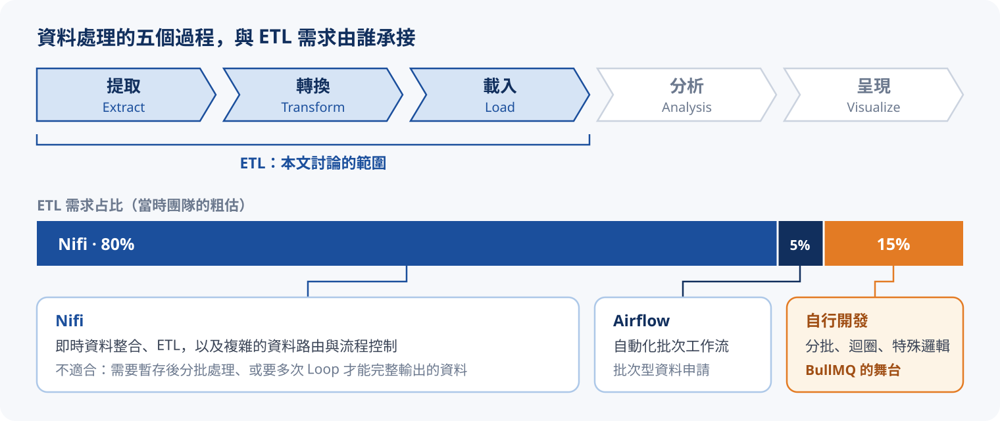
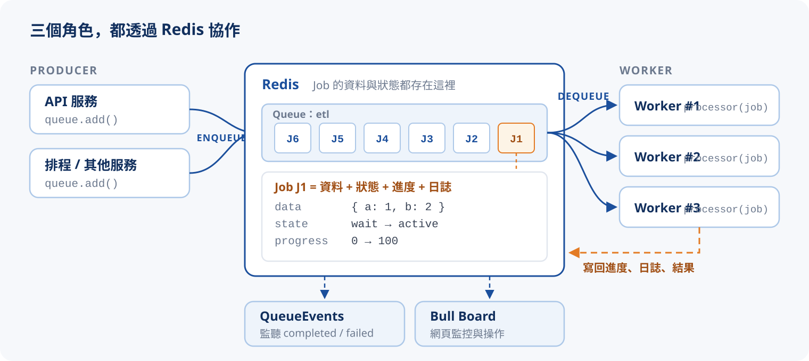
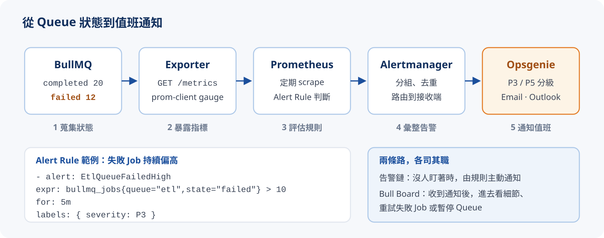

# BullMQ 入門

:::note{title="來源"}
本篇改寫自 2023/11/09 的內部技術主題分享「利用 BullMQ 簡單有效打造高可靠度的程式」，並參考 [BullMQ 官網](https://bullmq.io/) 與官方文件，補上目前版本（v5）的寫法。
:::

寫過背景任務的人大概都有類似經驗：一開始只是一個 `setInterval` 或 cron，接著要補重試、補日誌、補「跑到哪了」的進度、補失敗通知，最後還得回答「昨天那批資料為什麼少了三筆」。**BullMQ 把這些每次都要重寫的基礎建設，收斂成一個以 Redis 為底的佇列函式庫。**

## 為什麼需要 BullMQ

### 資料處理的五個過程

開發資料相關的服務時，大致會經過五個過程：

| 過程 | 做什麼 |
| :--- | :--- |
| 提取 Extract | 從資料庫、檔案、API、感測器、網頁等來源收集資料，可以是定期抽取、監看或即時串流 |
| 轉換 Transform | 把原始資料轉成需要的格式：轉型、聚合、合併、拆分、計算衍生指標 |
| 載入 Load | 把處理後的資料存到合適的位置：資料庫、資料倉儲、分散式儲存 |
| 分析 Analysis | 以統計、機器學習等方法從資料中取得洞察 |
| 呈現 Visualize | 把分析結果做成圖表、報告、儀表板給使用者或決策者 |

其中前三個就是常說的 :tip[ETL]{content="Extract、Transform、Load 的縮寫：提取、轉換、載入，是資料整合最核心的三個步驟。"}，也是本篇的主角。

### 現成工具只涵蓋大部分情境

當時團隊的 ETL 主要靠兩個現成工具：**Nifi** 負責即時整合與資料路由，**Airflow** 負責批次排程的工作流。但總有一塊需求兩者都不順手：



需要**暫存後分批處理**、要**跑好幾輪迴圈**才能輸出完整結果、或帶有**特殊商業邏輯**的任務，最後都只能自己寫 Job / Schedule。

### 自行開發會遇到的痛點

自己寫一支「會動」的 Job 不難，難的是讓它**可靠、可觀察、可維運**。當時整理出的痛點大致分成四類：

| 類別 | 痛點 |
| :--- | :--- |
| 容錯 | 容錯處理、重拋機制、Retry 機制與間隔（Retry Interval）、例外處理、錯誤代碼定義 |
| 可觀測性 | 日誌、流程追蹤、Metric、異常監控、異常通知；沒有可視化介面、不易排查錯誤 |
| 流量控制 | 背壓設計、設定緩衝區、FIFO / LIFO 的處理順序、手動觸發 |
| 維運 | Graceful Shutdown、災難復原、難以進行還原測試 |

每一項單獨做都不難，但全部自己刻、而且每個專案都刻一次，就是很大的成本。這正是 BullMQ 想解決的問題。

## BullMQ 是什麼

BullMQ 是一個以 Redis 為基礎的分散式任務佇列（distributed job queue），最早是 Node.js 函式庫，也是舊版 [Bull](https://github.com/OptimalBits/bull) 的繼任者。官網列出的主要特色：

| 特色 | 說明 |
| :--- | :--- |
| 延遲任務 Delayed jobs | 指定在某個時間點或一段時間後才執行，精度到毫秒，服務重啟也不會遺失 |
| 優先序 Priority | 為 Job 設定優先序，重要的任務先處理 |
| 自動重試 Auto retry | 失敗時自動重試，支援 fixed / exponential 退避與自訂策略 |
| 排程 Job Schedulers | 用 cron 表示式或固定間隔產生重複任務 |
| 流程 Flows | 父子 Job 的相依關係，子 Job 全部完成後才處理父 Job |
| 流量控制 Flow control | 以佇列為單位限流（rate limit）、Job 去重（deduplication） |
| 事件 Events | 監聽 completed、failed、progress 等事件，即時掌握佇列狀態 |
| 跨語言 Interoperability | 官方支援 Node.js、Bun、Python、.NET、Rust、Elixir、PHP，生產端與消費端可以用不同語言 |

:::warning{title="前提：需要 Redis"}
BullMQ 的所有狀態都存在 Redis，Standalone、Cluster、Sentinel（哨兵）模式都支援，也可以直接建在 K8s 環境裡。Redis 建議把 `maxmemory-policy` 設為 `noeviction`，避免記憶體吃緊時 Job 資料被悄悄淘汰。
:::

## 三個核心角色：Queue、Job、Worker

BullMQ 裡的 MQ 就是 :tip[Message Queue]{content="訊息佇列：生產者把訊息放進佇列、消費者從佇列取出處理，兩端不必同時在線，也不必知道彼此。"}。寫進佇列的資料都包在 **Job** 這個載體裡，Job 的資料與狀態都記錄在 Redis：



| 角色 | 職責 |
| :--- | :--- |
| `Queue` | 生產端。用 `queue.add()` 把 Job 放進佇列，也負責暫停、恢復、查詢數量等管理操作 |
| `Job` | 在佇列中流動的單位，帶著 `data`，並記錄狀態、進度、日誌、結果、嘗試次數 |
| `Worker` | 消費端。從佇列取出 Job 交給 processor 函式執行；可以開很多個、分散在不同機器 |
| `QueueEvents` | 監聽佇列上發生的事件，例如某個 Job 完成或失敗 |

因為 Producer 與 Worker 之間只隔著 Redis，**兩端可以獨立部署、獨立擴充**：流量大就多開幾個 Worker，不用動到 Producer。

### 最小可執行範例

```bash
npm install bullmq
```

:::annotate
```ts title="queue.ts"
import { Queue, Worker, QueueEvents } from 'bullmq';

const connection = { host: 'localhost', port: 6379, maxRetriesPerRequest: null }; // (1)!

// 生產端：把 Job 放進 etl 佇列
const queue = new Queue('etl', { connection });
await queue.add('sum', { a: 1, b: 2 }); // (2)!

// 消費端：處理 etl 佇列裡的 Job
const worker = new Worker(
  'etl',
  async (job) => {
    const c = job.data.a + job.data.b;
    return { ...job.data, c }; // (3)!
  },
  { connection, concurrency: 5 }, // (4)!
);

// 監聽事件
const events = new QueueEvents('etl', { connection });
events.on('completed', ({ jobId, returnvalue }) => console.log(jobId, returnvalue));
events.on('failed', ({ jobId, failedReason }) => console.error(jobId, failedReason));
```

1. Worker 使用的 ioredis 連線必須設 `maxRetriesPerRequest: null`，否則 BullMQ 會拋出警告，斷線時也可能錯誤地中止等待。
2. 第一個參數是 Job 名稱（同一佇列可放不同種類的 Job），第二個是要傳遞的資料，必須可以 JSON 序列化。
3. processor 的回傳值會存成 Job 的 `returnvalue`；拋出例外則視為失敗。
4. `concurrency` 決定一個 Worker 同時處理幾個 Job；要再擴充就多開幾個 Worker 行程。
:::

## Job 是資料，也是紀錄

BullMQ 和 Nifi 最大的不同在於：**佇列本身就可以做邏輯處理**，而且處理前的 `data`、處理後的 `returnvalue`，以及過程中的進度與日誌，全部保存在 Redis，事後可以追查。一步一步看一筆 Job 被處理時，Redis 裡的紀錄如何變化：

{/* @ai-visualize
id: bullmq-job-anatomy
type: motion
prompt: |
  核心洞察：Job 不只是傳遞資料的信封，它本身就是一份持續更新的紀錄；
            運算前後的資料、進度、日誌都寫回 Redis，所以事後能追查「處理到哪、結果是什麼」。
  互動：四個步驟（加入佇列、Worker 取出、運算與回報進度、完成並保存結果），可點步驟、上一步 / 下一步、自動播放、重置。
  圖形：上方是 Producer → Queue（Redis）→ Worker 三個方塊的流程圖，這筆 Job 以橘色方塊在三者間移動，
        底下附進度條與百分比；運算階段畫一條從 Worker 回寫 Redis 的虛線。
        下方左側是 producer / worker 的程式碼，高亮本步驟執行的行；右側是「Redis 中的 Job 紀錄」表格
        （state、data、progress、logs、returnvalue、processedOn、finishedOn），本步驟有變動的欄位以橘底與「更新」標籤強調。
  資料/數值：data { a: 1, b: 2 }，運算 c = a + b，進度 0 → 50 → 100，returnvalue { a: 1, b: 2, c: 3 }。
caption: 一步一步處理一筆 Job，看程式碼與 Redis 紀錄如何同步變化
status: generated
*/}
import GeneratedFrame from '@/components/GeneratedFrame.astro'
import BullmqJobAnatomy from '@notes/components/bullmq-job-anatomy'

<GeneratedFrame id="bullmq-job-anatomy" type="motion" prompt={"核心洞察：Job 不只是傳遞資料的信封，它本身就是一份持續更新的紀錄；\n          運算前後的資料、進度、日誌都寫回 Redis，所以事後能追查「處理到哪、結果是什麼」。\n互動：四個步驟（加入佇列、Worker 取出、運算與回報進度、完成並保存結果），可點步驟、上一步 / 下一步、自動播放、重置。\n圖形：上方是 Producer → Queue（Redis）→ Worker 三個方塊的流程圖，這筆 Job 以橘色方塊在三者間移動，\n      底下附進度條與百分比；運算階段畫一條從 Worker 回寫 Redis 的虛線。\n      下方左側是 producer / worker 的程式碼，高亮本步驟執行的行；右側是「Redis 中的 Job 紀錄」表格\n      （state、data、progress、logs、returnvalue、processedOn、finishedOn），本步驟有變動的欄位以橘底與「更新」標籤強調。\n資料/數值：data { a: 1, b: 2 }，運算 c = a + b，進度 0 → 50 → 100，returnvalue { a: 1, b: 2, c: 3 }。\n"} caption="一步一步處理一筆 Job，看程式碼與 Redis 紀錄如何同步變化">
  <BullmqJobAnatomy client:visible />
</GeneratedFrame>

對應到 API，就是 processor 裡的三個動作：

| 能力 | API | 用途 |
| :--- | :--- | :--- |
| 運算前後紀錄 | `job.data` / processor 回傳值 | 輸入與輸出都留在 Job 上，出問題時可以拿同一份 `data` 重跑 |
| 進度追蹤 | `job.updateProgress(n)` | 標記處理到哪個階段，可以是數字，也可以是物件（例如 `{ step: 'load', rows: 1200 }`） |
| 日誌記錄 | `job.log(text)` | 寫入這筆 Job 專屬的日誌，在 Dashboard 上直接看得到 |

```ts title="worker.ts" {3,5,7}
const worker = new Worker('etl', async (job) => {
  const rows = await extract(job.data.source);
  await job.updateProgress(30);
  const cleaned = transform(rows);
  await job.log(`transformed ${cleaned.length} rows`);
  await load(cleaned);
  await job.updateProgress(100);
  return { count: cleaned.length };
}, { connection });
```

## Job 的生命週期

一筆 Job 從加入到結束，會在幾個狀態之間移動。官方文件定義的狀態如下：

| 狀態 | 意義 |
| :--- | :--- |
| `wait` | 一般 Job 加入後的預設狀態，等待 Worker 取出 |
| `prioritized` | 有設定 `priority` 的 Job，依數字由小到大排序等待 |
| `delayed` | 有設定 `delay`，或失敗後等待退避重試的 Job；時間到才移回 `wait` / `prioritized` |
| `active` | 正在被 Worker 處理 |
| `completed` | processor 正常回傳 |
| `failed` | processor 拋出例外，且已用完重試次數 |
| `waiting-children` | 使用 Flow 時，父 Job 等待所有子 Job 完成（本篇不展開） |

實際加幾個 Job 進去，調整 Worker 數量與失敗機率，觀察它們怎麼流動：

{/* @ai-visualize
id: bullmq-job-lifecycle
type: motion
prompt: |
  核心洞察：Job 在 delayed / wait / prioritized / active / completed / failed 之間流動，
            延遲、優先序、重試、暫停都只是「讓 Job 停在哪個狀態、多久」的不同規則。
  互動：按鈕加入一般 Job、delay 3s、priority 1、priority 10、突發 5 個；pause() / resume() 切換佇列暫停；
        slider 調整 Worker concurrency（1–4）與失敗機率（0–60%）；可重置。模擬時鐘持續運行。
  圖形：四欄狀態機：delayed ｜ wait + prioritized（上下）｜ active（依 concurrency 顯示 worker 插槽）｜ completed + failed（上下）；
        欄間箭頭標示「到期」「先 / 後」，active 底部有一條橘色虛線繞回 delayed，標示「失敗且未達 attempts：退避後重試」。
        每個 Job 是一個帶編號的小晶片，在狀態間平滑移動；active 晶片下方有處理進度條，delayed 晶片下方是倒數條，
        重試中的晶片用橘色虛線框；暫停時 wait / prioritized 方塊改虛線並顯示 PAUSED。
        下方左側是事件紀錄（最近 6 筆），右側是觀察重點說明。
  資料/數值：處理時間 2s、delay 3s、attempts 3、exponential backoff 1s（重試等待 1s、2s）。
caption: 加幾個 Job、調整 concurrency 與失敗率，看它們在各狀態間流動
status: generated
*/}
import BullmqJobLifecycle from '@notes/components/bullmq-job-lifecycle'

<GeneratedFrame id="bullmq-job-lifecycle" type="motion" prompt={"核心洞察：Job 在 delayed / wait / prioritized / active / completed / failed 之間流動，\n          延遲、優先序、重試、暫停都只是「讓 Job 停在哪個狀態、多久」的不同規則。\n互動：按鈕加入一般 Job、delay 3s、priority 1、priority 10、突發 5 個；pause() / resume() 切換佇列暫停；\n      slider 調整 Worker concurrency（1–4）與失敗機率（0–60%）；可重置。模擬時鐘持續運行。\n圖形：四欄狀態機：delayed ｜ wait + prioritized（上下）｜ active（依 concurrency 顯示 worker 插槽）｜ completed + failed（上下）；\n      欄間箭頭標示「到期」「先 / 後」，active 底部有一條橘色虛線繞回 delayed，標示「失敗且未達 attempts：退避後重試」。\n      每個 Job 是一個帶編號的小晶片，在狀態間平滑移動；active 晶片下方有處理進度條，delayed 晶片下方是倒數條，\n      重試中的晶片用橘色虛線框；暫停時 wait / prioritized 方塊改虛線並顯示 PAUSED。\n      下方左側是事件紀錄（最近 6 筆），右側是觀察重點說明。\n資料/數值：處理時間 2s、delay 3s、attempts 3、exponential backoff 1s（重試等待 1s、2s）。\n"} caption="加幾個 Job、調整 concurrency 與失敗率，看它們在各狀態間流動">
  <BullmqJobLifecycle client:visible />
</GeneratedFrame>

### 延遲與優先序

```ts
// 5 秒後才執行
await queue.add('report', data, { delay: 5000 });

// 數字越小越優先，範圍 1 ~ 2,097,152
await queue.add('vip-sync', data, { priority: 1 });
await queue.add('batch-sync', data, { priority: 10 });
```

:::tip{title="容易踩到的坑：沒設 priority 反而最優先"}
BullMQ 會先處理 `wait` 裡沒有設定 priority 的 Job，`prioritized` 裡的 Job 要等 `wait` 清空才輪到。所以「只有少數重要 Job 設 `priority: 1`」並不會讓它插隊到一般 Job 前面。若需要優先序，**同一個佇列裡的 Job 最好都明確給 priority**，或乾脆把高優先任務拆到獨立佇列、配給專屬 Worker。
:::

### 暫停與恢復

BullMQ 的佇列也可以像 Nifi 一樣暫停與恢復。暫停後 Worker 不再取新的 Job，已經在 `active` 的會照常做完；佇列裡的 Job 維持在 `wait`，直到恢復為止。上線部署、下游系統維護時特別好用：

```ts
await queue.pause();   // 全域暫停：所有 Worker 都不再取件
await queue.resume();

await worker.pause();  // 只暫停這個 Worker 行程
worker.resume();
```

## 重試與退避

失敗是常態：下游 API 逾時、資料庫連線被打滿、網路抖一下。BullMQ 的做法是**把失敗的 Job 放回 `delayed`，等一段時間再重試**，直到成功或用完 `attempts` 才進入 `failed`。每次嘗試的時間、失敗原因（`failedReason`）與錯誤堆疊都會記在 Job 上。

退避（backoff）決定每次重試前要等多久。切換策略與次數，比較兩種退避的時間軸：

{/* @ai-visualize
id: bullmq-retry-backoff
type: motion
prompt: |
  核心洞察：attempts 決定「最多試幾次」，backoff 決定「每次之間等多久」；
            exponential 讓等待倍增，給下游恢復的時間，也避免重試把故障的服務打得更慘。
  互動：分段按鈕切換 backoff（fixed / exponential）、delay（500 / 1000 / 2000 ms）、attempts（1–6）、
        結果（第 n 次成功 / 全失敗）；「播放」讓時間游標沿時間軸推進，重置顯示完整時間軸。
  圖形：水平時間軸（秒，含刻度與格線，軸長取 fixed 與 exponential 兩者較長者，切換時比例可比較）：
        每次嘗試是一個方塊，失敗紅框打叉、成功綠框打勾，上方標 #n；嘗試之間是橘色等待線，標示秒數與 delayed；
        終點顯示 completed / failed 膠囊。下方是三個數字卡（最終狀態、嘗試次數、總耗時）、
        策略說明卡（等待序列與適用情境），以及會隨設定更新的 queue.add 程式碼。
  資料/數值：預設 exponential、delay 1s、attempts 5、第 4 次成功，等待序列 1s → 2s → 4s（對應原簡報的 1、2、4、8 秒）。
caption: 切換退避策略與重試次數，比較等待時間怎麼累積
status: generated
*/}
import BullmqRetryBackoff from '@notes/components/bullmq-retry-backoff'

<GeneratedFrame id="bullmq-retry-backoff" type="motion" prompt={"核心洞察：attempts 決定「最多試幾次」，backoff 決定「每次之間等多久」；\n          exponential 讓等待倍增，給下游恢復的時間，也避免重試把故障的服務打得更慘。\n互動：分段按鈕切換 backoff（fixed / exponential）、delay（500 / 1000 / 2000 ms）、attempts（1–6）、\n      結果（第 n 次成功 / 全失敗）；「播放」讓時間游標沿時間軸推進，重置顯示完整時間軸。\n圖形：水平時間軸（秒，含刻度與格線，軸長取 fixed 與 exponential 兩者較長者，切換時比例可比較）：\n      每次嘗試是一個方塊，失敗紅框打叉、成功綠框打勾，上方標 #n；嘗試之間是橘色等待線，標示秒數與 delayed；\n      終點顯示 completed / failed 膠囊。下方是三個數字卡（最終狀態、嘗試次數、總耗時）、\n      策略說明卡（等待序列與適用情境），以及會隨設定更新的 queue.add 程式碼。\n資料/數值：預設 exponential、delay 1s、attempts 5、第 4 次成功，等待序列 1s → 2s → 4s（對應原簡報的 1、2、4、8 秒）。\n"} caption="切換退避策略與重試次數，比較等待時間怎麼累積">
  <BullmqRetryBackoff client:visible />
</GeneratedFrame>

幾個實務上的補充：

- **有些錯誤重試也沒用**：例如資料格式錯誤、權限不足。在 processor 裡拋出 `UnrecoverableError`，BullMQ 會直接把 Job 標為 `failed`，不再消耗剩下的重試次數。
- **記得清理**：completed / failed 的 Job 預設會一直留在 Redis。用 `removeOnComplete`、`removeOnFail` 保留最近 N 筆或一段時間，避免 Redis 越長越大。
- **失敗不等於消失**：用完重試的 Job 留在 `failed`，可以在 Dashboard 查看原因，修好後手動重試，這就是「還原測試」的基礎。

```ts
import { UnrecoverableError } from 'bullmq';

await queue.add('sync', data, {
  attempts: 5,
  backoff: { type: 'exponential', delay: 1000 },
  removeOnComplete: { count: 1000 },      // 只保留最近 1000 筆成功紀錄
  removeOnFail: { age: 7 * 24 * 3600 },   // 失敗紀錄保留 7 天
});

new Worker('etl', async (job) => {
  if (!job.data.source) throw new UnrecoverableError('missing source'); // 不重試
  // ...
}, { connection });
```

## 排程：取代自己寫的 cron

需要「每天凌晨兩點跑一次」或「每 10 分鐘同步一次」時，用 Job Scheduler 產生重複任務。它的好處是排程本身也存在 Redis：服務重啟不會重複註冊，多個實例同時啟動也只會有一份排程。

```ts
// 每天 02:00 執行（cron 表示式）
await queue.upsertJobScheduler('daily-report', { pattern: '0 2 * * *' }, {
  name: 'report',
  data: { range: 'yesterday' },
});

// 每 10 分鐘執行一次
await queue.upsertJobScheduler('sync-every-10m', { every: 10 * 60 * 1000 });
```

排程產生的每一次執行都是一筆普通的 Job，所以前面講的重試、進度、日誌、暫停全部適用。

## 優雅關機

部署或縮容時，Worker 行程會收到 `SIGTERM`。如果直接結束，正在處理的 Job 會被中斷，直到鎖過期才被判定為 :tip[stalled]{content="Worker 在處理 Job 時會持續延長鎖；若行程當掉導致鎖過期，BullMQ 會把該 Job 判定為 stalled 並移回等待，讓其他 Worker 重新處理。"} 再重新處理。比較好的做法是收到訊號時先關閉 Worker，等手上的 Job 做完再離開：

```ts
const shutdown = async () => {
  await worker.close(); // 停止取新 Job，等進行中的 Job 完成
  await queue.close();
  process.exit(0);
};
process.on('SIGTERM', shutdown);
process.on('SIGINT', shutdown);
```

:::warning{title="Job 要能安全重跑"}
即使做了優雅關機，行程仍可能被強制砍掉，stalled 的 Job 會被重新處理。因此 processor 最好設計成**冪等**（同一筆 Job 跑兩次結果一樣），例如寫入時用 upsert、以 Job 的業務鍵去重。
:::

## Dashboard：Bull Board

上面這些狀態、進度、日誌如果只能用程式查，維運起來還是很累。社群的 [Bull Board](https://github.com/felixmosh/bull-board) 可以在既有服務上掛一個網頁介面，把 Queue 的狀態直接呈現出來，並能即時操作：

- 各狀態的 Job 數量與清單（wait、active、completed、failed、delayed）
- 每筆 Job 的運算前後資料、處理進度、日誌、錯誤訊息與堆疊、執行時間
- 暫停 / 恢復佇列、手動重試或刪除 Job

```bash
npm install @bull-board/api @bull-board/express
```

```ts title="dashboard.ts"
import express from 'express';
import { createBullBoard } from '@bull-board/api';
import { BullMQAdapter } from '@bull-board/api/bullMQAdapter';
import { ExpressAdapter } from '@bull-board/express';

const serverAdapter = new ExpressAdapter();
serverAdapter.setBasePath('/admin/queues');

createBullBoard({
  queues: [new BullMQAdapter(queue)],
  serverAdapter,
});

const app = express();
app.use('/admin/queues', serverAdapter.getRouter());
app.listen(3000); // 開啟 http://localhost:3000/admin/queues
```

:::danger{title="別把 Dashboard 裸露在外"}
Bull Board 可以直接刪除與重試 Job，部署時務必放在內網或加上驗證，不要直接對外開放。
:::

## 監控告警：Prometheus + Alertmanager + Opsgenie

Dashboard 解決了「看得到」，但沒人盯著的時候，還需要**有人被通知**。做法是把各佇列的 Job 數量暴露成 Prometheus 指標，再用告警規則把異常送到值班工具：



```ts title="metrics.ts"
import client from 'prom-client';

const jobsGauge = new client.Gauge({
  name: 'bullmq_jobs',
  help: 'Number of jobs by queue and state',
  labelNames: ['queue', 'state'],
  async collect() {
    const counts = await queue.getJobCounts('wait', 'active', 'delayed', 'completed', 'failed');
    for (const [state, n] of Object.entries(counts)) {
      this.set({ queue: queue.name, state }, n);
    }
  },
});

app.get('/metrics', async (_req, res) => {
  res.set('Content-Type', client.register.contentType);
  res.end(await client.register.metrics());
});
```

每次 Prometheus 抓取 `/metrics` 時才去 Redis 查一次數量（`collect()`），不需要自己跑計時器。接著在 Prometheus 設定告警規則，例如「失敗 Job 持續 5 分鐘超過 10 筆」就發出 P3 等級告警，由 Alertmanager 轉送到 Opsgenie，再依等級通知值班人員。

:::tip{title="還有哪些指標值得看"}
除了 failed 數量，`wait` 持續堆高代表 Worker 處理不過來（該擴充了），`active` 長時間不變可能是 Job 卡住。BullMQ 也內建處理量統計：Worker 設定 `metrics: { maxDataPoints: MetricsTime.ONE_WEEK }` 後，可用 `queue.getMetrics('completed')` 取得每分鐘的完成數。
:::

## 小結：痛點對照表

回到一開始自行開發的痛點，對照 BullMQ 提供的解法：

| 痛點 | BullMQ 的解法 |
| :--- | :--- |
| 容錯處理、Retry 機制、Retry Interval | `attempts` + `backoff`（fixed / exponential / 自訂） |
| 例外處理、錯誤代碼 | processor 拋出例外即失敗，`failedReason` 與堆疊記在 Job 上；`UnrecoverableError` 跳過重試 |
| 日誌、流程追蹤 | `job.log()`、`job.updateProgress()`，運算前後的 `data` / `returnvalue` 都保存在 Redis |
| 沒有可視化介面、不易排查錯誤 | Bull Board 即時查看各狀態 Job、日誌與錯誤 |
| 異常監控、異常通知、Metric | `getJobCounts()` / `getMetrics()` 搭配 Prometheus、Alertmanager、Opsgenie |
| 背壓、緩衝區 | Job 堆在 Redis 中等待，Worker 以 `concurrency` 控制消化速度，另有 rate limit |
| FIFO / LIFO、優先序 | 預設 FIFO；`lifo: true` 改為後進先出；`priority` 設定優先序 |
| 手動觸發 | 在 Dashboard 重試失敗的 Job，或用程式 `queue.add()` |
| 還原測試 | 失敗的 Job 保留原始 `data`，修好後可原樣重跑 |
| Graceful Shutdown | `worker.close()` 等進行中的 Job 做完再結束 |
| 災難復原 | 狀態都在 Redis，Worker 當掉後由 stalled 檢查把 Job 交給其他 Worker 重新處理 |

::::steps
:::step{title="先從一個佇列開始"}
挑一支現有、最常出問題的 Job，改成 `Queue` + `Worker`，補上 `attempts` 與 `backoff`。
:::
:::step{title="讓它看得見"}
加上 `updateProgress` 與 `log`，掛上 Bull Board。
:::
:::step{title="讓它會喊救命"}
把 Job 數量接到 Prometheus，設定告警規則與通知管道。
:::
::::

## 參考資料

- [BullMQ 官網](https://bullmq.io/)
- [BullMQ 官方文件](https://docs.bullmq.io/)
- [bullmq（npm）](https://www.npmjs.com/package/bullmq)
- [Bull Board（GitHub）](https://github.com/felixmosh/bull-board)
- [@bull-board/express（npm）](https://www.npmjs.com/package/@bull-board/express)
