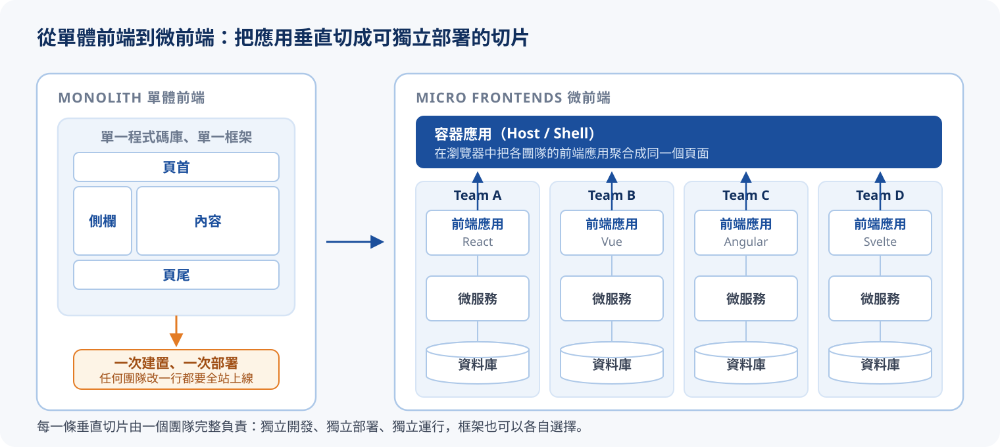
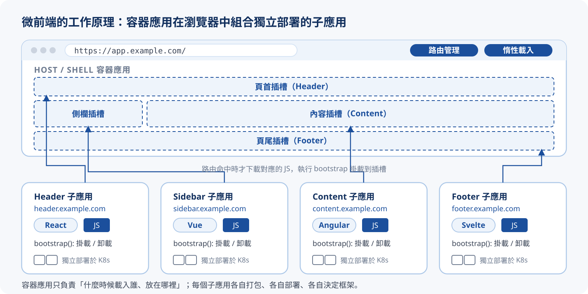
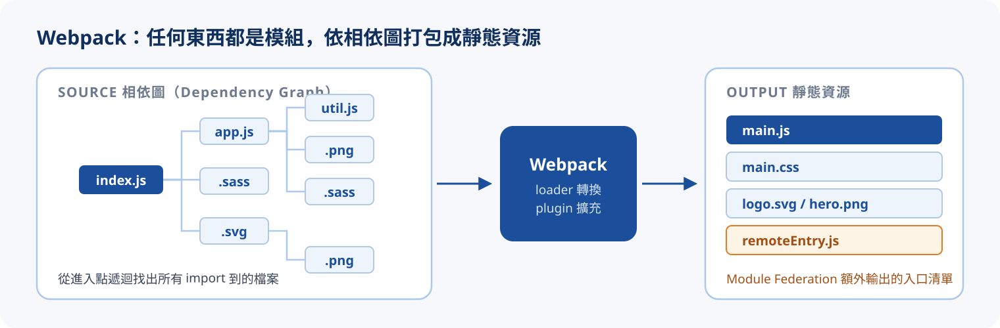

# 認識微前端：以 Webpack Module Federation 為例

> 本篇整理自 2022/08/27 的技術主題分享，並以 [micro-frontends.org](https://micro-frontends.org/) 與 [Webpack Module Federation 官方文件](https://webpack.js.org/concepts/module-federation/) 補充細節。

## 情境：一個前端，四個團隊

想像一個公司入口網站：頁首與導覽列由平台團隊維護，內容區是各業務團隊的功能，側欄是通知與待辦，頁尾又是另一組人負責。四個團隊、一個前端 repo、一條 build pipeline。

日子久了會發生幾件事：

- **任何人改一行，全站重新上線**：頁尾團隊修一個錯字，也得跑完整個前端的 build 與測試，再一起部署
- **技術棧被鎖死**：三年前選的框架版本，現在誰都不敢升，因為牽一髮動全身
- **build 越來越慢、衝突越來越多**：四個團隊在同一個 repo 排隊合併，release 得靠人協調
- **團隊無法自主**：業務團隊想快一點上線一個功能，卻要等別人的東西也準備好

後端早就用**微服務**解過同樣的問題：把大系統切成能獨立開發、部署、擴展的小服務。微前端就是把這個想法搬到瀏覽器裡。

## 什麼是微前端

微前端（Micro Frontend）是一種類似於微服務的架構，**把微服務的理念應用在瀏覽器上**：將 Web 應用從單體架構（Monolithic Architecture）轉變為多個前端應用的聚合。各個前端應用可以獨立開發、獨立部署、獨立運行，由不同的技術團隊維護，甚至可以用不同的框架建構。



重點在「垂直切分」：一個團隊從前端頁面、後端服務到資料庫，完整負責一條業務切片，而不是前端一組人、後端一組人的水平分工。[micro-frontends.org](https://micro-frontends.org/) 把微前端的核心理念整理成幾條原則：

| 原則 | 意思 |
| :--- | :--- |
| **技術無關（Technology agnostic）** | 每個團隊自行選擇與升級技術棧，不必和其他團隊協調 |
| **隔離團隊的程式碼** | 不共享執行期狀態、不依賴全域變數；即使用同一個框架，也不要共用 runtime |
| **建立團隊前綴** | CSS、事件、Local Storage、Cookie 都加上團隊識別，避免衝突 |
| **優先使用瀏覽器原生功能** | 跨應用溝通優先用瀏覽器事件（Custom Events）而非自訂的全域 API |
| **建立有韌性的網站** | 某個子應用 JavaScript 失敗或還沒載入，整個頁面仍應可用 |

:::note{title="微前端不是萬靈丹"}
微前端解決的是**組織規模**的問題：多個團隊、各自的節奏、不同的技術選擇。如果只有一個小團隊維護一個中等規模的應用，引入微前端只會多出一層基礎設施要維護，而且要處理重複載入的框架、跨應用的樣式與狀態等新問題。先確定痛點是「團隊協作」而不是「程式碼太多」，再考慮微前端。
:::

## 為什麼不用共用套件就好：Module vs 微前端

第一個常見的疑問是：要複用元件，把它發成 npm 套件不就好了？兩者的差別在**建置與發布的顆粒度**：

| | 共用套件（npm Module） | 微前端 |
| :--- | :--- | :--- |
| 複用方式 | 以 Repository（如 npm）的形式複用 | 執行期由容器應用載入 |
| 建置 / 發布 | 消費方**整體構建、整體發布** | 每個子應用**單獨構建、單獨發布** |
| 關係 | 套件之間互不相關，顆粒度小 | 主從架構（容器與子應用），顆粒度大 |
| 依賴衝突 | 需人工解決版本相依與衝突 | 透過隔離機制突破框架限制 |
| 升級 | 消費方要自己更新版本、重新 build、重新部署 | 提供方部署後自動呈現 |

用同一個「V1.0 發布後升到 V1.1」的故事走一遍，就能看出差別：

{/* @ai-visualize
id: micro-frontend-module-vs-mfe
type: motion
prompt: |
  核心洞察：共用 npm 套件是「整體構建、整體發布」，升級要靠每個消費方自己重做一次；
            微前端是「單獨構建、單獨發布」，提供方部署完成，所有頁面自動呈現新版。
  互動：stepper 上一步 / 下一步、自動播放、重置，依序走過 A 開發 V1.0 → 發布 → B 取用 → A 開發 V1.1 → 發布 → 一段時間後。
  圖形：上下兩條泳道（共用 npm 套件 / 微前端），每條泳道有「提供方 A」與「消費方 B 的頁面」兩列時間線；
        A 的動作以膠囊標示，B 的頁面以版本徽章逐步長出（V1.0 / V1.1），npm 泳道在 V1.1 發布後仍停在 V1.0 並以橘色標「沒收到升級通知」，
        微前端泳道以綠色標「自動呈現」；發布到生效之間畫箭頭。下方兩張說明卡分別描述兩邊在本步驟的狀態與 B 端要做的事。
  資料/數值：版本 V1.0 → V1.1（示意）。
caption: 逐步推進，看 V1.1 發布後兩邊的頁面各停在哪個版本。
status: generated
*/}
import GeneratedFrame from '@/components/GeneratedFrame.astro'
import MicroFrontendModuleVsMfe from '@notes/components/micro-frontend-module-vs-mfe'

<GeneratedFrame id="micro-frontend-module-vs-mfe" type="motion" prompt={"核心洞察：共用 npm 套件是「整體構建、整體發布」，升級要靠每個消費方自己重做一次；\n          微前端是「單獨構建、單獨發布」，提供方部署完成，所有頁面自動呈現新版。\n互動：stepper 上一步 / 下一步、自動播放、重置，依序走過 A 開發 V1.0 → 發布 → B 取用 → A 開發 V1.1 → 發布 → 一段時間後。\n圖形：上下兩條泳道（共用 npm 套件 / 微前端），每條泳道有「提供方 A」與「消費方 B 的頁面」兩列時間線；\n      A 的動作以膠囊標示，B 的頁面以版本徽章逐步長出（V1.0 / V1.1），npm 泳道在 V1.1 發布後仍停在 V1.0 並以橘色標「沒收到升級通知」，\n      微前端泳道以綠色標「自動呈現」；發布到生效之間畫箭頭。下方兩張說明卡分別描述兩邊在本步驟的狀態與 B 端要做的事。\n資料/數值：版本 V1.0 → V1.1（示意）。\n"} caption="逐步推進，看 V1.1 發布後兩邊的頁面各停在哪個版本。">
  <MicroFrontendModuleVsMfe client:visible />
</GeneratedFrame>

共用套件仍然有它的位置：純粹的工具函式、設計系統的基礎元件，用 npm 發布反而簡單。微前端針對的是「一整塊功能」的獨立上線。

## 微前端的工作原理

微前端有兩個角色：

- **容器應用（Host / Shell / Container）**：使用者實際打開的那個網址。它負責**路由管理**（哪個路徑該顯示誰）與**惰性載入**（等路由命中才去載入對應的子應用），並提供插槽讓子應用掛載
- **子應用（Remote / Micro App）**：各團隊獨立開發、打包、部署的前端應用，各自有自己的網址。它要暴露一組 **bootstrap 啟動方法**（通常是 mount / unmount），讓容器可以把它掛到指定的 DOM 節點，也能在離開時卸載



要把這個架構做起來，有兩個一定要回答的問題：

1. **元件內如何做到資源隔離**：子應用的 JavaScript 全域變數、CSS 樣式、DOM 操作，不能互相汙染
2. **元件間如何共享訊息**：子應用之間需要溝通時（例如登入狀態、選取的組織），要透過明確定義的 Public API，而不是偷偷讀對方的內部狀態

:::tip{title="整合時機：build time 還是 run time"}
把子應用組合起來的時機有兩種。**建置期整合**（build-time）是把各子應用當作套件在 build 時打包進容器，簡單但回到了「整體構建」的老路；**執行期整合**（run-time）才是微前端真正的價值：容器在瀏覽器裡（或在伺服器端、CDN 邊緣）動態載入各子應用最新部署的版本。後面介紹的四種方式都是執行期整合。
:::

## 四種實作方式的取捨

回到分享中的問題：微前端可以透過什麼樣的技術或框架來實作？常見的四種做法各有取捨：

| | 做法 | 優點 | 缺點 |
| :-: | :--- | :--- | :--- |
| A | **iframe** | 簡單上手；可有效隔離 JS、CSS、DOM | 重新整理後路由狀態消失；較難實現有效的訊息共享 |
| B | **Client side 用 JS 載入模組** | 引入腳本即可使用 | 不支援 Server-side render；需注意 JS、CSS 的載入順序 |
| C | **Web Component** | 元件各自獨立，所有資源由自身控制如何載入 | 需要 polyfills 補足瀏覽器支援度 |
| D | **Webpack Module Federation** | 模組可以獨立部署、獨立擴展 | 實作較複雜；需了解各前端框架的 bootstrap 啟動方法 |

切換不同做法，比較它們在六個面向上的長短：

{/* @ai-visualize
id: micro-frontend-approach-compare
type: chart
prompt: |
  核心洞察：四種實作方式沒有全能解：iframe 隔離最好但溝通最差、JS 載入最直觀但沒有隔離也沒有 SSR、
            Web Component 靠瀏覽器標準但需要 polyfill、Module Federation 最能獨立部署與共享依賴但門檻最高。
  互動：分頁切換 iframe / JS 腳本載入 / Web Component / Module Federation，雷達圖多邊形隨之變形；
        勾選「疊上其他三種方式」可在同一張雷達圖上比較。
  圖形：左側六軸雷達圖（上手容易、隔離程度、跨應用溝通、SSR 支援、獨立部署、瀏覽器相容），有同心刻度環與數值標籤；
        右側是該方式的做法說明、六個面向的評分長條、優點 / 缺點清單與適合情境。
  資料/數值：示意評分 1–5 分。
caption: 切換實作方式，看雷達圖如何變形；評分為示意值。
status: generated
*/}
import MicroFrontendApproachCompare from '@notes/components/micro-frontend-approach-compare'

<GeneratedFrame id="micro-frontend-approach-compare" type="chart" prompt={"核心洞察：四種實作方式沒有全能解：iframe 隔離最好但溝通最差、JS 載入最直觀但沒有隔離也沒有 SSR、\n          Web Component 靠瀏覽器標準但需要 polyfill、Module Federation 最能獨立部署與共享依賴但門檻最高。\n互動：分頁切換 iframe / JS 腳本載入 / Web Component / Module Federation，雷達圖多邊形隨之變形；\n      勾選「疊上其他三種方式」可在同一張雷達圖上比較。\n圖形：左側六軸雷達圖（上手容易、隔離程度、跨應用溝通、SSR 支援、獨立部署、瀏覽器相容），有同心刻度環與數值標籤；\n      右側是該方式的做法說明、六個面向的評分長條、優點 / 缺點清單與適合情境。\n資料/數值：示意評分 1–5 分。\n"} caption="切換實作方式，看雷達圖如何變形；評分為示意值。">
  <MicroFrontendApproachCompare client:visible />
</GeneratedFrame>

:::info{title="這些做法不互斥"}
實務上常常混搭：用 Module Federation 載入模組、用 Web Component 包住不同框架的子應用做樣式隔離、對完全不受控的舊系統則退回 iframe。[single-spa](https://single-spa.js.org/) 與 [qiankun](https://qiankun.umijs.org/) 這類微前端框架，本質上是把 B 做法（執行期載入 JS 並管理生命週期）加上路由、沙箱與樣式隔離等配套。
:::

分享的後半段聚焦在 D：Webpack Module Federation。

## Webpack 與 Module Federation

### Webpack：任何東西都是模組

Webpack 是一個模組打包工具，可以整合眾多語法與技術。它的核心觀念是：**在 Webpack 裡，任何東西都被當作模組**。從進入點開始，`.js`、`.sass`、`.svg`、`.png` 都是相依圖上的節點，經過 loader 轉換、plugin 加工後，輸出成瀏覽器可以直接載入的靜態資源。



### Module Federation：跨應用在執行期共享模組

Module Federation 是 Webpack 5.0 之後提供的一個 plugin，可以讓 JavaScript 模組**動態地從一個應用程式（或專案）匯入到當前的應用程式**。傳統的 `import` 只能引用同一次 build 裡的模組；Module Federation 讓你 `import('header/Header')`，而 `header` 其實是另一個獨立 build、獨立部署、跑在另一個網址上的應用。

它有三個關鍵特性：

| 特性 | 內容 |
| :--- | :--- |
| **遠端配置** | 遠端載入：模組來自另一個網址的 `remoteEntry.js`；惰性載入：用到時才下載對應的 chunk |
| **高相容性** | 框架相容：Host 與 Remote 可以是不同框架；版本相容：可宣告共享依賴的版本需求，不相容時各自載入自己的版本 |
| **雙向** | 同一個應用可以同時作為 Host（引用別人的模組）與 Remote（暴露模組給別人） |

幾個會一直出現的名詞：

| 名詞 | 意思 |
| :--- | :--- |
| **Host** | 消費方：在執行期載入其他應用的模組 |
| **Remote** | 提供方：把自己的模組暴露出去讓別人載入 |
| `remoteEntry.js` | Remote 的入口清單，很小的一支檔案，描述暴露了哪些模組、需要哪些共享依賴 |
| `exposes` | Remote 宣告「哪些模組可以被外部引用」 |
| `remotes` | Host 宣告「要引用哪些 Remote、它們的 `remoteEntry.js` 在哪」 |
| `shared` | 雙方都宣告的共享依賴（例如 `react`），執行期協商只載一份 |

逐步走過 Host 載入一個 Remote 模組的過程，並切換 `shared` 設定看它對下載量的影響：

{/* @ai-visualize
id: micro-frontend-federation-runtime
type: motion
prompt: |
  核心洞察：Module Federation 讓「從另一個獨立部署的應用 import 模組」在執行期發生：
            Host 先拿 remoteEntry.js 清單、協商共享依賴、再只下載需要的模組 chunk；shared singleton 讓整個頁面只有一份 React。
  互動：stepper 上一步 / 下一步、自動播放、重置，走過開啟容器 → 拿 remoteEntry.js → 協商 shared → 下載模組 → 掛載 → 切換路由惰性載入另一個 Vue Remote；
        切換「shared react：singleton / 不共享」，比較 Remote 是否重複下載 React。
  圖形：左側是容器應用的瀏覽器視窗示意，頁首、內容等插槽從虛線空框逐步被填滿，底部狀態列顯示頁面上有幾份 React；
        右側是網路請求瀑布（檔名、來源 port、大小長條、累計 KB），重複載入的 React 以橘色標示；
        下方是本步驟說明與對應的 webpack.config.js / 程式碼片段，相關行以橘色高亮。
  資料/數值：Host :8000、header :8001（React）、content :8002（Vue）；React 130 KB、remoteEntry.js 8 KB、Header chunk 12 KB（示意）。
caption: 逐步推進，並切換 shared 設定，看頁面上會有幾份 React。
status: generated
*/}
import MicroFrontendFederationRuntime from '@notes/components/micro-frontend-federation-runtime'

<GeneratedFrame id="micro-frontend-federation-runtime" type="motion" prompt={"核心洞察：Module Federation 讓「從另一個獨立部署的應用 import 模組」在執行期發生：\n          Host 先拿 remoteEntry.js 清單、協商共享依賴、再只下載需要的模組 chunk；shared singleton 讓整個頁面只有一份 React。\n互動：stepper 上一步 / 下一步、自動播放、重置，走過開啟容器 → 拿 remoteEntry.js → 協商 shared → 下載模組 → 掛載 → 切換路由惰性載入另一個 Vue Remote；\n      切換「shared react：singleton / 不共享」，比較 Remote 是否重複下載 React。\n圖形：左側是容器應用的瀏覽器視窗示意，頁首、內容等插槽從虛線空框逐步被填滿，底部狀態列顯示頁面上有幾份 React；\n      右側是網路請求瀑布（檔名、來源 port、大小長條、累計 KB），重複載入的 React 以橘色標示；\n      下方是本步驟說明與對應的 webpack.config.js / 程式碼片段，相關行以橘色高亮。\n資料/數值：Host :8000、header :8001（React）、content :8002（Vue）；React 130 KB、remoteEntry.js 8 KB、Header chunk 12 KB（示意）。\n"} caption="逐步推進，並切換 shared 設定，看頁面上會有幾份 React。">
  <MicroFrontendFederationRuntime client:visible />
</GeneratedFrame>

## 動手做：React Host 搭配不同框架的 Remote

分享中的範例以 React 作為 Host（應用的主體），搭配不同前端框架的應用作為動態載入的元件：

| 應用 | 角色 | 框架 | 開發 port |
| :--- | :--- | :--- | :-: |
| host | Host | React | 8000 |
| header | Remote | React | 8001 |
| content | Remote | Vue 3 | 8002 |
| footer | Remote | Angular | 8003 |

### 建立專案

React、Vue 等專案可以用社群工具 [`create-mf-app`](https://github.com/jherr/create-mf-app) 快速建立已經設定好 Module Federation 的骨架；Angular 則用 `@angular-architects/module-federation` 這個 schematic 加到既有專案：

::::tabs
:::tab{label="host（React）"}
```bash
npx create-mf-app
```

```text
? Pick the name of your app: host
? Project Type: Application
? Port number: 8000
? Framework: react
? Language: typescript
? CSS: Tailwind
```
:::
:::tab{label="header（React）"}
```bash
npx create-mf-app
```

```text
? Pick the name of your app: header
? Project Type: Application
? Port number: 8001
? Framework: react
? Language: typescript
? CSS: Tailwind
```
:::
:::tab{label="content（Vue 3）"}
```bash
npx create-mf-app
```

```text
? Pick the name of your app: content
? Project Type: Application
? Port number: 8002
? Framework: vue3
? Language: typescript
? CSS: Tailwind
```
:::
:::tab{label="footer（Angular）"}
```bash
ng new ng-footer --create-application=false
ng g application footer
ng add @angular-architects/module-federation --project footer --port 8003
```

schematic 會產生 `webpack.config.js`，並把 `main.ts` 改成先動態 import `bootstrap.ts` 的結構。
:::
::::

### Host 的 webpack 設定

Host 要做的事只有一件：宣告要引用哪些 Remote。

:::annotate
```js title="host/webpack.config.js"
const ModuleFederationPlugin = require('webpack/lib/container/ModuleFederationPlugin');
const deps = require('./package.json').dependencies;

module.exports = {
  // ...
  devServer: {
    port: 8000, // (1)!
  },
  plugins: [
    new ModuleFederationPlugin({ // (2)!
      name: 'host', // (3)!
      filename: 'remoteEntry.js', // (4)!
      remotes: { // (5)!
        header: 'header@http://localhost:8001/remoteEntry.js',
        content: 'content@http://localhost:8002/remoteEntry.js',
        footer: 'footer@http://localhost:8003/remoteEntry.js',
      },
      exposes: {},
      shared: { // (6)!
        ...deps,
        react: { singleton: true, requiredVersion: deps.react },
        'react-dom': { singleton: true, requiredVersion: deps['react-dom'] },
      },
    }),
  ],
};
```

1. 開發模式 Web Server 的 port。
2. Module Federation Plugin，Webpack 5 內建，不需要另外安裝。
3. Bundle 後外部應用可以參照的模組名稱。Host 也可以同時當 Remote，所以一樣要有名字。
4. Bundle 後外部應用可以參照的檔案名稱，也就是入口清單。
5. 引用外部的應用。格式是 `<在本應用內的別名>: '<Remote 的 name>@<Remote 的 remoteEntry.js URL>'`；之後在程式碼裡就用 `import('header/...')` 引用。
6. 共享依賴。`...deps` 把 `package.json` 的依賴全部宣告為可共享；React 額外設 `singleton`，保證頁面上只有一份。
:::

### Remote 的 webpack 設定

Remote 則相反：宣告要暴露哪些模組。

:::annotate
```js title="header/webpack.config.js"
const ModuleFederationPlugin = require('webpack/lib/container/ModuleFederationPlugin');
const deps = require('./package.json').dependencies;

module.exports = {
  // ...
  devServer: {
    port: 8001,
  },
  plugins: [
    new ModuleFederationPlugin({
      name: 'header', // (1)!
      filename: 'remoteEntry.js',
      remotes: {},
      exposes: { // (2)!
        './Header': './src/Header',
      },
      shared: { // (3)!
        ...deps,
        react: { singleton: true, requiredVersion: deps.react },
        'react-dom': { singleton: true, requiredVersion: deps['react-dom'] },
      },
    }),
  ],
};
```

1. 要和 Host `remotes` 裡 `@` 前面的名稱一致。
2. 匯出設定：`<對外的模組名稱>: '<本專案內的檔案路徑>'`。Host 用 `import('header/Header')` 時，`header` 對應 `remotes` 的別名、`Header` 對應這裡的 `./Header`。
3. 與 Host 對稱的共享宣告。兩邊都宣告 `singleton`，執行期才會只留一份 React。
:::

### 在 Host 中使用 Remote 的模組

同框架（React 對 React）時，可以直接把遠端模組當成 lazy 元件：

```tsx title="host/src/App.tsx"
import React, { Suspense } from 'react';

const Header = React.lazy(() => import('header/Header'));

export default function App() {
  return (
    <Suspense fallback={<div>載入頁首中</div>}>
      <Header />
    </Suspense>
  );
}
```

跨框架時（React Host 載入 Vue 或 Angular 的 Remote），Remote 暴露的就不是元件，而是一個**啟動函式**，這也是分享中提到「需了解前端各大框架 bootstrap 啟動方法」的原因：

::::tabs
:::tab{label="content（Vue 3）暴露 mount"}
```ts title="content/src/mount.ts"
import { createApp } from 'vue';
import Content from './Content.vue';

export function mount(el: HTMLElement) {
  const app = createApp(Content);
  app.mount(el);
  return () => app.unmount();
}
```

```js title="content/webpack.config.js"
exposes: {
  './mount': './src/mount',
},
```
:::
:::tab{label="host 掛載 Vue Remote"}
```tsx title="host/src/pages/Content.tsx"
import { useEffect, useRef } from 'react';

export default function ContentPage() {
  const ref = useRef<HTMLDivElement>(null);

  useEffect(() => {
    let unmount: (() => void) | undefined;
    import('content/mount').then(({ mount }) => {
      if (ref.current) unmount = mount(ref.current);
    });
    return () => unmount?.();
  }, []);

  return <div ref={ref} />;
}
```

React 只負責提供一個 DOM 節點；Vue 應用在裡面自己啟動、自己卸載。Angular 的做法相同，只是 `mount` 裡呼叫的是 `platformBrowserDynamic().bootstrapModule(...)`。
:::
::::

:::warning{title="index.ts 要先動態 import bootstrap"}
使用 `shared` 時，應用的進入點不能直接執行 React 程式碼，要拆成兩層：

```ts title="src/index.ts"
import('./bootstrap');
```

```tsx title="src/bootstrap.tsx"
import { createRoot } from 'react-dom/client';
import App from './App';

createRoot(document.getElementById('root')!).render(<App />);
```

多這一層非同步邊界，Module Federation 才有機會在應用程式碼執行前完成共享依賴的協商。忘了這一步，最常見的錯誤就是 `Shared module is not available for eager consumption`。`create-mf-app` 與 Angular schematic 產生的骨架都已經是這個結構。
:::

### TypeScript 的遠端模組宣告

`header/Header` 這種模組在本專案裡並不存在，TypeScript 會報找不到模組。最簡單的做法是補一個型別宣告：

```ts title="host/src/remotes.d.ts"
declare module 'header/Header';
declare module 'content/mount' {
  export function mount(el: HTMLElement): () => void;
}
```

## 小結

- 微前端是把微服務的理念搬到瀏覽器：把應用**垂直切分**成可以獨立開發、部署、運行的子應用，再由容器應用在執行期聚合
- 它與共用 npm 套件的差別在**建置與發布的顆粒度**：套件升級要每個消費方重做一次，微前端由提供方部署後自動呈現
- 實作方式有 iframe、JS 載入、Web Component、Module Federation 四種，各有取捨；隔離與溝通是所有做法都要回答的兩個問題
- Module Federation 讓「從另一個獨立部署的應用 import 模組」在執行期發生：`remotes` / `exposes` 定義誰引用誰，`shared` 讓 React 這類依賴只載一份，跨框架時則透過 bootstrap 啟動函式掛載

:::info{title="延伸：Module Federation 的後續發展"}
分享當時 Module Federation 還是 Webpack 5 內建的 plugin。之後它獨立成 [Module Federation 2.0](https://module-federation.io/)，提供獨立的 runtime、型別自動產生與 Rspack 支援；Angular 社群也推出不依賴 Webpack 的 Native Federation。概念與本篇相同，設定方式與工具鏈則以各自的官方文件為準。
:::
