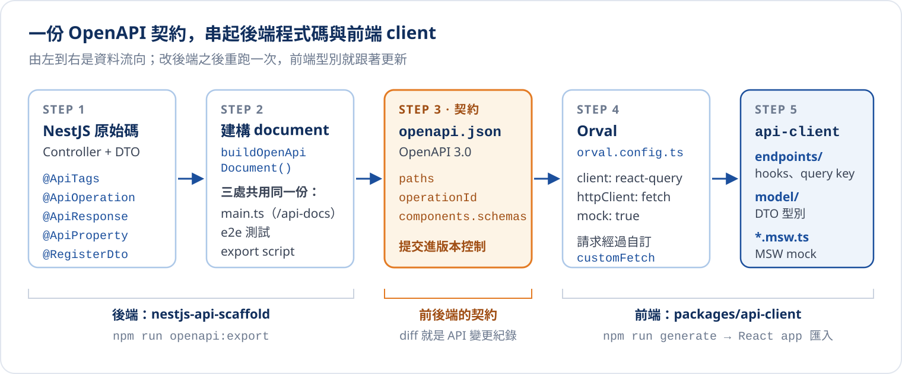

# 從 NestJS 到 React：OpenAPI Codegen

:::note{title="範圍"}
本篇以本專案的 `projects/apps/nestjs-api-scaffold`（NestJS 11、`@nestjs/swagger` 11）與 `projects/packages/api-client`（Orval 8、TanStack Query 5）為例，所有產出名稱與錯誤訊息都是實際執行的結果。腳手架本身的基礎建設請見 [NestJS API 腳手架盤點](./nestjs-api-scaffold-infra.mdx)。
:::

前後端分開開發時，同一個 API 的形狀通常會被寫兩次：後端的 DTO 一份，前端的 `interface` 和 `fetch` 呼叫又一份。兩份程式碼沒有任何連結，後端把欄位改名、前端照樣編譯通過，問題要等到使用者畫面壞掉才浮現。

Codegen 的做法是**讓後端的程式碼成為唯一的事實來源**：後端用裝飾器描述 API → 產生 OpenAPI 文件 → 再從文件產生前端的型別與呼叫函式。前端不再手寫任何 API 型別，後端一改，前端重新產生就會跟著變，對不上的地方直接在編譯時報錯。

## 整條流水線



| 步驟 | 誰負責 | 產物 | 指令 |
| :--- | :--- | :--- | :--- |
| 1. 用裝飾器描述 API | 後端 | Controller、DTO | — |
| 2. 建構 OpenAPI document | 後端 | 記憶體中的 `OpenAPIObject` | — |
| 3. 輸出靜態 spec | 後端 | `apps/nestjs-api-scaffold/openapi.json` | `npm run api:openapi:export` |
| 4. 產生 client | 前端 | `packages/api-client/src/generated/` | `npm run api:client:generate`（含步驟 3） |
| 5. 在 React 使用 | 前端 | `useGetPing()` 等 hooks | — |

這是 **code-first** 的流程：先寫後端程式，文件從程式產生。另一種 **contract-first** 是先手寫 OpenAPI 文件，前後端都從文件產生程式碼。團隊以後端為主導、API 隨程式演進時，code-first 比較省力；需要先和外部夥伴談定介面時，contract-first 比較合適。

## Codegen 工具怎麼選

OpenAPI 轉 TypeScript client 的工具很多，以下是目前 Node.js 生態裡的主流選擇：

| 工具 | 定位 | React 相關產出 | 適合情境 |
| :--- | :--- | :--- | :--- |
| [Orval](https://orval.dev) | 功能齊全，設定集中在一個檔案 | TanStack Query、SWR、fetch／axios client、MSW mock、Zod | 想一次拿到 hooks 與 mock :badge[本篇採用]{variant="info" size="sm"} |
| [Hey API](https://heyapi.dev) | `openapi-typescript-codegen` 的接班人，plugin 架構 | TanStack Query（React／Vue）、多種 client、Zod／Valibot | 產出最精簡，生態活躍 |
| [Kubb](https://kubb.dev) | 模組化，可客製程度最高 | React Query、SWR、MSW、Zod，以及 Cypress 等 plugin | 需要深度客製產出 |
| [openapi-typescript](https://openapi-ts.dev) | 只產生型別，零 runtime | 不產生 hooks，搭配 `openapi-fetch` | 只要型別、client 自己寫 |
| `@openapitools/openapi-generator-cli` | 官方 OpenAPI Generator 的 npm 包裝 | `typescript-fetch`／`typescript-axios` client | 同一份 spec 要產生多種語言（需要 Java） |

:::warning{title="名字很像但已停止維護"}
npm 上的 `openapi-codegen`（Mermade）最後一版是 5 年前發布的；`openapi-typescript-codegen` 也已 deprecated，官方指向 Hey API。新專案不要選這兩個。
:::

選 Orval 的理由是它在一個設定檔裡就能產出 TanStack Query hooks 與 **MSW mock**：前端在後端 API 還沒做好時，可以直接用 mock 開發，等後端完成再切換。

## 第一步：用裝飾器寫出好的 spec

Codegen 的品質上限就是 spec 的品質。`@nestjs/swagger` 從裝飾器與 DTO 收集資訊，每一個裝飾器最後都會變成產出程式碼的一部分。下面用 `GET /ping` 逐項對照，也可以切換 operationId 策略，看產出的名稱怎麼變：

{/* @ai-visualize
id: nestjs-openapi-codegen-trace
type: motion
prompt: |
  核心洞察：codegen 產出的每一個名稱與型別，都能追溯到後端某一個裝飾器；spec 寫得多完整，前端拿到的型別就多精確。
  互動：六個對應項目的分頁（Tag 決定檔案、路由變成 URL 與 query key、method 名稱變成 hook 名稱、
        summary 變成 JSDoc、回應 schema 變成回傳型別、DTO 變成 interface 與假資料），可點上一步 / 下一步；
        另有 operationId 策略切換（取 method 名稱 / Nest 預設 Controller_method），切換時所有產出名稱跟著變。
  圖形：上方是三個節點的流程圖（NestJS 原始碼 → OpenAPI spec → Orval 產出），節點內顯示目前項目在三個階段的代表字串，
        spec 節點用橘色表示契約；下方三欄程式碼面板（ping.dto.ts 與 ping.controller.ts、openapi.json 節錄、Orval 產出節錄），
        屬於目前項目的行以底色與左側色條高亮，其餘淡化。
  資料/數值：取 method 名稱時為 getPing、useGetPing、getGetPingQueryKey、GetPing200；
            Nest 預設時為 PingController_getPing、usePingControllerGetPing、getPingControllerGetPingQueryKey、PingControllerGetPing200。
caption: 點選對應項目，看一個裝飾器怎麼一路變成前端的函式與型別
status: generated
*/}
import GeneratedFrame from '@/components/GeneratedFrame.astro'
import NestjsOpenapiCodegenTrace from '@notes/components/nestjs-openapi-codegen-trace'

<GeneratedFrame id="nestjs-openapi-codegen-trace" type="motion" prompt={"核心洞察：codegen 產出的每一個名稱與型別，都能追溯到後端某一個裝飾器；spec 寫得多完整，前端拿到的型別就多精確。\n互動：六個對應項目的分頁（Tag 決定檔案、路由變成 URL 與 query key、method 名稱變成 hook 名稱、\n      summary 變成 JSDoc、回應 schema 變成回傳型別、DTO 變成 interface 與假資料），可點上一步 / 下一步；\n      另有 operationId 策略切換（取 method 名稱 / Nest 預設 Controller_method），切換時所有產出名稱跟著變。\n圖形：上方是三個節點的流程圖（NestJS 原始碼 → OpenAPI spec → Orval 產出），節點內顯示目前項目在三個階段的代表字串，\n      spec 節點用橘色表示契約；下方三欄程式碼面板（ping.dto.ts 與 ping.controller.ts、openapi.json 節錄、Orval 產出節錄），\n      屬於目前項目的行以底色與左側色條高亮，其餘淡化。\n資料/數值：取 method 名稱時為 getPing、useGetPing、getGetPingQueryKey、GetPing200；\n          Nest 預設時為 PingController_getPing、usePingControllerGetPing、getPingControllerGetPingQueryKey、PingControllerGetPing200。\n"} caption="點選對應項目，看一個裝飾器怎麼一路變成前端的函式與型別">
  <NestjsOpenapiCodegenTrace client:visible />
</GeneratedFrame>

整理成表：

| 後端寫的 | OpenAPI 欄位 | Orval 產出 | 沒寫會怎樣 |
| :--- | :--- | :--- | :--- |
| `@ApiTags("ping")` | `tags` | `endpoints/ping/` 資料夾 | 全部擠進 `default/` |
| `@Get("ping")` | `paths./ping.get` | URL 函式、query key | — |
| method 名稱 `getPing` | `operationId` | `getPing()`、`useGetPing()` | 名稱會帶 Controller 前綴 |
| `@ApiOperation({ summary })` | `summary`、`description` | JSDoc | 前端看不到說明 |
| `@ApiResponse({ schema })` | `responses.200` | 回傳型別 `GetPing200` | 回傳型別是 `unknown` |
| `@ApiProperty()`、`@RegisterDto()` | `components.schemas` | `interface PingDto`、faker 假資料 | 欄位不會出現在型別裡 |

### operationId：決定前端看到的名稱

`@nestjs/swagger` 預設的 operationId 是 `PingController_getPing`，產出的 hook 會變成 `usePingControllerGetPing`。腳手架把文件建構集中到 `buildOpenApiDocument()`，並改成只取 method 名稱：

:::annotate
```ts title="src/openapi/openapi-document.ts" {13}
export function buildOpenApiDocument(app: INestApplication): OpenAPIObject {
  const swaggerConfig = new DocumentBuilder()
    .setTitle("API")
    .setVersion("1.0")
    .build();
  return SwaggerModule.createDocument(app, swaggerConfig, {
    extraModels: [ApiResponseDto, ...getRegisteredDtos()], // (1)!
    operationIdFactory: (_controllerKey, methodKey) => methodKey, // (2)!
  });
}
```

1. 統一包裝 `ApiResponseDto` 與所有標了 `@RegisterDto()` 的 DTO 都放進 `components.schemas`，`getSchemaPath()` 引用時才找得到。
2. `getPing` 直接成為 operationId。代價是 **handler 的 method 名稱在整個專案內必須唯一**；兩個 Controller 都有 `findAll()` 時，要用 `@ApiOperation({ operationId: "findAllTodos" })` 個別指定。
:::

`main.ts`（提供 `/api-docs` 與 `/openapi.json`）、e2e 測試、下一步的 export script 都呼叫同一個函式，三處的文件保證一致。

### 統一回應包裝：別讓型別被稀釋

腳手架的回應都包在 `ApiResponseDto` 裡（`success`、`code`、`data`、`traceId`…）。`@nestjs/swagger` 讀不到 TypeScript 泛型，所以用 `ApiResponseDto.of(PingDto)` 產生「包裝 + `data` 是 `PingDto`」的 `allOf` schema。

這裡有一個實際踩到的陷阱：原本基底 `ApiResponseDto` 也宣告了 `data`，但沒有欄位定義，只是一個 `type: object`。Orval 會把它轉成 `{ [key: string]: unknown }`，和 `PingDto` 交集之後，**讀任何不存在的欄位都不會報錯**：

```ts
// 修正前：GetPing200 = ApiResponseDto（data 是任意物件）& { data?: PingDto | null }
data.data?.alive; // 欄位根本不存在，型別卻是 unknown，tsc 通過
```

修法是讓基底 schema 不含 `data`，只由 `of()` 注入具體型別：

```ts title="src/common/dto/api-response.dto.ts"
@ApiHideProperty() // 基底不輸出 data，避免產生任意物件型別
data!: T | null;
```

修正後 `data.data?.alive` 會得到 `Property 'alive' does not exist on type 'PingDto'`。

:::tip{title="檢查 spec 品質的簡單方法"}
在產出的 `model/` 裡搜尋 `unknown` 與 `[key: string]`。出現的地方，通常就是後端少寫了 `@ApiResponse` schema，或某個欄位的型別沒有描述清楚。
:::

## 第二步：輸出靜態的 openapi.json

服務啟動後雖然有 `/openapi.json` 可以下載，但 codegen 不應該依賴一台跑著的 server：CI 裡沒有，而且要先啟動才能產生，流程很脆弱。腳手架加了一支 export script，只建立 Nest 應用實例、取得 document 就關閉，不監聽任何 port：

:::annotate
```ts title="src/openapi/export-openapi.ts"
async function exportOpenApi(): Promise<void> {
  process.env.DATABASE_PATH = ":memory:"; // (1)!

  const app = await NestFactory.create(AppModule, { logger: ["error", "warn"] });
  const document = buildOpenApiDocument(app); // (2)!
  await app.close();

  const outputPath = resolve(process.argv[2] ?? "openapi.json");
  writeFileSync(outputPath, JSON.stringify(document, null, 2) + "\n"); // (3)!
}
```

1. 建立應用時 TypeORM 會連資料庫；改用記憶體 DB，輸出 spec 不會建立或改動 `data/*.sqlite`。
2. 與 `main.ts` 呼叫同一個函式，輸出的檔案和線上 `/openapi.json` 完全相同。
3. 固定縮排、結尾換行，讓 git diff 穩定，只反映真正的 API 變化。
:::

```bash
npm run api:openapi:export
```

`openapi.json` **提交進版本控制**。它是前後端之間的契約，PR 裡這個檔案的 diff 就是一份 API 變更紀錄，reviewer 不用讀後端程式碼也能看出這次改了哪些介面。

## 第三步：用 Orval 產生 client

產出放在 monorepo 的共用套件 `projects/packages/api-client`，之後任何 React app 都能直接依賴它。

:::annotate
```ts title="packages/api-client/orval.config.ts"
export default defineConfig({
  scaffold: {
    input: {
      target: "../../apps/nestjs-api-scaffold/openapi.json", // (1)!
    },
    output: {
      mode: "tags-split", // (2)!
      target: "src/generated/endpoints",
      schemas: "src/generated/model",
      client: "react-query",
      httpClient: "fetch",
      mock: true, // (3)!
      clean: true,
      override: {
        mutator: { path: "src/http/custom-fetch.ts", name: "customFetch" }, // (4)!
        fetch: { includeHttpResponseReturnType: false }, // (5)!
      },
    },
  },
});
```

1. 讀上一步輸出的靜態檔，不需要啟動後端。
2. 依 Swagger tag 拆檔：`endpoints/ping/`、`endpoints/health/`…，前端的模組邊界與後端的 tag 一致。
3. 同時產生 MSW handlers 與 faker 假資料。
4. 所有請求都經過自訂的 `customFetch`，集中處理 base URL、標頭與錯誤。
5. 預設的 fetch client 會把結果包成 `{ data, status, headers }`；後端本身已經有統一包裝，再包一層就會變成 `data.data.data`，所以關掉。
:::

產出的結構：

```text
packages/api-client/src/
├─ generated/                 ← Orval 產出，每次產生會清空重建，不要手改
│  ├─ endpoints/
│  │  ├─ ping/
│  │  │  ├─ ping.ts           ← getPing()、useGetPing()、getGetPingQueryKey()
│  │  │  ├─ ping.msw.ts       ← MSW handler
│  │  │  └─ ping.faker.ts     ← 假資料產生器
│  │  └─ health/ …
│  └─ model/                  ← PingDto、GetPing200、ApiResponseDto…
├─ http/custom-fetch.ts       ← 手寫：所有請求共用的 mutator
├─ index.ts                   ← 對外 entry
└─ mocks.ts                   ← mock 獨立 entry，避免 msw／faker 進正式 bundle
```

### 自訂 fetch mutator

Orval 產生的每個函式最後都呼叫 mutator。這是整個 client 唯一需要手寫的地方：

:::annotate
```ts title="packages/api-client/src/http/custom-fetch.ts"
export async function customFetch<T>(url: string, options: RequestInit = {}): Promise<T> {
  const headers = new Headers(config.headers?.()); // (1)!
  new Headers(options.headers).forEach((value, key) => headers.set(key, value));

  const response = await fetch(`${config.baseUrl}${url}`, { ...options, headers }); // (2)!
  const body = await parseBody(response); // (3)!

  if (!response.ok) {
    throw new ApiError(response.status, body, response.headers); // (4)!
  }
  return body as T;
}
```

1. 每個請求都會帶上的標頭，例如之後接上登入時的 `Authorization`。
2. base URL 由前端 app 在啟動時以 `configureApiClient({ baseUrl })` 設定，預設同源。
3. 依 `Content-Type` 解析：JSON 走 `json()`，`/metrics` 這種 `text/plain` 走 `text()`。
4. 非 2xx 一律拋出，TanStack Query 才會進入 error 狀態；後端的錯誤回應同樣是 `ApiResponseDto`，放在 `ApiError.body`。
:::

## 第四步：在 React 使用

```tsx title="app/src/main.tsx"
import { QueryClient, QueryClientProvider } from "@tanstack/react-query";
import { configureApiClient } from "api-client";

configureApiClient({ baseUrl: import.meta.env.VITE_API_BASE_URL });

const queryClient = new QueryClient();
// <QueryClientProvider client={queryClient}><App /></QueryClientProvider>
```

```tsx title="app/src/PingStatus.tsx"
import { useGetPing, ApiError } from "api-client";

export function PingStatus() {
  const { data, error, isPending } = useGetPing();
  if (isPending) return <span>檢查中</span>;
  if (error) return <span>{error instanceof ApiError ? error.status : "網路錯誤"}</span>;
  return <span>{data.data?.pong ? "可連線" : "無回應"}（{data.traceId}）</span>;
}
```

- `data` 是後端的統一包裝，實際資料在 `data.data`，`traceId` 可以直接拿來回報問題。
- 要讓快取失效時，用產出的 query key：`queryClient.invalidateQueries({ queryKey: getGetPingQueryKey() })`，不要手寫字串。
- 不想透過 hook，也可以直接呼叫 `await getPing()`，例如在 router loader 裡預先載入。

### 後端還沒好，先用 mock 開發

```ts title="app/src/mocks.ts"
import { setupWorker } from "msw/browser";
import { getPingMock, getHealthMock } from "api-client/mocks";

await setupWorker(...getPingMock(), ...getHealthMock()).start();
```

MSW 在瀏覽器攔截請求，回傳 faker 依 schema 產生的假資料，元件程式碼完全不用改。假資料的擬真程度取決於 spec：欄位標了 `type: "integer"`、`format: "date-time"`、`enum`，假資料才會像樣；沒標的 `number` 會產生 `0.58` 這種小數，`string` 則是亂數字串。

## 後端改了 API，前端什麼時候知道？

Codegen 的價值不在少打幾行程式碼，而在**把「前後端對不上」從執行期提前到編譯期**。下面用四種常見的後端變更，比較手寫型別與 codegen 在各個階段的表現：

{/* @ai-visualize
id: nestjs-openapi-codegen-drift
type: motion
prompt: |
  核心洞察：codegen 把前後端的不一致從「使用者操作時」提前到「前端 build 時」；但它也有代價，
            operationId 跟著 method 名稱時，後端純重構也會變成前端的 breaking change。
  互動：四種後端變更分頁（欄位改名、欄位改型別、method 改名、新增欄位），階段可上一階段 / 下一階段 / 播放 / 重置。
  圖形：泳道圖，兩條泳道（手寫型別、Codegen）沿五個階段（後端修改、PR review、前端 build、部署、使用者操作）推進，
        時間游標以淡藍色欄位標示目前階段；看得到變化的節點標藍，被擋下或使用者遇到錯誤的節點標橘並打叉，
        沒有問題的節點標綠打勾；被擋下之後的階段以虛線與「不會發生」表示。
        下方兩張卡片分別說明兩條泳道在目前階段發生什麼，附上 diff 或 tsc 錯誤訊息。
  資料/數值：欄位改名 TS2339 Property 'pong' does not exist on type 'PingDto'；
            改型別 TS2322 Type 'string | false' is not assignable to type 'boolean'（僅在標註 boolean 的地方）；
            method 改名 TS2724 has no exported member named 'useGetPing'. Did you mean 'usePing'?；
            新增欄位兩邊都不會壞，codegen 讓新欄位出現在自動完成與 mock。
caption: 選一種後端變更，推進階段，比較兩條路在哪裡發現問題
status: generated
*/}
import NestjsOpenapiCodegenDrift from '@notes/components/nestjs-openapi-codegen-drift'

<GeneratedFrame id="nestjs-openapi-codegen-drift" type="motion" prompt={"核心洞察：codegen 把前後端的不一致從「使用者操作時」提前到「前端 build 時」；但它也有代價，\n          operationId 跟著 method 名稱時，後端純重構也會變成前端的 breaking change。\n互動：四種後端變更分頁（欄位改名、欄位改型別、method 改名、新增欄位），階段可上一階段 / 下一階段 / 播放 / 重置。\n圖形：泳道圖，兩條泳道（手寫型別、Codegen）沿五個階段（後端修改、PR review、前端 build、部署、使用者操作）推進，\n      時間游標以淡藍色欄位標示目前階段；看得到變化的節點標藍，被擋下或使用者遇到錯誤的節點標橘並打叉，\n      沒有問題的節點標綠打勾；被擋下之後的階段以虛線與「不會發生」表示。\n      下方兩張卡片分別說明兩條泳道在目前階段發生什麼，附上 diff 或 tsc 錯誤訊息。\n資料/數值：欄位改名 TS2339 Property 'pong' does not exist on type 'PingDto'；\n          改型別 TS2322 Type 'string | false' is not assignable to type 'boolean'（僅在標註 boolean 的地方）；\n          method 改名 TS2724 has no exported member named 'useGetPing'. Did you mean 'usePing'?；\n          新增欄位兩邊都不會壞，codegen 讓新欄位出現在自動完成與 mock。\n"} caption="選一種後端變更，推進階段，比較兩條路在哪裡發現問題">
  <NestjsOpenapiCodegenDrift client:visible />
</GeneratedFrame>

三個值得記住的觀察：

- **改名與改型別**：手寫型別一路暢通到使用者手上；codegen 在前端 build 就失敗。
- **TypeScript 只擋「型別對不上」的用法**：`pong ? "可連線" : "無回應"` 對字串也合法，改型別時這種寫法不會報錯。codegen 讓 diff 看得見，但仍需要 review 判斷語意。
- **method 改名反而是 codegen 比較脆弱**：operationId 跟著 method 名稱，後端純重構也會讓前端 import 失效。對外要穩定的端點，用 `@ApiOperation({ operationId })` 把名稱固定下來。

## 日常工作流程

::::steps
:::step{title="改後端"}
新增或修改 Controller、DTO，記得補上 `@ApiResponse({ schema: ApiResponseDto.of(YourDto) })` 與 `@RegisterDto()`。
:::
:::step{title="重新產生"}
在專案根目錄執行 `npm run api:client:generate`：先輸出 `openapi.json`，再跑 Orval。Orval 8 需要 **Node ≥ 22.18**。
:::
:::step{title="三樣東西一起提交"}
後端程式碼、`openapi.json`、`packages/api-client/src/generated/` 放在同一個 commit。reviewer 從 spec 與 model 的 diff 就能看出介面變化。
:::
:::step{title="CI 檢查是否同步"}
CI 重跑一次產生流程，再用 `git diff --exit-code` 確認沒有差異；有差異代表有人改了後端卻忘了重新產生。這一步目前還沒接上，是下一個要補的項目。
:::
::::

```bash title="CI 檢查（規劃中）"
npm run api:client:generate
git diff --exit-code -- projects/apps/nestjs-api-scaffold/openapi.json projects/packages/api-client/src/generated
```

## 已知限制

| 項目 | 現況 | 建議 |
| :--- | :--- | :--- |
| method 名稱必須唯一 | `operationIdFactory` 只取 method 名稱，重名時 operationId 會衝突 | 重名或需要穩定名稱的端點用 `@ApiOperation({ operationId })` 指定 |
| `data` 可能是 `undefined` | 包裝的 `data` 在 spec 中不是 required，型別是 `data?: PingDto \| null` | 成功回應一定有 `data`，可以在 `of()` 加上 `required: ["data"]` 收緊 |
| mock 不夠擬真 | `code` 產生小數、`timestamp` 是亂數字串 | DTO 補上 `type: "integer"`、`format: "date-time"`、`example` |
| 網路錯誤不是 `ApiError` | 連不到 server 時拋出的是 fetch 原生的 `TypeError` | UI 判斷錯誤時兩種都要處理 |
| 請求參數沒有驗證 | 腳手架還沒有 `ValidationPipe`，`@Body()` 的 DTO 只影響文件、不影響執行 | 等 Validation 選型完成後，讓同一份 DTO 同時負責驗證與文件 |

## 小結

- **後端程式碼是唯一的事實來源**：前端不手寫 API 型別，全部從 spec 產生。
- **spec 的品質決定型別的品質**：每個端點都寫 `@ApiResponse` schema，DTO 欄位描述清楚，留意 `unknown` 與 `[key: string]`。
- **`openapi.json` 是契約**：提交進版控，讓 API 變更在 PR 裡看得見。
- **codegen 不是萬靈丹**：它擋得住型別對不上的錯誤，擋不住語意改變；命名策略也要想清楚，不然後端的重構會變成前端的 breaking change。
