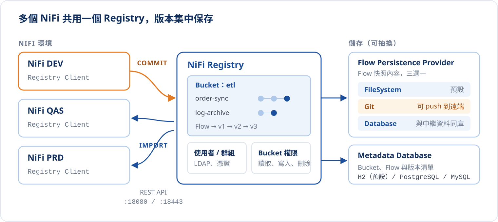
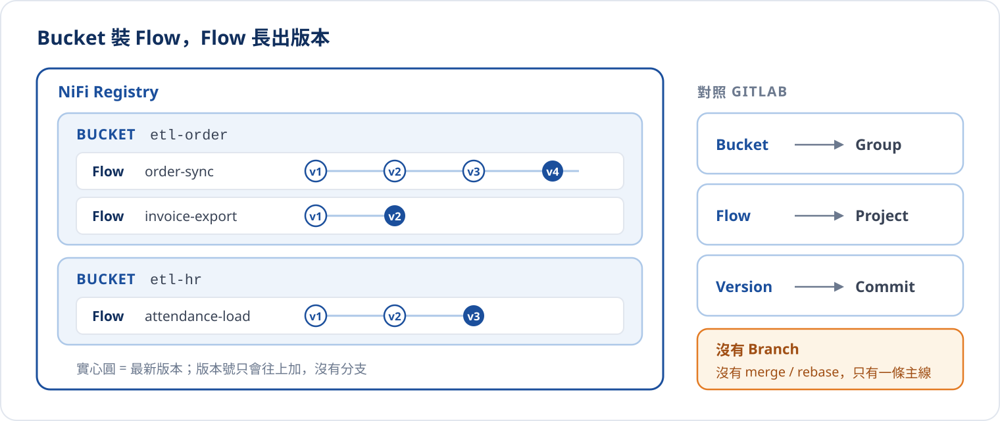

# NiFi Registry 入門

> 本篇整理自 2024/01/11 的技術主題分享「如何在 NiFi 實現版本控制：讓環境移轉不再是苦差事」，並以 [Apache NiFi Registry 官方文件](https://nifi.apache.org/projects/registry/)補充細節。

在 NiFi 上開發資料流程，和寫程式一樣要經過 DEV、QAS、PRD 幾個環境。程式碼有 Git 管版本、有 CI/CD 做部署；
但 NiFi 的流程是在畫布上「拉」出來的，如果沒有工具支援，搬到下一個環境就只能靠人工匯出、匯入、再一個一個改設定。

這篇要回答三個問題：

1. 沒有版控時，NiFi 流程是怎麼搬的？痛在哪裡？
2. NiFi Registry 用哪些概念（Bucket、Flow、Version）把流程納入版控？
3. 環境之間的設定差異，怎麼用 Parameter Context 抽離出流程？

## 沒有版控時：用 Template 搬流程

在導入 NiFi Registry 之前，典型的做法是透過 **Template** 在環境之間轉移流程：

::::steps
:::step{title="開發流程"}
登入 NiFi 控制台，建立或修改資料流程：Processor、Connection、Funnel 等元件。
:::
:::step{title="存成 Template"}
流程完成後，把它保存為可重複使用的 Template。
:::
:::step{title="匯出 Template"}
在控制台匯出 Template，系統產生一份包含流程設定的 XML 檔。
:::
:::step{title="移除目標環境的舊流程"}
到要部署的 NiFi 上，先刪除舊版流程與相關元件，避免新舊並存。
:::
:::step{title="匯入 Template"}
在目標 NiFi 匯入 XML，並把 Template 拖到畫布上建立流程。
:::
:::step{title="手動調整設定"}
逐一修改 Processor 的敏感屬性（密碼等不會隨 Template 匯出）、Controller Service 的 Host / IP / Port 等環境相依設定。
:::
::::

:::note{title="Template 已在 NiFi 2.0 移除"}
NiFi 2.0 起已不再支援 Template，改以 Flow Definition（JSON）下載 / 上傳，以及 Flow Registry 做版本管理。
不過這裡描述的痛點，換成手動搬 JSON 依然存在。
:::

### 三個痛點

| 痛點 | 說明 |
| :--- | :--- |
| **人工轉移難免出錯** | 手動轉移可能造成參數填錯、連線接錯、元件遺漏，導致流程運作不正常或少了某些功能。 |
| **難以追蹤修改了哪些項目** | 多人協作時，說不清楚誰在什麼時候改了什麼；沒有修改紀錄，也就無法回到上一個可用的版本。 |
| **難以處理環境配置差異** | 資料庫連線、目標系統 IP、驗證憑證在每個環境都不同，每次搬遷都要重新手動調整，錯誤機率隨之增加。 |

第三點最容易被低估：它不是只痛一次，而是**每發佈一版就重來一次**。拖動下方的設定數量、按「再發佈一版」，
比較兩種做法累積的手動動作：

{/* @ai-visualize
id: nifi-registry-migration-compare
type: motion
prompt: |
  核心洞察：Template 移轉每發佈一次就要重做「匯出、刪舊、匯入、手改設定」，手動輸入的設定值隨發佈次數線性累積；
            Registry + Parameter Context 把流程與環境設定分開，參數只在第一次部署時設定，之後只剩 Commit 與 Change version。
  互動：slider 調整每次移轉的環境相依設定數（1 到 10）；「再發佈一版」按鈕推進第 1 到 6 次移轉，可退回與重置。
  圖形：上方是兩條泳道，列出本次移轉的步驟方塊（Template：存 Template、匯出、刪舊流程、匯入，後接 N 個橘色「手動設定」小格；
        Registry：第一次為 Commit、Import 加 N 個藍色參數格，之後為 Commit、Change version 與虛線的「參數沿用」）；
        中間兩張數字卡對比累積手動動作與其中的手動輸入次數；下方折線圖畫出兩種做法到第 k 次的累積動作數，目前次數以虛線游標標示。
  資料/數值：Template 每次 4 + N 個動作；Registry 第一次 2 + N、之後每次 2 個。
caption: 拖動設定數量、推進發佈次數，看手動動作如何累積
status: generated
*/}
import GeneratedFrame from '@/components/GeneratedFrame.astro'
import NifiRegistryMigrationCompare from '@notes/components/nifi-registry-migration-compare'

<GeneratedFrame id="nifi-registry-migration-compare" type="motion" prompt={"核心洞察：Template 移轉每發佈一次就要重做「匯出、刪舊、匯入、手改設定」，手動輸入的設定值隨發佈次數線性累積；\n          Registry + Parameter Context 把流程與環境設定分開，參數只在第一次部署時設定，之後只剩 Commit 與 Change version。\n互動：slider 調整每次移轉的環境相依設定數（1 到 10）；「再發佈一版」按鈕推進第 1 到 6 次移轉，可退回與重置。\n圖形：上方是兩條泳道，列出本次移轉的步驟方塊（Template：存 Template、匯出、刪舊流程、匯入，後接 N 個橘色「手動設定」小格；\n      Registry：第一次為 Commit、Import 加 N 個藍色參數格，之後為 Commit、Change version 與虛線的「參數沿用」）；\n      中間兩張數字卡對比累積手動動作與其中的手動輸入次數；下方折線圖畫出兩種做法到第 k 次的累積動作數，目前次數以虛線游標標示。\n資料/數值：Template 每次 4 + N 個動作；Registry 第一次 2 + N、之後每次 2 個。\n"} caption="拖動設定數量、推進發佈次數，看手動動作如何累積">
  <NifiRegistryMigrationCompare client:visible />
</GeneratedFrame>

解法有兩塊，分別對應上面的痛點：

- **NiFi Registry**：解決「追蹤修改」與「人工搬遷」，讓流程可以像程式一樣 commit、拉取指定版本。
- **Parameter Context**：解決「環境配置差異」，把連線位址、帳號密碼這類值從流程裡抽出來，由各環境自己保管。

## NiFi Registry 是什麼

NiFi Registry 是 Apache NiFi 的子專案，一個獨立部署的應用程式，作為 NiFi / MiNiFi 之間**共享資源的集中儲存與管理中心**。官方列出的主要能力有三項：

- **Flow Registry**：保存與管理版本化的流程
- **與 NiFi 整合**：在 NiFi 畫布上直接 commit、匯入、升級版本化的流程
- **權限管理**：使用者、群組與存取政策



幾個部署上的重點：

- 預設以 **18080**（HTTP）/ **18443**（HTTPS）提供 Web UI 與 REST API，UI 路徑是 `/nifi-registry`
- **Flow Persistence Provider** 決定流程快照存在哪裡：預設為本機檔案系統；改用 `GitFlowPersistenceProvider` 時，每次 commit 都會變成 Git repo 裡的一個 commit，還能自動 push 到遠端，順便解決 Registry 本身的備份問題
- **Metadata Database** 保存 Bucket、Flow、版本清單等中繼資料，預設是內嵌的 H2，正式環境建議改用 PostgreSQL 或 MySQL
- 設定檔集中在 `conf/`：`nifi-registry.properties`（連接埠、資料庫、TLS）、`providers.xml`（儲存方式）、`authorizers.xml`（使用者與權限）

:::warning{title="2026 年起 NiFi Registry 已進入棄用流程"}
依官網公告，NiFi 社群於 2026 年 2 月投票通過棄用 NiFi Registry，預計在 NiFi 3.0 移除，
並建議改用直接連接 GitHub、GitLab、Bitbucket、Azure DevOps 的 **Git-based Flow Registry Client**。
這篇介紹的版控操作（Start version control、Commit、Change version）與 Parameter Context 的觀念在 Git-based Client 上一樣適用，
差別在於版本存放的位置從 Registry 換成 Git repo。已在使用 NiFi 1.x 與 Registry 的環境，本篇仍可直接參考。
:::

## 核心概念：Bucket、Flow、Version



| 概念 | 說明 | 類比 GitLab |
| :--- | :--- | :--- |
| **Bucket** | 存放與組織版本化項目的容器，也是權限控管的單位 | Group |
| **Flow** | 一個被版控的 Process Group：裡面的 Processor、Connection、Controller Service 等元件組成一個完整的資料流程 | Project |
| **Version** | Flow 每次 commit 產生的快照，帶有版本號、時間、提交者與 comment | Commit |

:::warning{title="沒有 Branch"}
NiFi Registry 沒有 branch 的概念，因此也沒有 merge、rebase 這類操作；每個 Flow 只有一條直線遞增的版本歷史，可以把它想成永遠只有 master。
所以流程的修改應該集中在 DEV 進行，其他環境只負責「拉取指定版本」。
:::

Bucket 是授權的邊界，可以針對使用者或群組設定以下權限：

| 權限 | 在 Registry 能做的事 | 在 NiFi 能做的事 |
| :--- | :--- | :--- |
| **Read** | 檢視 Bucket 內的 Flow | 匯入 Flow、切換版本 |
| **Write** | — | Commit 新版本 |
| **Delete** | 刪除 Flow | — |

實務上可以讓 DEV 的 NiFi 擁有 Read + Write，QAS / PRD 只給 Read：正式環境只能拉版本、不能回推修改。

## Flow 開發生命週期

導入 Registry 後，NiFi 流程的開發週期就和寫程式很像：在 DEV 開發並 commit，QAS 拉取指定版本測試，
驗證通過再部署到 PRD。每個被版控的 Process Group 左上角會顯示一個**版本狀態圖示**，告訴你它和 Registry 的關係。

下面走一遍完整的情境，包含一次「有人直接在 QAS 改設定」的意外：

{/* @ai-visualize
id: nifi-registry-flow-lifecycle
type: motion
prompt: |
  核心洞察：Registry 只有一條版本主線，流程只在 DEV 修改並 commit，其他環境只拉版本；
            每個環境的 Process Group 以版本狀態圖示反映它和 Registry 的關係，環境被直接修改時必須先還原才能升版。
  互動：stepper 八步（開始版控、QAS 匯入、DEV 修改、Commit v2、QAS 被直接改、還原本地修改、QAS 升版、PRD 部署），
        可點選任一步、上一步 / 下一步、自動播放與重置；說明卡顯示該步的說明與 NiFi 右鍵選單路徑。
  圖形：上方是 NiFi Registry 橫條（bucket / flow 名稱與 v1、v2 版本點，最新版實心並標 LATEST）；
        下方三個環境方塊 DEV、QAS、PRD，各有 Process Group 卡片顯示版本號與狀態圖示；
        commit 以橘色向上箭頭、import / change version 以藍色向下箭頭並附標籤；目前焦點環境橘色外框。
        最下方是五種版本狀態圖例（Up to date、Locally modified、Stale、Locally modified and stale、Sync failure），本步出現的狀態高亮。
caption: 逐步走過 DEV → QAS → PRD，觀察每個環境的版本狀態
status: generated
*/}
import NifiRegistryFlowLifecycle from '@notes/components/nifi-registry-flow-lifecycle'

<GeneratedFrame id="nifi-registry-flow-lifecycle" type="motion" prompt={"核心洞察：Registry 只有一條版本主線，流程只在 DEV 修改並 commit，其他環境只拉版本；\n          每個環境的 Process Group 以版本狀態圖示反映它和 Registry 的關係，環境被直接修改時必須先還原才能升版。\n互動：stepper 八步（開始版控、QAS 匯入、DEV 修改、Commit v2、QAS 被直接改、還原本地修改、QAS 升版、PRD 部署），\n      可點選任一步、上一步 / 下一步、自動播放與重置；說明卡顯示該步的說明與 NiFi 右鍵選單路徑。\n圖形：上方是 NiFi Registry 橫條（bucket / flow 名稱與 v1、v2 版本點，最新版實心並標 LATEST）；\n      下方三個環境方塊 DEV、QAS、PRD，各有 Process Group 卡片顯示版本號與狀態圖示；\n      commit 以橘色向上箭頭、import / change version 以藍色向下箭頭並附標籤；目前焦點環境橘色外框。\n      最下方是五種版本狀態圖例（Up to date、Locally modified、Stale、Locally modified and stale、Sync failure），本步出現的狀態高亮。\n"} caption="逐步走過 DEV → QAS → PRD，觀察每個環境的版本狀態">
  <NifiRegistryFlowLifecycle client:visible />
</GeneratedFrame>

版控相關的操作都在 Process Group 的右鍵選單 **Version** 底下：

| 操作 | 用途 | 使用時機 |
| :--- | :--- | :--- |
| **Start version control** | 選 Bucket、命名 Flow，建立 v1 | 流程第一次納入版控 |
| **Show local changes** | 列出與目前版本的差異 | commit 前檢查、排查誰動了什麼 |
| **Commit local changes** | 把本地修改存成新版本 | DEV 完成一次修改 |
| **Revert local changes** | 丟棄本地修改，回到目前版本 | 環境被誤改、或想放棄修改 |
| **Change version** | 切換到指定版本（升版或回退） | QAS / PRD 部署、緊急回滾 |
| **Stop version control** | 解除版控，流程保留在畫布上 | 流程要另起爐灶或廢棄 |

:::tip{title="回滾就是 Change version"}
因為每個版本都完整保存在 Registry，PRD 上線後發現問題時，直接 Change version 回上一版即可，不需要再找當初的 Template 檔。
:::

## Parameter Context：把環境差異抽出流程

Registry 解決了「流程怎麼搬」，但如果流程裡寫死了 `dev-db` 的連線位址，搬到 PRD 還是會出事。
**Parameter Context** 就是用來處理這件事的：它是一組具名的參數集合，綁定在 Process Group 上，
元件屬性改用 `#{參數名稱}` 參照，實際的值則由各環境自己的 Parameter Context 提供。

切換下方分頁看同一份流程在不同環境解析出的值；再勾選「把連線 URL 直接寫死」，看看漏掉參數化會發生什麼事：

{/* @ai-visualize
id: nifi-parameter-context-binding
type: motion
prompt: |
  核心洞察：同一份流程在每個環境都一樣，變的只有 Parameter Context 的值；寫死在 Processor 裡的值會原封不動跟著流程搬到 PRD。
            Registry 只保存參數參照與非敏感值，敏感參數的值不會送出，匯入時沿用目標環境同名的 Context。
  互動：分頁切換 NiFi DEV / QAS / PRD / Registry 快照；勾選框「把連線 URL 直接寫死在 Processor」。
  圖形：三欄對應圖——左欄 PutDatabaseRecord 的屬性（#{db.url}、#{db.user}、#{db.password}、寫死的 Table Name），
        中欄該環境 Parameter Context 的參數值，右欄執行時的實際值，欄與欄之間以連線表示解析路徑（參照為實線、寫死為灰色虛線）；
        寫死的 URL 在 QAS / PRD 以紅色標示仍指向 dev-db；Registry 快照分頁中敏感參數以橘色虛線框標示「不送出」。
caption: 切換環境，看同一個參照解析出不同的值
status: generated
*/}
import NifiParameterContextBinding from '@notes/components/nifi-parameter-context-binding'

<GeneratedFrame id="nifi-parameter-context-binding" type="motion" prompt={"核心洞察：同一份流程在每個環境都一樣，變的只有 Parameter Context 的值；寫死在 Processor 裡的值會原封不動跟著流程搬到 PRD。\n          Registry 只保存參數參照與非敏感值，敏感參數的值不會送出，匯入時沿用目標環境同名的 Context。\n互動：分頁切換 NiFi DEV / QAS / PRD / Registry 快照；勾選框「把連線 URL 直接寫死在 Processor」。\n圖形：三欄對應圖——左欄 PutDatabaseRecord 的屬性（#{db.url}、#{db.user}、#{db.password}、寫死的 Table Name），\n      中欄該環境 Parameter Context 的參數值，右欄執行時的實際值，欄與欄之間以連線表示解析路徑（參照為實線、寫死為灰色虛線）；\n      寫死的 URL 在 QAS / PRD 以紅色標示仍指向 dev-db；Registry 快照分頁中敏感參數以橘色虛線框標示「不送出」。\n"} caption="切換環境，看同一個參照解析出不同的值">
  <NifiParameterContextBinding client:visible />
</GeneratedFrame>

使用 Parameter Context 的幾個要點：

- **版本需求**：Parameter Context 自 NiFi 1.10.0 起提供。舊的 Variable Registry（`${變數}`）已被取代，並在 NiFi 2.0 移除，新流程請一律使用參數
- **同名慣例**：在每個環境建立**同名**的 Parameter Context（例如都叫 `order-sync-params`），各自填入該環境的值；匯入或升版時，NiFi 會沿用目標環境已存在的同名 Context，新增的參數才會補進去
- **敏感參數**：密碼、Token 設為 Sensitive Parameter，值不會送到 Registry，只會記錄「這個屬性參照了哪個參數」；所以每個環境第一次部署時都要自己填一次
- **判斷標準**：凡是「換環境就會變」的值都該參數化；每個環境都一樣的值（如 Table Name）寫死即可

## 動手設定

以下以一台 NiFi 連接 NiFi Registry 為例：

::::steps
:::step{title="啟動 NiFi Registry"}
用官方 Docker image 最快：

```bash
docker run --name nifi-registry -p 18080:18080 -d apache/nifi-registry:latest
```

開啟 `http://localhost:18080/nifi-registry` 即可看到 Registry UI。
:::
:::step{title="建立 Bucket"}
在 Registry UI 右上角的設定（扳手圖示）→ **New Bucket**，依團隊或業務領域命名，例如 `etl-order`。
:::
:::step{title="在 NiFi 新增 Registry Client"}
NiFi 右上角選單（≡）→ **Controller Settings** → **Registry Clients** 分頁 → 點 **+** 新增。
Type 選 `NifiRegistryFlowRegistryClient`，並在 Properties 填入：

| Property | 值 |
| :--- | :--- |
| URL | `http://<registry-host>:18080`（啟用 TLS 時為 `https://<registry-host>:18443`） |
| SSL Context Service | 使用 HTTPS 時指定，HTTP 可留空 |
:::
:::step{title="開始版控"}
在要納管的 Process Group 按右鍵 → **Version** → **Start version control**，選擇 Registry、Bucket，填寫 Flow 名稱與 comment 後儲存，得到 v1。
:::
:::step{title="在其他環境匯入"}
其他環境的 NiFi 同樣設定 Registry Client。從工具列拖入 Process Group 圖示，選擇 **Import from Registry**（NiFi 1.x 為對話框中的 Import），挑選 Bucket、Flow 與版本即可。
:::
::::

若想讓 Registry 的版本也保存到 Git 遠端，可以把 `conf/providers.xml` 的 Flow Persistence Provider 換成 Git 版本：

```xml title="conf/providers.xml"
<flowPersistenceProvider>
    <class>org.apache.nifi.registry.provider.flow.git.GitFlowPersistenceProvider</class>
    <property name="Flow Storage Directory">./flow_storage</property>
    <property name="Remote To Push">origin</property>
    <property name="Remote Access User">git-user</property>
    <property name="Remote Access Password">personal-access-token</property>
</flowPersistenceProvider>
```

`Flow Storage Directory` 必須是一個已經 `git clone` 好的目錄；設定變更後需重啟 NiFi Registry 才會生效。

## 最佳實踐

:::tip{title="NiFi 版控的幾條規則"}
- **以 Process Group 為版控單位**：一個 Flow 對應一個業務流程，避免把整張畫布塞進同一個版本
- **修改只發生在 DEV**：QAS / PRD 只做 Import 與 Change version；若發現環境被直接改過，先 Show local changes 確認，再 Revert
- **環境相依的值全部參數化**：連線位址、帳號、路徑、排程參數放進 Parameter Context；密碼一律設為 Sensitive
- **commit comment 要寫清楚**：Registry 沒有 PR 審查，comment 是日後追查「為什麼改」的唯一線索
- **用 Bucket 權限區隔環境**：PRD 的 NiFi 只給 Read，從權限上杜絕在正式環境回推修改
- **Registry 本身也要備份**：改用 Git Persistence Provider 並 push 到遠端，Metadata Database 改用外部資料庫
:::

## 小結

- Template 手動搬流程的問題是：**每次發佈都要重做**，錯誤與無法追蹤的修改隨發佈次數累積
- NiFi Registry 以 **Bucket → Flow → Version** 管理流程版本，沒有 branch，流程只在 DEV 修改、其他環境拉版本
- 版本狀態圖示（最新、本地已修改、過期、已修改且過期、同步失敗）讓每個環境與 Registry 的關係一目了然
- **Parameter Context** 把環境差異從流程中抽離；同名 Context 加上敏感參數，讓同一份流程能安全地跑在每個環境
- NiFi Registry 已進入棄用流程，新專案可以評估 Git-based Flow Registry Client，但版控與參數化的觀念完全相通
