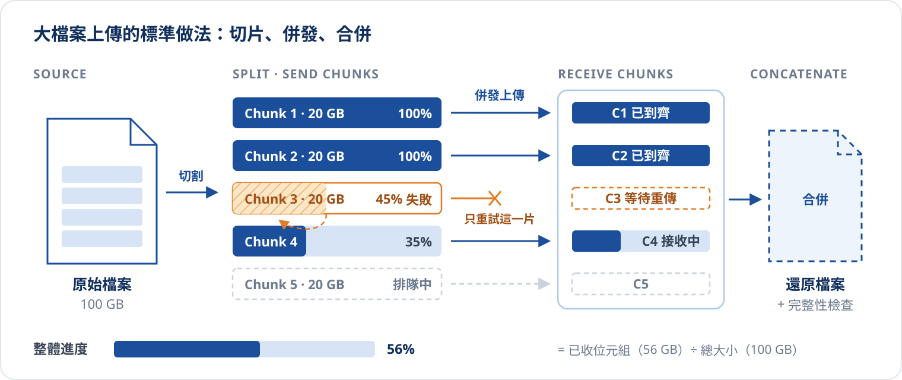
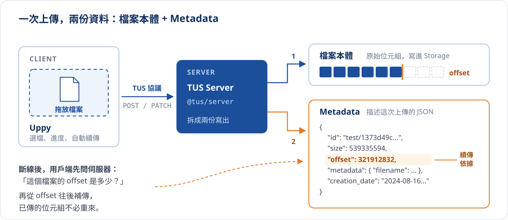
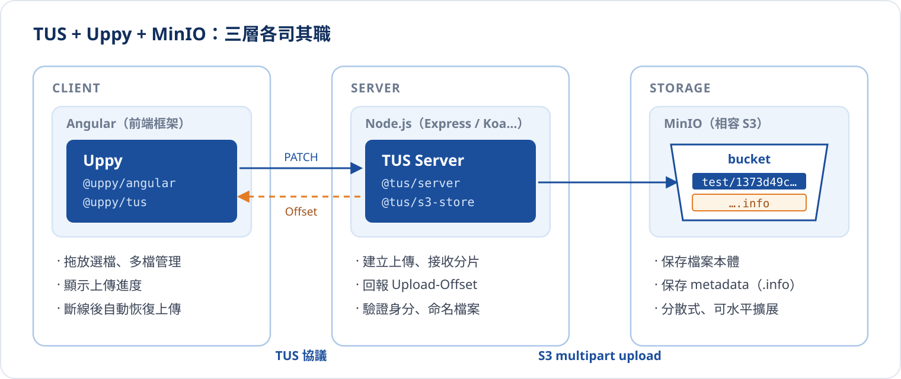

# 透過 TUS 實現可續傳的檔案上傳

> 本篇整理自 2024/08/20 的技術主題分享，並以 [tus.io](https://tus.io/) 官方協議文件補充細節。

## 情境：上傳到 99.99% 斷線

想像一個 50 GB 的影片檔，已經上傳了一個半小時，進度條停在 99.99%，這時網路閃斷了一下，畫面跳出「網路連線發生錯誤，請重新上傳」。

如果上傳機制沒有**斷點續傳**，也沒有**分片上傳**，使用者只能從 0% 重新開始。檔案越大、網路越不穩，這件事就越可能發生，而且可能**永遠傳不完**：只要網路撐不過一次完整上傳所需的時間，每一次重試都會在半路失敗。

下面用同一條網路，比較傳統單次上傳與 TUS 續傳。調整檔案大小與網路的穩定程度，看兩者何時開始分道揚鑣：

{/* @ai-visualize
id: tus-resume-compare
type: motion
prompt: |
  核心洞察：斷線不可避免，差別在斷線後要不要從 0 開始；當網路撐不過一次完整上傳的時間，
            傳統上傳會永遠傳不完，TUS 只多花重新連線的時間。
  互動：slider 調整檔案大小（1–20 GB）與「網路每撐幾分鐘斷一次」（1–10 分鐘）；
        「播放時間軸」讓時間游標由左往右推進，逐步揭露兩條泳道與曲線，可暫停、重置。
  圖形：上方兩條並排泳道（TUS 續傳 / 傳統上傳），已傳段落為藍色色塊，斷線點以橘色斷線記號標示，
        傳統上傳的失敗段落以橘色斜線填滿並標「白傳 x GB」；
        下方是「伺服器已收到的資料量」折線圖：TUS 為階梯上升（斷線時持平），傳統上傳為鋸齒（斷線即歸零）；
        時間軸以分鐘為刻度，TUS 完成處畫虛線標示完成時間。下方兩張說明卡分別顯示完成時間、斷線次數與白傳量。
  資料/數值：頻寬 20 MB/s，每次重新連線 30 秒（示意）。
caption: 調整檔案大小與網路穩定度，看傳統上傳何時開始「永遠傳不完」。
status: generated
*/}
import GeneratedFrame from '@/components/GeneratedFrame.astro'
import TusResumeCompare from '@notes/components/tus-resume-compare'

<GeneratedFrame id="tus-resume-compare" type="motion" prompt={"核心洞察：斷線不可避免，差別在斷線後要不要從 0 開始；當網路撐不過一次完整上傳的時間，\n          傳統上傳會永遠傳不完，TUS 只多花重新連線的時間。\n互動：slider 調整檔案大小（1–20 GB）與「網路每撐幾分鐘斷一次」（1–10 分鐘）；\n      「播放時間軸」讓時間游標由左往右推進，逐步揭露兩條泳道與曲線，可暫停、重置。\n圖形：上方兩條並排泳道（TUS 續傳 / 傳統上傳），已傳段落為藍色色塊，斷線點以橘色斷線記號標示，\n      傳統上傳的失敗段落以橘色斜線填滿並標「白傳 x GB」；\n      下方是「伺服器已收到的資料量」折線圖：TUS 為階梯上升（斷線時持平），傳統上傳為鋸齒（斷線即歸零）；\n      時間軸以分鐘為刻度，TUS 完成處畫虛線標示完成時間。下方兩張說明卡分別顯示完成時間、斷線次數與白傳量。\n資料/數值：頻寬 20 MB/s，每次重新連線 30 秒（示意）。\n"} caption="調整檔案大小與網路穩定度，看傳統上傳何時開始「永遠傳不完」。">
  <TusResumeCompare client:visible />
</GeneratedFrame>

## 大檔案上傳要克服哪些問題

「重新上傳」只是表面症狀。要讓大檔案上傳可靠、可監控，通常要同時處理下面幾類問題：

| 面向 | 問題 | 需要的機制 |
| :--- | :--- | :--- |
| 可靠性 | 網路中斷、單次請求逾時 | 斷點續傳、重試機制、錯誤處理 |
| 效能 | 大檔案耗費大量時間 | 分片設計、串流處理、併發上傳 |
| 正確性 | 片段遺失或順序錯亂 | 檔案完整性檢查（checksum）、合併驗證 |
| 可觀測性 | 缺少日誌、難以追蹤、不易排查錯誤 | 進度監控、錯誤回報、上傳狀態查詢 |
| 使用體驗 | 失敗後只能重來、看不到進度 | 上傳控制（暫停 / 繼續 / 取消）、進度條 |

## 分片上傳的基本原理

業界處理大檔案的標準思路是**化整為零**：把檔案切成許多小片段（Chunk），逐一或併發上傳，伺服器收齊後再合併回原始檔案。



::::steps
:::step{title="切割成 Chunks"}
把大檔案分割成多個小片段，大小通常在數 MB 到數十 MB 之間。片段越小，失敗時要重傳的量越少，但請求次數越多。
:::
:::step{title="併發上傳"}
每個 Chunk 獨立上傳，可以同時開多條連線傳送多個 Chunk 提高效率；但連線數要有上限，避免把伺服器壓垮。
:::
:::step{title="監控進度"}
追蹤每個 Chunk 的完成量，彙總成整體進度條或百分比回饋給使用者。
:::
:::step{title="錯誤處理"}
某個 Chunk 失敗時只重試那一片；重試多次仍失敗才停止整體上傳並回報錯誤。
:::
:::step{title="合併 Chunks"}
所有 Chunk 都成功抵達後，伺服器依序合併成原始檔案，並做完整性檢查。
:::
::::

## 自己實作的難處

原理不難，難的是**做對**。如果要開發團隊從零實作上面這套機制，會碰到不少系統設計與效能問題：

- **Chunk 切割與合併**：如何有效率地切割、確保所有片段都到齊後正確合併，並驗證合併結果與原檔一致
- **併發上傳與連線管理**：同時處理多個片段的併發上傳，又要控制連線數量，避免伺服器過載
- **進度監控與回饋**：即時追蹤每個片段的進度並回饋給使用者，可能還要引入 WebSocket 之類的即時通訊
- **斷點狀態的保存**：斷線後，伺服器與用戶端要對「已經傳到哪裡」有一致的答案

這些都是通用問題，沒必要每個專案重新發明一次。這正是 TUS 與 Uppy 的切入點：

| 工具 | 定位 | 解決什麼 |
| :--- | :--- | :--- |
| **TUS** | 可續傳上傳的**開放協議** | 規範用戶端與伺服器如何建立上傳、回報進度、從斷點續傳；伺服器與用戶端都有現成實作 |
| **Uppy** | 前端的**檔案上傳元件** | 提供拖放選檔、檔案管理、進度顯示等 UI，內建 TUS 外掛，直接與 TUS Server 溝通 |

## TUS 是什麼

[TUS](https://tus.io/) 是一個建立在 HTTP 之上的**可續傳檔案上傳開放協議**，由 Transloadit 維護、以 MIT 授權開源，Vimeo、Cloudflare、Supabase 等服務都在正式環境使用。它的設計目標是：網路再不穩，上傳都能從中斷的地方接著傳，而不是從頭來過。

TUS 的核心只有一個觀念：**每一筆上傳都有自己的 URL，伺服器隨時記得這個 URL 已經收到幾個位元組（offset）**。用戶端斷線後，只要問一下 offset，就能從那裡繼續。

### 核心流程：POST、HEAD、PATCH

| 方法 | 用途 | 關鍵標頭 | 成功回應 |
| :--- | :--- | :--- | :--- |
| `OPTIONS` | 探測伺服器支援的版本與擴充（選用） | 回應帶 `Tus-Version`、`Tus-Extension`、`Tus-Max-Size` | `204 No Content` |
| `POST` | 建立一筆上傳，取得專屬 URL | `Upload-Length`、`Upload-Metadata` | `201 Created` + `Location` |
| `HEAD` | 查詢這筆上傳目前的 offset | 回應帶 `Upload-Offset`、`Cache-Control: no-store` | `200 OK` |
| `PATCH` | 從指定 offset 寫入一段資料 | `Upload-Offset`、`Content-Type: application/offset+octet-stream` | `204 No Content` + 新的 `Upload-Offset` |

除了 `OPTIONS` 以外，每個請求與回應都要帶 `Tus-Resumable: 1.0.0` 標頭，表示使用的協議版本。

切換情境，一步一步看請求與回應怎麼往來，以及伺服器上的 offset 如何變化：

{/* @ai-visualize
id: tus-protocol-flow
type: motion
prompt: |
  核心洞察：TUS 續傳的關鍵是「offset 以伺服器為準」：斷線後先 HEAD 問進度，再從該 offset PATCH；
            用戶端若用自己記得的舊 offset 硬送，伺服器會回 409 拒絕，避免資料錯位。
  互動：三個情境分頁（順利上傳 / 中途斷線 / offset 不一致），stepper 上一步 / 下一步、自動播放、重置。
  圖形：上方是「伺服器上的檔案」0–100 MB 進度條，已寫入的位元組填藍、本步驟新寫入的以淺藍或橘色（斷線時）長出，
        標出伺服器 offset；offset 不一致時另以橘色虛線標出「用戶端以為的 offset」。
        下方是 Client（Uppy）與 TUS Server 兩條生命線的時序圖，逐步長出請求（實線）與回應（虛線），
        目前步驟以藍色強調、完成為綠色、409 為橘色，斷線的請求畫到一半打叉並註明沒有回應。
        最下方是本步驟說明，以及 REQUEST / RESPONSE 兩欄的 HTTP 標頭。
  資料/數值：檔案 100 MB，每段 PATCH 40 MB；斷線時伺服器實際寫入到 60 MB。
caption: 切換情境、逐步推進，看 offset 如何讓上傳安全地從斷點接續。
status: generated
*/}
import TusProtocolFlow from '@notes/components/tus-protocol-flow'

<GeneratedFrame id="tus-protocol-flow" type="motion" prompt={"核心洞察：TUS 續傳的關鍵是「offset 以伺服器為準」：斷線後先 HEAD 問進度，再從該 offset PATCH；\n          用戶端若用自己記得的舊 offset 硬送，伺服器會回 409 拒絕，避免資料錯位。\n互動：三個情境分頁（順利上傳 / 中途斷線 / offset 不一致），stepper 上一步 / 下一步、自動播放、重置。\n圖形：上方是「伺服器上的檔案」0–100 MB 進度條，已寫入的位元組填藍、本步驟新寫入的以淺藍或橘色（斷線時）長出，\n      標出伺服器 offset；offset 不一致時另以橘色虛線標出「用戶端以為的 offset」。\n      下方是 Client（Uppy）與 TUS Server 兩條生命線的時序圖，逐步長出請求（實線）與回應（虛線），\n      目前步驟以藍色強調、完成為綠色、409 為橘色，斷線的請求畫到一半打叉並註明沒有回應。\n      最下方是本步驟說明，以及 REQUEST / RESPONSE 兩欄的 HTTP 標頭。\n資料/數值：檔案 100 MB，每段 PATCH 40 MB；斷線時伺服器實際寫入到 60 MB。\n"} caption="切換情境、逐步推進，看 offset 如何讓上傳安全地從斷點接續。">
  <TusProtocolFlow client:visible />
</GeneratedFrame>

:::tip{title="TUS 的 PATCH 與前面講的「分片」是什麼關係？"}
TUS 核心協議是**循序**寫入：每次 PATCH 從目前 offset 往後接一段，天生就是分片。要做到「多片同時上傳」，則要靠 `concatenation` 擴充：先平行上傳多個 partial upload，最後再請伺服器合併成一個檔案。
:::

### 常見狀態碼

| 狀態碼 | 意義 | 典型原因 |
| :-: | :--- | :--- |
| `409 Conflict` | offset 不一致 | PATCH 帶的 `Upload-Offset` 與伺服器記錄的不同，要先 HEAD 取得正確值 |
| `404 Not Found` | 找不到這筆上傳 | URL 錯誤，或上傳已被清除 |
| `410 Gone` | 上傳已失效 | 過期（expiration）或被刪除（termination） |
| `412 Precondition Failed` | 協議版本不支援 | `Tus-Resumable` 的版本伺服器不認得 |
| `415 Unsupported Media Type` | 內容型別錯誤 | PATCH 沒有使用 `application/offset+octet-stream` |
| `460 Checksum Mismatch` | 校驗失敗 | 啟用 checksum 擴充時，這段資料的雜湊值對不上 |

### 擴充功能

核心協議刻意保持精簡，其他能力以擴充（extension）形式選用，伺服器在 `Tus-Extension` 標頭中宣告自己支援哪些：

| 擴充 | 作用 |
| :--- | :--- |
| `creation` | 用 POST 建立上傳（幾乎所有實作都支援） |
| `creation-with-upload` | 建立上傳的同一個 POST 就附帶第一段資料，省一次往返 |
| `creation-defer-length` | 建立時還不知道總長度，之後再補上（適合串流來源） |
| `expiration` | 以 `Upload-Expires` 告知未完成的上傳何時失效 |
| `checksum` | 以 `Upload-Checksum` 驗證每段資料的完整性 |
| `termination` | 用 DELETE 主動取消並清除一筆上傳 |
| `concatenation` | 把多個 partial upload 合併成一個檔案，實現平行上傳 |

## 一次上傳，兩份資料：檔案與 Metadata

TUS 在伺服器端會把一次上傳拆成兩份資料保存：**檔案本體**（原始位元組）與 **Metadata**（描述這次上傳的資訊）。續傳時需要的 offset，就記錄在 Metadata 裡。



實際的 Metadata 長這樣：

```json title="test/1373d49c80f36de265be8b494ff391a9.json"
{
  "id": "test/1373d49c80f36de265be8b494ff391a9",
  "size": 539335594,
  "offset": 0,
  "metadata": {
    "relativePath": "null",
    "name": "selectdb-x2doris-1.0.4_2.12-bin.tar.gz",
    "type": "application/gzip",
    "filetype": "application/gzip",
    "filename": "selectdb-x2doris-1.0.4_2.12-bin.tar.gz"
  },
  "creation_date": "2024-08-16T14:45:59.366Z"
}
```

| 欄位 | 說明 |
| :--- | :--- |
| `id` | 這筆上傳的唯一識別碼（由伺服器的命名函式產生） |
| `size` | 檔案總大小，單位為位元組，對應 `Upload-Length` |
| `offset` | 目前已寫入的位元組數，初始為 0，隨上傳推進而增加 |
| `metadata` | 用戶端在 `Upload-Metadata` 帶上來的資訊：原始檔名、檔案類型、相對路徑等 |
| `creation_date` | 這筆上傳的建立時間 |

使用 `@tus/file-store` 時，Metadata 會以 `<id>.json` 檔案存在檔案旁邊；使用 `@tus/s3-store` 時，則以 `<id>.info` 物件存在同一個 bucket。

## 實作一：Node.js 架設 TUS Server

官方提供的 Node.js 實作是 `@tus/server`，可以單獨啟動，也能掛在 Express、Koa、Fastify、Next.js 等框架上。

### 環境與套件

| 項目 | 需求 |
| :--- | :--- |
| Node.js | 16.0 以上（新版套件要求更高的 Node.js 版本，以套件文件為準） |
| npm | 7.0 以上 |
| 伺服器核心 | `@tus/server` |
| 儲存驅動 | `@tus/file-store`（本機檔案系統）或 `@tus/s3-store`（S3 相容物件儲存） |

```bash
npm install @tus/server
npm install @tus/file-store @tus/s3-store
```

:::note{title="套件名稱的變動"}
從 1.0.0 開始，套件拆分並改在 `@tus/` scope 底下發布。舊的 `tus-node-server` 套件已不穩定、只會收到安全修補，新專案請使用 `@tus/server`。
:::

### 選擇儲存方式

`datastore` 決定上傳的檔案存到哪裡，兩種常見選擇：

::::tabs
:::tab{label="FileStore：本機檔案系統"}
```ts title="server.ts"
import { FileStore } from '@tus/file-store';

const datastore = new FileStore({ directory: './temp' });
```

檔案直接寫到本機的 `./temp` 目錄，是最基本的選項。

| 優點 | 限制 |
| :--- | :--- |
| 設定簡單，適合小型應用或開發環境 | 擴展性有限，不適合多台伺服器水平擴展 |
| 輕量，部署與執行成本低 | 需要自行處理備份與還原，避免資料遺失 |
:::
:::tab{label="S3Store：MinIO / AWS S3"}
```ts title="server.ts"
import { S3Store } from '@tus/s3-store';
import * as https from 'https';

// 只在自簽憑證的開發環境使用；正式環境不要關閉憑證驗證
const httpsAgent = new https.Agent({ rejectUnauthorized: false });

const datastore = new S3Store({
  partSize: 8 * 1024 * 1024, // 每個分片 8 MB
  s3ClientConfig: {
    region: 'us-west-2',
    requestHandler: { httpsAgent },
    forcePathStyle: true,
    bucket: 'your-bucket',
    endpoint: 'https://minio.example.com/',
    credentials: {
      accessKeyId: process.env.S3_ACCESS_KEY!,
      secretAccessKey: process.env.S3_SECRET_KEY!,
    },
  },
});
```

| 設定 | 說明 |
| :--- | :--- |
| `partSize` | 寫入 S3 時每個分片的大小，這裡是 8 MB（S3 multipart upload 要求至少 5 MB） |
| `region` | S3 服務所在區域；MinIO 通常可以隨意填 |
| `forcePathStyle` | 使用路徑樣式 URL（`endpoint/bucket/key`），連接 MinIO 等非 AWS 的 S3 相容儲存時通常要開 |
| `bucket` | 儲存桶名稱 |
| `endpoint` | MinIO 伺服器的端點 URL |
| `credentials` | 存取金鑰；請從環境變數讀取，不要寫死在程式碼裡 |
:::
::::

### 建立 Server

:::annotate
```ts title="server.ts"
import { Server } from '@tus/server';
import * as crypto from 'crypto';

const port = Number(process.env.PORT ?? 3000);

const server = new Server({
  path: '/files', // (1)!
  datastore,
  namingFunction: async (_req, metadata) => { // (2)!
    const id = crypto.randomBytes(16).toString('hex');
    return `test/${id}`;
  },
  generateUrl: (_req, { proto, host, path, id }) => { // (3)!
    id = Buffer.from(id, 'utf-8').toString('base64url');
    return `${proto}://${host}${path}/${id}`;
  },
  getFileIdFromRequest: (req) => { // (4)!
    const match = /([^/]+)\/?$/.exec(req.url as string);
    if (!match) return;
    return Buffer.from(match[1], 'base64url').toString('utf-8');
  },
  onIncomingRequest: async (req) => { // (5)!
    const token = req.headers.authorization;
    if (token !== 'Bearer testing.token') {
      throw { status_code: 401, body: 'Unauthorized' };
    }
  },
});

server.listen({ port }); // (6)!
```

1. TUS API 的路徑，例如 `http://localhost:3000/files`；`POST /files` 建立上傳，之後對 `/files/<id>` 做 HEAD 與 PATCH。
2. 決定每筆上傳的 id：這裡用 16 位元組的隨機十六進位字串，前面加上 `test/` 作為 MinIO 中的資料夾路徑。`metadata` 參數可以取得原始檔名、檔案類型等資訊，用來自訂命名規則。
3. 控制回傳給用戶端的上傳 URL。因為 id 含有 `/`，直接放進 URL 會被當成路徑分隔，所以先以 base64url 編碼，得到像 `http://localhost:3000/files/dGVzdC85MTQ2MGQ4...` 的網址。
4. 與上一步對稱：從請求 URL 的最後一段取出編碼過的 id，再解碼回 `test/<id>`。有自訂 `generateUrl` 時，通常都要一起改寫這個函式。
5. 每個請求進來時都會呼叫，適合做身分驗證：這裡檢查 `Authorization` 標頭的 Bearer token，實務上可換成 JWT 驗證。丟出 `{ status_code, body }` 就會直接回應錯誤。
6. 啟動伺服器並監聽指定的 port。
:::

:::warning{title="版本差異"}
上面的寫法以分享當時的 `@tus/server` 1.x 為準。後續主版本的 hook 參數與整合方式有所調整，實作前請對照所用版本的 [官方文件](https://github.com/tus/tus-node-server)。
:::

## 實作二：Angular 用 Uppy 打造上傳元件

[Uppy](https://uppy.io/) 是模組化的開源 JavaScript 上傳元件，提供拖放選檔、檔案清單、進度顯示等完整 UI，並有官方的 TUS 外掛（底層使用 `tus-js-client`）。

### 環境與套件

| 項目 | 需求 |
| :--- | :--- |
| Angular | 最低 12 以上，建議 16 以上 |
| Angular 整合 | `@uppy/angular`：把 Uppy Dashboard 等元件包成 Angular 元件 |
| TUS 外掛 | `@uppy/tus`：讓 Uppy 透過 TUS 協議上傳到 TUS Server |

```bash
npm install @uppy/core @uppy/angular @uppy/tus
```

### 三步驟接上 TUS Server

::::tabs
:::tab{label="app.module.ts"}
```ts title="app.module.ts" {1,5}
import { UppyAngularDashboardModule } from '@uppy/angular';

@NgModule({
  declarations: [AppComponent],
  imports: [BrowserModule, AppRoutingModule, UppyAngularDashboardModule],
  providers: [],
  bootstrap: [AppComponent],
})
export class AppModule {}
```

匯入 `UppyAngularDashboardModule`，它把 Uppy 的 Dashboard 包成 Angular 元件，讓模板可以直接使用 `<uppy-dashboard>`。
:::
:::tab{label="app.component.ts"}
```ts title="app.component.ts" {7-13}
import { Component } from '@angular/core';
import { Uppy } from '@uppy/core';
import Tus from '@uppy/tus';

@Component({ /* ... */ })
export class AppComponent {
  public uppy: Uppy = new Uppy({ debug: true, autoProceed: false }).use(Tus, {
    endpoint: 'http://localhost:3000/files/',
    onBeforeRequest: async (req) => {
      const token = 'testing.token';
      req.setHeader('Authorization', `Bearer ${token}`);
    },
  });
}
```

- `new Uppy(...)` 建立上傳核心；`autoProceed: false` 代表選完檔案後由使用者按下上傳
- `.use(Tus, { endpoint })` 啟用 TUS 外掛，`endpoint` 就是前面 TUS Server 的 `path`
- `onBeforeRequest` 在每個請求送出前執行，這裡補上 `Authorization` 標頭，對應伺服器端的 `onIncomingRequest` 驗證
:::
:::tab{label="app.component.html"}
```html title="app.component.html"
<uppy-dashboard [uppy]="uppy"></uppy-dashboard>
```

放上 Dashboard 元件，拖放區、檔案清單、進度條、暫停與繼續按鈕都已內建。斷線後 Uppy 會自動用 HEAD 查詢 offset 並接續上傳。
:::
::::

## 系統全貌：TUS + Uppy + MinIO

把三者組合起來，就是一套能處理大檔案、支援斷點續傳、並存到分散式物件儲存的上傳系統：



| 層 | 技術 | 職責 |
| :--- | :--- | :--- |
| Client | Angular + Uppy（`@uppy/tus`） | 拖放選檔、上傳進度、斷線自動恢復 |
| Server | Node.js + `@tus/server` | 實作 TUS 協議：建立上傳、接收分片、回報 offset、身分驗證、命名 |
| Storage | MinIO（`@tus/s3-store`） | 分散式物件儲存，相容 Amazon S3；保存檔案本體與 metadata |

:::info{title="為什麼選 MinIO"}
FileStore 把檔案綁在單一台伺服器的磁碟上；改用 S3 相容的物件儲存後，TUS Server 本身變成無狀態，可以放心水平擴展，備份與容量也交給儲存層處理。
:::

## 小結

- **痛點**：大檔案上傳一旦斷線就從頭來，網路越不穩、檔案越大，越可能永遠傳不完
- **原理**：切片上傳、記錄 offset、斷線後從 offset 接續，失敗只重傳一小段
- **TUS**：把上述原理標準化成 HTTP 協議，核心只有 POST 建立、HEAD 查進度、PATCH 寫資料；offset 以伺服器為準
- **實作**：伺服器用 `@tus/server` 搭配 FileStore 或 S3Store；前端用 Uppy 的 TUS 外掛，幾行設定就有完整的上傳 UI 與自動續傳

## 參考資料

- [tus.io：Resumable file uploads](https://tus.io/)
- [TUS 協議規格 1.0.x](https://tus.io/protocols/resumable-upload)
- [tus-node-server（@tus/server）](https://github.com/tus/tus-node-server)
- [Uppy](https://uppy.io/)
